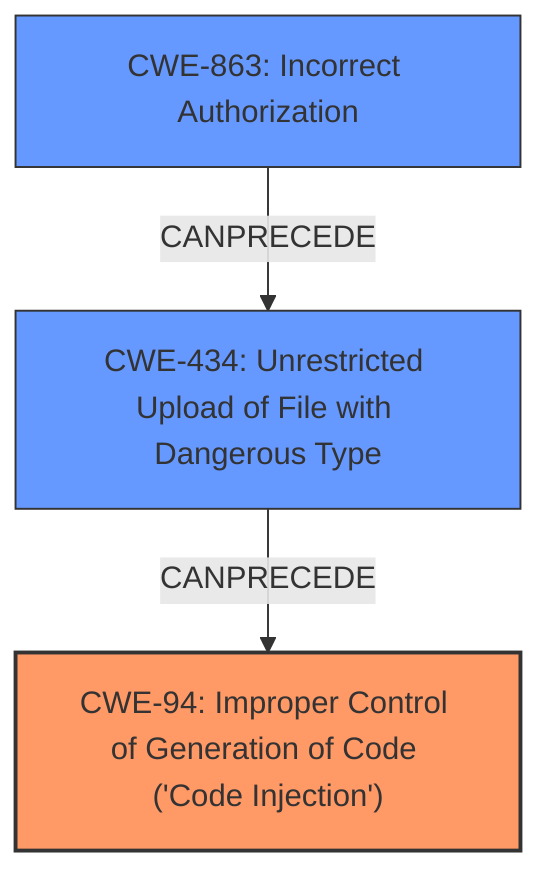

# Enhanced Analysis for CVE-2025-1385

# Summary
| CWE ID    | CWE Name                                                                       | Confidence | CWE Abstraction Level | CWE Vulnerability Mapping Label | CWE-Vulnerability Mapping Notes |
| --------- | ------------------------------------------------------------------------------ | ---------- | --------------------- | ------------------------------- | ------------------------------- |
| CWE-94    | Improper Control of Generation of Code ('Code Injection')                      | 0.9        | Base                  | Primary                         | Allowed-with-Review             |
| CWE-434   | Unrestricted Upload of File with Dangerous Type                                | 0.7        | Base                  | Secondary                       | Allowed                         |
| CWE-863   | Incorrect Authorization                                                          | 0.6        | Class                 | Secondary                       | Allowed-with-Review             |

## Evidence and Confidence

*   **Confidence Score:** 0.8
*   **Evidence Strength:** MEDIUM

## Relationship Analysis
The primary relationship impacting the decision is that CWE-94 is a root cause that directly leads to arbitrary code execution. CWE-434 (Unrestricted File Upload) can precede CWE-94 by providing the means to upload malicious code. CWE-863 (Incorrect Authorization) also plays a role by potentially allowing unauthorized access to the upload functionality. The chosen CWEs are at the Base and Class levels, representing the most specific classifications supported by the evidence.



## Vulnerability Chain
The vulnerability chain starts with a misconfigured ClickHouse server, specifically:
1.  **Misconfiguration:** Enabling the library bridge feature.
2.  **CWE-863: Incorrect Authorization**: An **attacker with privilege** can access table engines to execute arbitrary code.
3.  **CWE-434: Unrestricted Upload of File with Dangerous Type**: An attacker can upload a malicious library to a specific directory.
4.  **CWE-94: Improper Control of Generation of Code ('Code Injection')**: The clickhouse-library-bridge **API fails input validation**, leading to the execution of the uploaded library, resulting in arbitrary code execution on the ClickHouse server.

## Summary of Analysis
The analysis identifies **CWE-94 Improper Control of Generation of Code ('Code Injection')** as the primary weakness, because the **root cause** is the fail input validation in clickhouse-library-bridge API which allows an attacker to execute arbitrary code. This aligns with the CVE summary "Remote Code Execution (RCE) on the ClickHouse server." The description clearly states that the clickhouse-library-bridge API fails to validate input, leading to code injection. The presence of file upload functionality suggests a secondary weakness related to **CWE-434 Unrestricted Upload of File with Dangerous Type**, as this is how the malicious code is introduced. Finally, the requirement for an attacker to have access to both table engines points to a potential **CWE-863 Incorrect Authorization**, as the attacker should not have the necessary privileges.

The final selection is based on the evidence from the CVE summary and description, combined with the relationships between the CWEs. CWE-94 is at the optimal level of specificity because it directly addresses the code injection vulnerability.

Relevant CWE Information:

# Enhanced Context (25 CWEs)
The following CWEs were identified as potentially relevant to this vulnerability:

## CWE-94: Improper Control of Generation of Code ('Code Injection')
**Abstraction Level**: base
**Similarity Score**: 3.14
**Source**: graph

**Description**:
CWE-94: Improper Control of Generation of Code ('Code Injection')

**Mapping Guidance**:
- Usage: Allowed-with-Review
- Rationale: This entry is frequently misused for vulnerabilities with a technical impact of "code execution," which does not by itself indicate a root cause weakness, since dozens of weaknesses can enable code execution.

**Relationships**:
- CANFOLLOW -> CWE-98
- PARENTOF -> CWE-96
- PARENTOF -> CWE-95
- PARENTOF -> CWE-1336
- CHILDOF -> CWE-913

### CWE-94 Technical Explanation:

*   **How the vulnerability's details match the CWE's characteristics:** The vulnerability allows arbitrary code execution due to **failed input validation** in clickhouse-library-bridge API, which directly aligns with CWE-94's characteristic of **improper control of code generation**.
*   **The security implications and potential impact:** This leads to Remote Code Execution (RCE) on the ClickHouse server, allowing an attacker to fully compromise the system.
*   **Any parent-child relationships or chain patterns that influenced your mapping:** CWE-94 can be preceded by **CWE-434 (Unrestricted Upload of File with Dangerous Type)**, as the malicious code is uploaded before being executed.
*   **Whether the weakness is primary or secondary in the vulnerability:** This is the primary weakness.
*   **How the official MITRE mapping guidance influenced your decision:** The guidance suggests that code execution alone doesn't indicate a root cause, but in this case, the **failed input validation** clearly points to CWE-94.

### CWE-434 Technical Explanation:

*   **How the vulnerability's details match the CWE's characteristics:** The vulnerability allows an attacker to upload a malicious library to a specific directory, without sufficient restrictions on the file type or content, directly corresponding to CWE-434's description.
*   **The security implications and potential impact:** This allows an attacker to introduce malicious code into the system, which can then be executed, leading to full system compromise.
*   **Any parent-child relationships or chain patterns that influenced your mapping:** CWE-434 can precede CWE-94, as the uploaded file serves as the input for the code injection.
*   **Whether the weakness is primary or secondary in the vulnerability:** This is a secondary weakness, contributing to the overall exploitability.
*   **How the official MITRE mapping guidance influenced your decision:** The guidance supports the use of CWE-434 as a base-level weakness related to file uploads.

### CWE-863 Technical Explanation:

*   **How the vulnerability's details match the CWE's characteristics:** The vulnerability requires an attacker to have access to both table engines, suggesting that the authorization checks are not correctly implemented or are missing, aligning with CWE-863's characteristic of **incorrect authorization**.
*   **The security implications and potential impact:** This allows an attacker to perform actions they should not be authorized to do, leading to potential compromise of the system.
*   **Any parent-child relationships or chain patterns that influenced your mapping:** CWE-863 can precede CWE-434, as the attacker's unauthorized access is a prerequisite for uploading the malicious file.
*   **Whether the weakness is primary or secondary in the vulnerability:** This is a secondary weakness, enabling other parts of the attack.
*   **How the official MITRE mapping guidance influenced your decision:** The guidance indicates that CWE-863 is a Class-level CWE and more specific Base-level children might be more appropriate, but the available information does not allow to narrow down the authorization issue more specifically.

### CWEs Considered but Not Used:

*   CWE-22: Improper Limitation of a Pathname to a Restricted Directory ('Path Traversal'): While file uploads are involved, the primary issue isn't about traversing directories but rather about the unrestricted nature of the uploads.
*   CWE-427: Uncontrolled Search Path Element: This is not directly related as the vulnerability does not involve manipulating search paths.
*   CWE-285: Improper Authorization: Similar to CWE-863, but less fitting, as the problem isn't that no authorization happens, but it happens with **incorrect privilege**.


## CWE Relationship Analysis

Current CWEs represent these abstraction levels: .


### Vulnerability Chain Analysis

**Chain starting from CWE-863:**
- 863 (Incorrect Authorization) - ROOT


**Chain starting from CWE-427:**
- 427 (Uncontrolled Search Path Element) - ROOT


### CWE Relationship Diagram

```mermaid
graph TD
    classDef primary fill:#f96,stroke:#333,stroke-width:2px
    classDef secondary fill:#69f,stroke:#333
    classDef tertiary fill:#9e9,stroke:#333
```