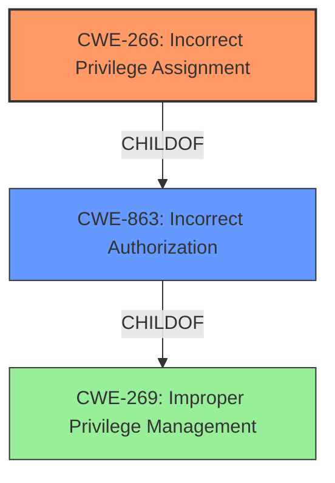

# Raw Analyzer Response for CVE-2025-1390

# Summary
| CWE ID  | CWE Name                                        | Confidence | CWE Abstraction Level | CWE Vulnerability Mapping Label | CWE-Vulnerability Mapping Notes |
| :-------- | :---------------------------------------------- | :--------- | :-------------------- | :------------------------------ | :-------------------------------- |
| CWE-266   | Incorrect Privilege Assignment                  | 0.85       | Base                  | Primary                         | Allowed                           |
| CWE-863   | Incorrect Authorization                         | 0.75       | Class                 | Secondary                       | Allowed-with-Review               |

## Evidence and Confidence

*   **Confidence Score:** 0.80
*   **Evidence Strength:** MEDIUM

## Relationship Analysis
The primary relationship influencing the CWE selection is the parent-child relationship between CWE-269 (Improper Privilege Management), CWE-863 (Incorrect Authorization), and CWE-266 (Incorrect Privilege Assignment). While CWE-269 and CWE-863 were considered, CWE-266 was chosen as the most specific base-level CWE that directly addresses the **incorrect privilege assignment** due to the configuration parsing error. The chain relationship isn't prominent in this case, it can be thought of as **incorrect configuration** leading to **incorrect privilege assignment**.

## Vulnerability Chain
The vulnerability chain starts with a configuration parsing error and culminates in privilege escalation.

1.  **Root Cause:** **Incorrect parsing of group names** in the `pam_cap.so` module.
2.  **Weakness:** **Incorrect privilege assignment** due to misinterpretation of configuration.
3.  **Impact:** **Privilege escalation**, where unintended users gain inherited capabilities.

## Summary of Analysis
The initial analysis focused on identifying the root cause and the resulting impact. The key evidence from the vulnerability description includes: "**incorrectly recognizing configurations not starting with @ as group names**" and "**nonintended users being granted an inherited capability set, potentially leading to security risks**". The analysis of CVE reference links content summary confirms that the root cause is a configuration parsing error.

Based on the provided information, CWE-266 (Incorrect Privilege Assignment) is the most appropriate primary CWE, as it directly describes the **incorrect assignment of privileges** to users due to the parsing error. While CWE-863 (Incorrect Authorization) is also relevant, it is a more general class of weakness. CWE-266 provides a more specific and accurate representation of the vulnerability. The MITRE mapping guidance for privileges vs. permissions further supports this selection, emphasizing that **incorrect privilege assignment** should be mapped to CWE-266. The retriever results listed CWE-266, CWE-863, and CWE-267 (Privilege Defined With Unsafe Actions) which were considered. CWE-267 was not selected as the privileges themselves are not unsafe, it is just the incorrect assignment.

Relevant CWE Information:

# Enhanced Context (25 CWEs)
The following CWEs were identified as potentially relevant to this vulnerability:

## CWE-266: Incorrect Privilege Assignment
**Abstraction Level**: Base
**Similarity Score**: 0.79
**Source**: dense

**Description**:
A product **incorrectly assigns a privilege** to a particular actor, creating an unintended sphere of control for that actor.

**Mapping Guidance**:
- Usage: Allowed
- Rationale: This CWE entry is at the Base level of abstraction, which is a preferred level of abstraction for mapping to the root causes of vulnerabilities.

## CWE-863: Incorrect Authorization
**Abstraction Level**: Class
**Similarity Score**: 1808.74
**Source**: sparse

**Description**:
The product performs an authorization check when an actor attempts to access a resource or perform an action, but it does not correctly perform the check.

**Mapping Guidance**:
- Usage: Allowed-with-Review
- Rationale: This CWE entry is a Class and might have Base-level children that would be more appropriate

## CWE-267: Privilege Defined With Unsafe Actions
**Abstraction Level**: Base
**Similarity Score**: 0.79
**Source**: dense

**Description**:
A particular privilege, role, capability, or right can be used to perform unsafe actions that were not intended, even when it is assigned to the correct entity.

**Mapping Guidance**:
- Usage: Allowed
- Rationale: This CWE entry is at the Base level of abstraction, which is a preferred level of abstraction for mapping to the root causes of vulnerabilities.