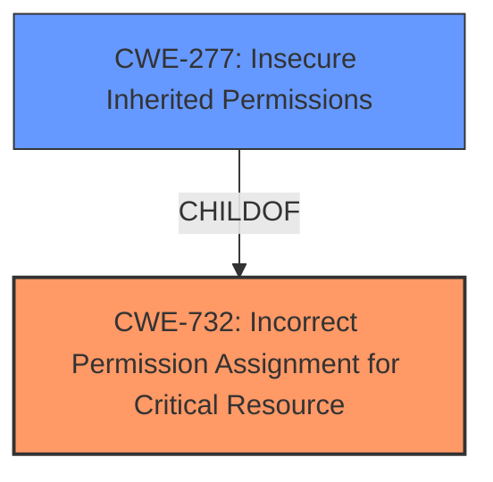

# Raw Analyzer Response for CVE-2025-1413

# Summary
| CWE ID | CWE Name | Confidence | CWE Abstraction Level | CWE Vulnerability Mapping Label | CWE-Vulnerability Mapping Notes |
|---|---|---|---|---|---|
| CWE-732 | Incorrect Permission Assignment for Critical Resource | 1.0 | Class | Allowed-with-Review | Primary CWE. This CWE accurately captures the essence of the vulnerability, where the DaVinci Resolve application is installed with incorrect file permissions. |
| CWE-277 | Insecure Inherited Permissions | 0.7 | Variant | Allowed | Secondary Candidate. While less direct than CWE-732, it highlights the potential for permissions to be inherited insecurely. |

## Evidence and Confidence

*   **Confidence Score:** 1.0
*   **Evidence Strength:** HIGH

## Relationship Analysis
The primary CWE is CWE-732, which is a Class-level CWE. CWE-277 is a Variant of CWE-732, indicating a more specific type of permission issue. The relationship between these CWEs helps refine the classification, highlighting the potential for inherited permissions to exacerbate the problem. Other CWEs considered, such as those related to privilege management (CWE-269) and authorization (CWE-863), were deemed less relevant as the core issue is the incorrect assignment of permissions to a critical resource.

## Vulnerability Chain
The vulnerability chain starts with the **incorrect file permissions** (rwxrwxrwx) assigned to the DaVinci Resolve application. This leads to the **Dylib Hijacking** weakness, which allows attackers (guest accounts, other users, applications) to escalate privileges.

Incorrect Permission Assignment -> Dylib Hijacking -> Privilege Escalation

## Summary of Analysis
The initial analysis identified **incorrect file permissions** as the root cause, leading to potential **Dylib Hijacking** and privilege escalation. The **CVE Reference Links Content Summary** explicitly mentions "Incorrect Privilege Assignment (CWE-266)" as a weakness. However, after reviewing the complete CWE specifications and the MITRE mapping guidance, CWE-732 was deemed a more accurate representation because the issue is about the permissions of a specific resource and not privilege assignment to an actor.

The decision to use CWE-732 is based on the vulnerability description: "DaVinci Resolve on MacOS was found to be installed with **incorrect file permissions** (rwxrwxrwx)." This clearly points to an issue with permission assignment for a critical resource. CWE-732 aligns well with this description. The MITRE mapping guidance for CWE-732 states: "The product specifies permissions for a security-critical resource in a way that allows that resource to be read or modified by unintended actors," which directly matches the vulnerability.

CWE-277 was considered as a secondary candidate because it further specifies how those permissions could be inherited.

CWE-266, CWE-269, CWE-285, and CWE-863 were considered but ultimately not selected. CWE-266 focuses on privilege assignment to an actor, which isn't the core issue here. CWE-269 is discouraged and often misused. CWE-285 and CWE-863 relate to authorization checks, which are not the primary problem in this scenario. The vulnerability is at the level of file system permissions, not authorization logic within the application.

The selected CWEs are at the optimal level of specificity, with CWE-732 being a Class-level CWE that accurately captures the root cause and CWE-277 being a Variant that provides additional context.