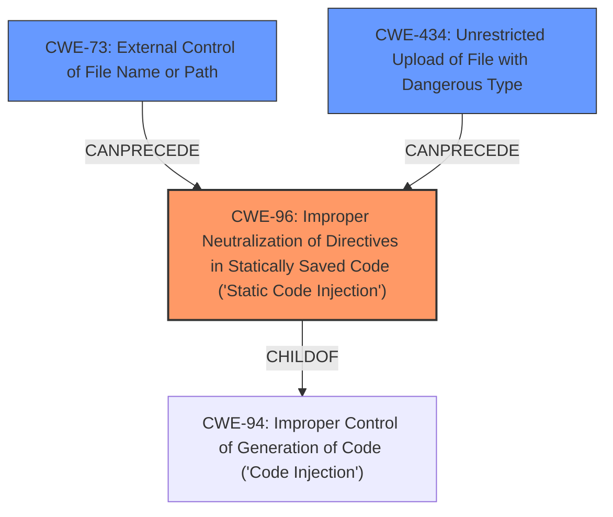

# Analysis for CVE-2025-1465

# Summary
| CWE ID | CWE Name | Confidence | CWE Abstraction Level | CWE Vulnerability Mapping Label | CWE-Vulnerability Mapping Notes |
|---|---|---|---|---|---|
| CWE-96 | Improper Neutralization of Directives in Statically Saved Code ('Static Code Injection') | 0.9 | Base | Allowed | Primary CWE. The vulnerability allows injecting code into a statically saved file (database configuration file). |
| CWE-73 | External Control of File Name or Path | 0.7 | Base | Allowed | Secondary CWE. This relates to the directory traversal vulnerability used to delete the `install_ok.txt` file. |
| CWE-434 | Unrestricted Upload of File with Dangerous Type | 0.6 | Base | Allowed | Secondary CWE. An attacker can upload a malicious webshell into the database configuration file. |

## Evidence and Confidence

*   **Confidence Score:** 0.8
*   **Evidence Strength:** HIGH

## Relationship Analysis
The analysis reveals the following relationships:

*   CWE-96 (Primary) is a base-level CWE focused on the root cause: **improper neutralization** when saving code.
*   CWE-73 and CWE-434 are related vulnerabilities that can precede code injection. CWE-73 enables the deletion of a file, and CWE-434 enables the upload of a malicious file (webshell).
*   CWE-94 is a parent of CWE-96. While CWE-94 is a broader "Code Injection" category, CWE-96 is more specific, relating to statically saved code.

## Vulnerability Chain
The vulnerability chain is as follows:

1.  CWE-73: Directory traversal allows deleting the `install_ok.txt` file.
2.  CWE-434: Unrestricted file upload enables uploading a malicious web shell into the database configuration file.
3.  CWE-96: The web shell code is statically saved into the database configuration file without proper neutralization, resulting in code execution.

The chain starts with a file deletion vulnerability and culminates in code injection into a statically saved file.

## Summary of Analysis
The initial assessment identified **code injection** as the main weakness. Further analysis of the CVE reference links revealed that the **code injection** occurs because a web shell is injected into the database configuration file, which is statically saved. The primary CWE is therefore CWE-96, "Improper Neutralization of Directives in Statically Saved Code ('Static Code Injection')". Supporting this is the vulnerability description which contains the key phrase "**code injection**".

The graph relationships show that CWE-96 is a child of CWE-94, which is a more general form of code injection. However, given the specific nature of the vulnerability, CWE-96 is a more accurate and specific representation of the vulnerability.

The retriever results support the selection of CWE-96 as a relevant CWE.

CWE-73 is included because the attacker uses directory traversal to delete the `install_ok.txt` file.
CWE-434 is included because the attacker uploads a malicious web shell.

I considered CWE-94 "Improper Control of Generation of Code ('Code Injection')" but it is too general. CWE-96 is more precise because it specifically addresses **code injection** into statically saved code.
I also considered CWE-79 "Improper Neutralization of Input During Web Page Generation ('Cross-site Scripting')" and CWE-89 "Improper Neutralization of Special Elements used in an SQL Command ('SQL Injection')" as code injection types but neither of these is specific to statically saved code.

The selected CWEs provide the optimal level of specificity.