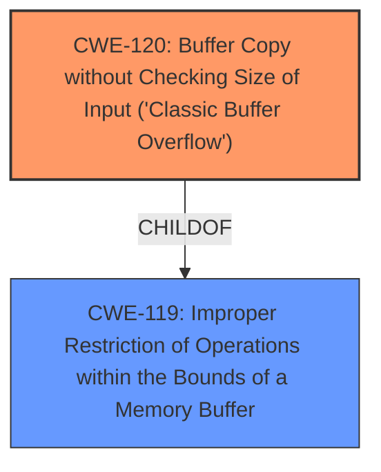

# Enhanced Analysis for CVE-2025-1471

# Summary
| CWE ID | CWE Name | Confidence | CWE Abstraction Level | CWE Vulnerability Mapping Label | CWE-Vulnerability Mapping Notes |
|---|---|---|---|---|---|
| CWE-120 | Buffer Copy without Checking Size of Input ('Classic Buffer Overflow') | 1.0 | Base | Allowed-with-Review | Primary CWE |

## Evidence and Confidence

*   **Confidence Score:** 1.0
*   **Evidence Strength:** HIGH

## Relationship Analysis
The primary CWE is CWE-120, which has relationships to other CWEs. Specifically, CWE-120 is a child of CWE-119 (Improper Restriction of Operations within the Bounds of a Memory Buffer), indicating a more general class of buffer-related errors. CWE-120 can also precede CWE-456 (Missing Initialization), CWE-416 (Use After Free), CWE-231 (Relative Path Traversal), and CWE-170 (Improper Neutralization of Special Elements used in a Command). However, these relationships don't directly apply to the given vulnerability description. The choice of CWE-120 is at the base level of abstraction, providing sufficient detail for this vulnerability.



## Vulnerability Chain
The vulnerability chain begins with the use of a **constant length buffer for string conversion**. If the input format string and arguments exceed the buffer size, a **buffer overflow** occurs. This leads to potential crashes, denial of service, or arbitrary code execution. The root cause is the **improper** sizing of the buffer, leading to the **buffer overflow**.

## Summary of Analysis
The analysis is based on the provided vulnerability description and the CVE reference link summary. The vulnerability involves a **buffer overflow** due to the use of a **constant length buffer** in the Eclipse OMR z/OS atoe print functions. The evidence from the CVE reference summary explicitly states the root cause: "The `atoe` methods were using a constant length buffer for string conversion," and the weakness: "**Buffer Overflow**: If the input format string and arguments were larger than the constant length buffer, a buffer overflow would occur."

The retriever results also point to CWE-119 (Improper Restriction of Operations within the Bounds of a Memory Buffer) and CWE-120 (Buffer Copy without Checking Size of Input ('Classic Buffer Overflow')). CWE-120 is the more specific and appropriate choice because the description explicitly states a "buffer overflow" occurs when the input exceeds the buffer size. The description indicates a copy operation without proper size validation, directly aligning with CWE-120. CWE-119 is a broader category.

Other CWEs were considered but deemed less appropriate:

*   CWE-190 (Integer Overflow or Wraparound): Not applicable, as the vulnerability is not related to integer overflow.
*   CWE-1284 (Improper Validation of Specified Quantity in Input): While input size is relevant, the core issue is the lack of size checking during the buffer copy operation, not the validation of the size itself.
*   CWE-681 (Incorrect Conversion between Numeric Types): Not relevant, as the vulnerability does not involve incorrect numeric type conversions.
*   CWE-125 (Out-of-bounds Read): Not relevant as the issue is a write, not a read.
*   CWE-193 (Off-by-one Error): Not specific enough as it doesn't address the larger issue of unchecked buffer copy.
*   CWE-124 (Buffer Underwrite ('Buffer Underflow')): Not applicable as it relates to underflow, not overflow.

CWE-120 is at the optimal level of specificity as it directly addresses the root cause and mechanism of the vulnerability, which is a buffer copy without checking the size of the input.


## CWE Relationship Analysis

Current CWEs represent these abstraction levels: .


### Vulnerability Chain Analysis

**Chain starting from CWE-1284:**
- 1284 (Improper Validation of Specified Quantity in Input) - ROOT


**Chain starting from CWE-416:**
- 416 (Use After Free) - ROOT


### CWE Relationship Diagram

```mermaid
graph TD
    classDef primary fill:#f96,stroke:#333,stroke-width:2px
    classDef secondary fill:#69f,stroke:#333
    classDef tertiary fill:#9e9,stroke:#333
```