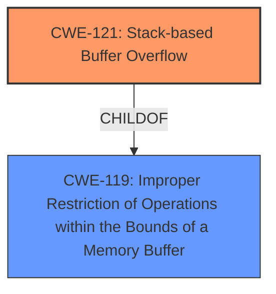

# Analysis Report for CVE-2025-1539

# Vulnerability Analysis Report: CVE-2025-1539

## Description

A vulnerability, which was classified as critical, has been found in D-Link DAP-1320 1.00. Affected by this issue is the function replace_special_char of the file /storagein.pd-XXXXXX. The manipulation leads to **stack-based buffer overflow**. The attack may be launched remotely. The exploit has been disclosed to the public and may be used. This vulnerability only affects products that are no longer supported by the maintainer.

## Vulnerability Description Key Phrases

- **Weakness:** stack-based buffer overflow
- **Product:** D-Link DAP-1320
- **Version:** 1.00
- **Component:** /storagein.pd-XXXXXX

## Analysis (with Relationship Data)

# Summary
| CWE ID | CWE Name | Confidence | CWE Abstraction Level | CWE Vulnerability Mapping Label | CWE-Vulnerability Mapping Notes |
|---|---|---|---|---|---|
| CWE-121 | Stack-based Buffer Overflow | 1.0 | Variant | Primary | Allowed |
| CWE-119 | Improper Restriction of Operations within the Bounds of a Memory Buffer | 0.5 | Class | Secondary | Discouraged |

## Evidence and Confidence

*   **Confidence Score:** 1.0
*   **Evidence Strength:** HIGH

## Relationship Analysis
The primary relationship that impacted my decision was the parent-child relationship between CWE-119 and CWE-121. CWE-121 is a variant of CWE-119, providing a more specific classification for stack-based buffer overflows. Since the vulnerability description explicitly mentions a "stack-based buffer overflow", using CWE-121 is more appropriate than the more general CWE-119.



## Vulnerability Chain
The vulnerability chain consists of a **stack-based buffer overflow** (CWE-121) due to **improper restriction of operations within the bounds of a memory buffer** (CWE-119). The chain starts with the **stack-based buffer overflow** which may lead to remote code execution.

## Summary of Analysis
The vulnerability description clearly states "stack-based buffer overflow". This directly corresponds to CWE-121, which is a Variant-level CWE specifically designed for this type of vulnerability. The retriever results also list CWE-121 as a potential candidate. While CWE-119 is a parent class, the explicit mention of "stack-based" makes CWE-121 a more accurate and specific choice.

The decision is based on the evidence:
- **Vulnerability Description Key Phrases:** "**weakness:** **stack-based buffer overflow**"

Relevant CWE Information:

# Enhanced Context (25 CWEs)
The following CWEs were identified as potentially relevant to this vulnerability:

## CWE-121: Stack-based Buffer Overflow
**Abstraction Level**: Variant
**Similarity Score**: 0.74
**Source**: dense

**Description**:
A stack-based buffer overflow condition is a condition where the buffer being overwritten is allocated on the stack (i.e., is a local variable or, rarely, a parameter to a function).

**Mapping Guidance**:
- Usage: Allowed
- Rationale: This CWE entry is at the Variant level of abstraction, which is a preferred level of abstraction for mapping to the root causes of vulnerabilities.

### CWEs Considered but Not Used:

*   **CWE-119 Improper Restriction of Operations within the Bounds of a Memory Buffer:** While this is a parent of CWE-121, the description explicitly states a *stack-based* overflow, making the child CWE a more precise fit.
*   **CWE-190 Integer Overflow or Wraparound:** This CWE relates to integer handling, which is not directly mentioned or implied in the vulnerability description.
*   **CWE-89 Improper Neutralization of Special Elements used in an SQL Command ('SQL Injection'):** This CWE relates to SQL injection vulnerabilities, which are not relevant to the described buffer overflow.
*   **CWE-79 Improper Neutralization of Input During Web Page Generation ('Cross-site Scripting'):** This CWE relates to Cross-site Scripting vulnerabilities, which are not relevant to the described buffer overflow.
*   **CWE-674 Uncontrolled Recursion:** This CWE relates to uncontrolled recursion, which is not directly mentioned or implied in the vulnerability description.
*   **CWE-125 Out-of-bounds Read:** This CWE relates to out-of-bounds reads, which is not directly mentioned or implied in the vulnerability description.
*   **CWE-1284 Improper Validation of Specified Quantity in Input:** This CWE relates to improper validation of input quantity, which is not directly mentioned or implied in the vulnerability description.
*   **CWE-78 Improper Neutralization of Special Elements used in an OS Command ('OS Command Injection'):** This CWE relates to OS Command Injection vulnerabilities, which are not relevant to the described buffer overflow.
*   **CWE-128 Wrap-around Error:** This CWE relates to wrap-around errors, which is not directly mentioned or implied in the vulnerability description.


## CWE Relationship Analysis

Current CWEs represent these abstraction levels: .


### Vulnerability Chain Analysis

**Chain starting from CWE-89:**
- 89 (Improper Neutralization of Special Elements used in an SQL Command ('SQL Injection')) - ROOT


**Chain starting from CWE-121:**
- 121 (Stack-based Buffer Overflow) - ROOT


### CWE Relationship Diagram

```mermaid
graph TD
    classDef primary fill:#f96,stroke:#333,stroke-width:2px
    classDef secondary fill:#69f,stroke:#333
    classDef tertiary fill:#9e9,stroke:#333
```


*Report generated on 2025-07-14 07:25:15*
