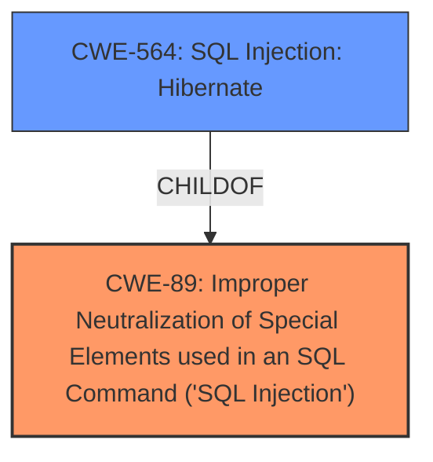

# Analysis Report for CVE-2025-1572

# Vulnerability Analysis Report: CVE-2025-1572

## Description

The KiviCare Clinic & Patient Management System (EHR) plugin for WordPress is vulnerable to **SQL Injection** via the u_id parameter in all versions up to, and including, 3.6.7 due to **insufficient escaping on the user supplied parameter and lack of sufficient preparation on the existing SQL query**. This makes it possible for authenticated attackers, with doctor-level access and above, to append additional SQL queries into already existing queries that can be used to extract sensitive information from the database.

## Vulnerability Description Key Phrases

- **Rootcause:** insufficient escaping on the user supplied parameter and lack of sufficient preparation on the existing SQL query
- **Weakness:** SQL Injection
- **Impact:** ['append additional SQL queries into already existing queries', 'extract sensitive information from the database']
- **Attacker:** authenticated attackers with doctor-level access and above
- **Product:** KiviCare Clinic & Patient Management System
- **Version:** up to and including 3.6.7

## Analysis (with Relationship Data)

# Summary
| CWE ID | CWE Name | Confidence | CWE Abstraction Level | CWE Vulnerability Mapping Label | CWE-Vulnerability Mapping Notes |
|---|---|---|---|---|---|
| CWE-89 | Improper Neutralization of Special Elements used in an SQL Command ('SQL Injection') | 1.0 | Base | Allowed | Primary CWE. The vulnerability is due to **insufficient escaping on the user supplied parameter and lack of sufficient preparation on the existing SQL query**, leading to SQL injection. |

## Evidence and Confidence

*   **Confidence Score:** 1.0
*   **Evidence Strength:** HIGH

## Relationship Analysis
The primary CWE is CWE-89, which is a Base level CWE. There are Variant level CWEs that are children of CWE-89, such as CWE-564 (SQL Injection: Hibernate), but the description does not provide enough information to select a more specific CWE.



## Vulnerability Chain
The vulnerability chain is as follows:
1.  **Root Cause**: **Insufficient escaping on the user supplied parameter and lack of sufficient preparation on the existing SQL query**.
2.  **Weakness**: CWE-89: Improper Neutralization of Special Elements used in an SQL Command ('SQL Injection').
3.  **Impact**: append additional SQL queries into already existing queries that can be used to extract sensitive information from the database.

## Summary of Analysis
The vulnerability is an **SQL Injection** due to **insufficient escaping on the user supplied parameter and lack of sufficient preparation on the existing SQL query**. The primary CWE is CWE-89. The retriever results also list CWE-89 as the top candidate. The evidence provided in the vulnerability description directly supports this classification. The CWE-89 is at the optimal level of specificity, as the description doesn't provide more details that would lead to a more specific variant.

Relevant CWE Information:

# Enhanced Context (25 CWEs)
The following CWEs were identified as potentially relevant to this vulnerability:

## CWE-89: Improper Neutralization of Special Elements used in an SQL Command ('SQL Injection')
**Abstraction Level**: Base
**Similarity Score**: 0.72
**Source**: dense

**Description**:
The product constructs all or part of an SQL command using externally-influenced input from an upstream component, but it does not neutralize or incorrectly neutralizes special elements that could modify the intended SQL command when it is sent to a downstream component. Without sufficient removal or quoting of SQL syntax in user-controllable inputs, the generated SQL query can cause those inputs to be interpreted as SQL instead of ordinary user data.

**Mapping Guidance**:
- Usage: Allowed
- Rationale: This CWE entry is at the Base level of abstraction, which is a preferred level of abstraction for mapping to the root causes of vulnerabilities.

CWE-116: Improper Encoding or Escaping of Output was considered but rejected because the vulnerability is specifically related to SQL injection, which is best described by CWE-89. CWE-116 is more general.
CWE-352: Cross-Site Request Forgery (CSRF) was considered but rejected because the vulnerability is not related to CSRF.
CWE-90: Improper Neutralization of Special Elements used in an LDAP Query ('LDAP Injection') was considered but rejected because the vulnerability is specifically related to SQL injection, not LDAP injection.
CWE-502: Deserialization of Untrusted Data was considered but rejected because the vulnerability is not related to deserialization of untrusted data.
CWE-79: Improper Neutralization of Input During Web Page Generation ('Cross-site Scripting') was considered but rejected because the vulnerability is specifically related to SQL injection, not cross-site scripting.


## CWE Relationship Analysis

Current CWEs represent these abstraction levels: .


### Vulnerability Chain Analysis

**Chain starting from CWE-90:**
- 90 (Improper Neutralization of Special Elements used in an LDAP Query ('LDAP Injection')) - ROOT


**Chain starting from CWE-89:**
- 89 (Improper Neutralization of Special Elements used in an SQL Command ('SQL Injection')) - ROOT


### CWE Relationship Diagram

```mermaid
graph TD
    classDef primary fill:#f96,stroke:#333,stroke-width:2px
    classDef secondary fill:#69f,stroke:#333
    classDef tertiary fill:#9e9,stroke:#333
```


*Report generated on 2025-07-14 07:27:46*
