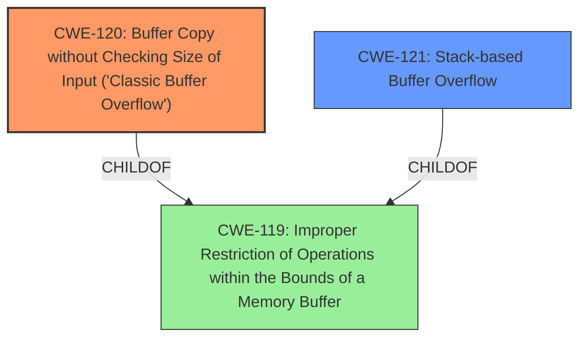

# Analysis Report for CVE-2025-1587

# Vulnerability Analysis Report: CVE-2025-1587

## Description

A vulnerability was found in SourceCodester Telecom Billing Management System 1.0. It has been rated as critical. This issue affects the function addrecords of the file main.cpp of the component Add New Record. The manipulation of the argument name/phonenumber leads to **buffer overflow**. Local access is required to approach this attack. The exploit has been disclosed to the public and may be used. Other parameters might be affected as well.

## Vulnerability Description Key Phrases

- **Weakness:** buffer overflow
- **Vector:** manipulation of argument name/phonenumber
- **Product:** SourceCodester Telecom Billing Management System
- **Version:** 1.0
- **Component:** Add New Record

## Analysis (with Relationship Data)

# Summary
| CWE ID | CWE Name | Confidence | CWE Abstraction Level | CWE Vulnerability Mapping Label | CWE-Vulnerability Mapping Notes |
|---|---|---|---|---|---|
| CWE-120 | Buffer Copy without Checking Size of Input ('Classic Buffer Overflow') | 1.0 | Base | Allowed-with-Review | Primary CWE. Addresses the root cause of the vulnerability due to the use of `scanf` without size validation, leading to a buffer overflow. |
| CWE-121 | Stack-based Buffer Overflow | 0.7 | Variant | Allowed | Secondary candidate. The vulnerability occurs on the stack, which is relevant. |
| CWE-119 | Improper Restriction of Operations within the Bounds of a Memory Buffer | 0.5 | Class | Discouraged | Secondary candidate. General buffer issue. |

## Evidence and Confidence

*   **Confidence Score:** 0.9
*   **Evidence Strength:** HIGH

## Relationship Analysis
The primary CWE is CWE-120, which is a base-level CWE and a child of CWE-119. CWE-121 is a variant of CWE-119, specifying the location of the buffer overflow (stack).



## Vulnerability Chain
The vulnerability chain starts with the use of `scanf` without proper bounds checking (CWE-120), which allows for writing beyond the buffer's boundary. This leads to a buffer overflow, specifically on the stack.

## Summary of Analysis
The vulnerability is a classic buffer overflow due to the usage of `scanf` without specifying the maximum length, leading to writing beyond the buffer's boundaries. This aligns directly with CWE-120 ("Buffer Copy without Checking Size of Input"). The "CVE Reference Links Content Summary" provides strong evidence for this, stating that the **root cause** is using `scanf` without a maximum length specifier, allowing for unbounded input and a **buffer overflow**. The **weakness** is also explicitly stated as a **buffer overflow** in the "Vulnerability Description Key Phrases".

CWE-120 is at the base level of abstraction and accurately represents the **root cause**. While CWE-121 (Stack-based Buffer Overflow) is also relevant, CWE-120 captures the fundamental flaw of not checking the input size during a buffer copy operation. The "CVE Reference Links Content Summary" section clearly describes the **vulnerability** as a **buffer overflow** caused by using `scanf` without a maximum length. The provided mitigation also supports the selection of CWE-120, suggesting safer input functions like `fgets` or `scanf` with a maximum field width specifier.

The Retriever Results listed CWE-119 ("Improper Restriction of Operations within the Bounds of a Memory Buffer") as the top combined result. However, CWE-119 is a class-level CWE and is discouraged when more specific CWEs are available. CWE-120 is a more specific base-level CWE that directly addresses the **root cause** of the **buffer overflow** due to the lack of input size checking.

Based on the evidence, relationship analysis, and mapping guidance, CWE-120 is the most appropriate primary CWE for this vulnerability.

Relevant CWE Information:

# Enhanced Context (25 CWEs)
The following CWEs were identified as potentially relevant to this vulnerability:

## CWE-131: Incorrect Calculation of Buffer Size
**Abstraction Level**: Base
**Similarity Score**: 0.79
**Source**: dense

**Description**:
The product does not correctly calculate the size to be used when allocating a buffer, which could lead to a buffer overflow.

**Mapping Guidance**:
- Usage: Allowed
- Rationale: This CWE entry is at the Base level of abstraction, which is a preferred level of abstraction for mapping to the root causes of vulnerabilities.

## CWE-125: Out-of-bounds Read
**Abstraction Level**: Base
**Similarity Score**: 0.76
**Source**: dense

**Description**:
The product reads data past the end, or before the beginning, of the intended buffer.

**Mapping Guidance**:
- Usage: Allowed
- Rationale: This CWE entry is at the Base level of abstraction, which is a preferred level of abstraction for mapping to the root causes of vulnerabilities.

## CWE-129: Improper Validation of Array Index
**Abstraction Level**: Variant
**Similarity Score**: 0.76
**Source**: dense

**Description**:
The product uses untrusted input when calculating or using an array index, but the product does not validate or incorrectly validates the index to ensure the index references a valid position within the array.

**Mapping Guidance**:
- Usage: Allowed
- Rationale: This CWE entry is at the Variant level of abstraction, which is a preferred level of abstraction for mapping to the root causes of vulnerabilities.

## CWE-193: Off-by-one Error
**Abstraction Level**: Base
**Similarity Score**: 0.76
**Source**: dense

**Description**:
A product calculates or uses an incorrect maximum or minimum value that is 1 more, or 1 less, than the correct value.

**Mapping Guidance**:
- Usage: Allowed
- Rationale: This CWE entry is at the Base level of abstraction, which is a preferred level of abstraction for mapping to the root causes of vulnerabilities.

## CWE-754: Improper Check for Unusual or Exceptional Conditions
**Abstraction Level**: Class
**Similarity Score**: 0.75
**Source**: dense

**Description**:
The product does not check or incorrectly checks for unusual or exceptional conditions that are not expected to occur frequently during day to day operation of the product.

**Mapping Guidance**:
- Usage: Allowed-with-Review
- Rationale: This CWE entry is a Class and might have Base-level children that would be more appropriate

## CWE-252: Unchecked Return Value
**Abstraction Level**: Base
**Similarity Score**: 0.75
**Source**: dense

**Description**:
The product does not check the return value from a method or function, which can prevent it from detecting unexpected states and conditions.

**Mapping Guidance**:
- Usage: Allowed
- Rationale: This CWE entry is at the Base level of abstraction, which is a preferred level of abstraction for mapping to the root causes of vulnerabilities.

## CWE-116: Improper Encoding or Escaping of Output
**Abstraction Level**: Class
**Similarity Score**: 0.75
**Source**: dense

**Description**:
The product prepares a structured message for communication with another component, but encoding or escaping of the data is either missing or done incorrectly. As a result, the intended structure of the message is not preserved.

**Mapping Guidance**:
- Usage: Allowed-with-Review
- Rationale: This CWE entry is a Class and might have Base-level children that would be more appropriate

## CWE-434: Unrestricted Upload of File with Dangerous Type
**Abstraction Level**: Base
**Similarity Score**: 0.75
**Source**: dense

**Description**:
The product allows the upload or transfer of dangerous file types that are automatically processed within its environment.

**Mapping Guidance**:
- Usage: Allowed
- Rationale: This CWE entry is at the Base level of abstraction, which is a preferred level of abstraction for mapping to the root causes of vulnerabilities.

## CWE-134: Use of Externally-Controlled Format String
**Abstraction Level**: Base
**Similarity Score**: 0.75
**Source**: dense

**Description**:
The product uses a function that accepts a format string as an argument, but the format string originates from an external source.

**Mapping Guidance**:
- Usage: Allowed
- Rationale: This CWE entry is at the Base level of abstraction, which is a preferred level of abstraction for mapping to the root causes of vulnerabilities.

## CWE-119: Improper Restriction of Operations within the Bounds of a Memory Buffer
**Abstraction Level**: Class
**Similarity Score**: 0.75
**Source**: dense

**Description**:
The product performs operations on a memory buffer, but it reads from or writes to a memory location outside the buffer's intended boundary. This may result in read or write operations on unexpected memory locations that could be linked to other variables, data structures, or internal program data.

**Mapping Guidance**:
- Usage: Discouraged
- Rationale: CWE-119 is commonly misused in low-information vulnerability reports when lower-level CWEs could be used instead, or when more details about the vulnerability are available.

## CWE-190: Integer Overflow


## CWE Relationship Analysis

Current CWEs represent these abstraction levels: .


### Vulnerability Chain Analysis

**Chain starting from CWE-121:**
- 121 (Stack-based Buffer Overflow) - ROOT


**Chain starting from CWE-116:**
- 116 (Improper Encoding or Escaping of Output) - ROOT


### CWE Relationship Diagram

```mermaid
graph TD
    classDef primary fill:#f96,stroke:#333,stroke-width:2px
    classDef secondary fill:#69f,stroke:#333
    classDef tertiary fill:#9e9,stroke:#333
```


*Report generated on 2025-07-14 07:29:42*
