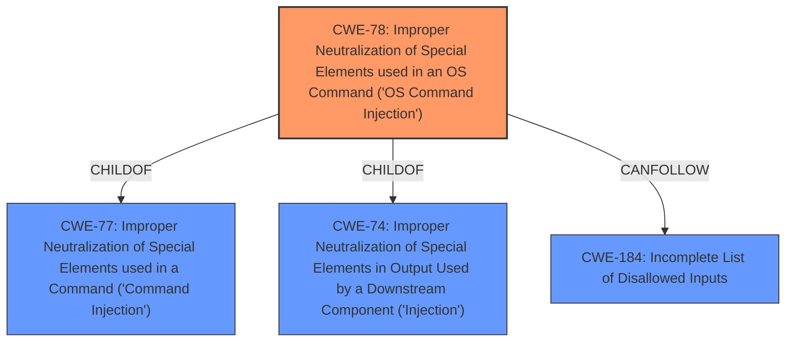

# Enhanced Analysis for CVE-2025-1610

# Summary
| CWE ID | CWE Name | Confidence | CWE Abstraction Level | CWE Vulnerability Mapping Label | CWE-Vulnerability Mapping Notes |
|---|---|---|---|---|---|
| CWE-78 | Improper Neutralization of Special Elements used in an OS Command ('OS Command Injection') | 1.0 | Base | Allowed | Primary CWE |

## Evidence and Confidence

*   **Confidence Score:** 1.0
*   **Evidence Strength:** HIGH

## Relationship Analysis
The primary CWE is CWE-78, which is a base level CWE. It has relationships with other CWEs, such as being a child of CWE-77 (Improper Neutralization of Special Elements used in a Command) and CWE-74 (Improper Neutralization of Special Elements in Output Used by a Downstream Component). There are also chain relationships, such as CANFOLLOW to CWE-184 (Incomplete List of Disallowed Inputs). The chosen CWE, CWE-78, is the most specific and accurate representation of the vulnerability based on the provided information.



## Vulnerability Chain
The vulnerability chain starts with the **improper neutralization of special elements** in the `mac/enable` argument, leading to **OS command injection**.

## Summary of Analysis
The vulnerability description clearly states that the manipulation of the `mac/enable` argument leads to **OS command injection**. The retriever results also list CWE-78 as the top candidate. CWE-78 (Improper Neutralization of Special Elements used in an OS Command ('OS Command Injection')) is the most appropriate CWE because the **weakness** is directly related to the **improper neutralization** of input that leads to the execution of unintended OS commands. The evidence from the "Vulnerability Description Key Phrases" section indicates the **weakness** is **os command injection**. The confidence score is 1.0 because the description explicitly states the **vulnerability** is an **OS command injection**, and the retriever results confirm this. Other CWEs were considered, but were not as specific as CWE-78. For example, CWE-74 (Improper Neutralization of Special Elements in Output Used by a Downstream Component ('Injection')) is a more general injection weakness, and CWE-77 (Improper Neutralization of Special Elements used in a Command ('Command Injection')) is a class level.

Relevant CWE Information:

**CWE-78: Improper Neutralization of Special Elements used in an OS Command ('OS Command Injection')**
The product constructs all or part of an OS command using externally-influenced input from an upstream component, but it does not neutralize or incorrectly neutralizes special elements that could modify the intended OS command when it is sent to a downstream component.


## CWE Relationship Analysis

Current CWEs represent these abstraction levels: .


### Vulnerability Chain Analysis

**Chain starting from CWE-184:**
- 184 (Incomplete List of Disallowed Inputs) - ROOT


**Chain starting from CWE-74:**
- 74 (Improper Neutralization of Special Elements in Output Used by a Downstream Component ('Injection')) - ROOT


### CWE Relationship Diagram

```mermaid
graph TD
    classDef primary fill:#f96,stroke:#333,stroke-width:2px
    classDef secondary fill:#69f,stroke:#333
    classDef tertiary fill:#9e9,stroke:#333
```