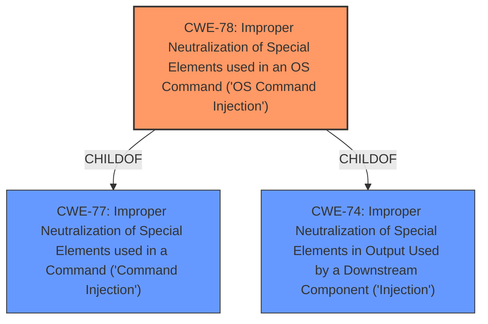

# Analysis Report for CVE-2025-1616

# Vulnerability Analysis Report: CVE-2025-1616

## Description

A vulnerability, which was classified as critical, has been found in FiberHome AN5506-01A ONU GPON RP2511. Affected by this issue is some unknown functionality of the component Diagnosis. The manipulation of the argument Destination Address leads to **os command injection**. The attack may be launched remotely. The exploit has been disclosed to the public and may be used. The vendor was contacted early about this disclosure but did not respond in any way.

## Vulnerability Description Key Phrases

- **Weakness:** os command injection
- **Vector:** manipulation of the argument Destination Address
- **Product:** FiberHome AN5506-01A ONU GPON
- **Component:** Diagnosis

## Analysis (with Relationship Data)

# Summary
| CWE ID | CWE Name | Confidence | CWE Abstraction Level | CWE Vulnerability Mapping Label | CWE-Vulnerability Mapping Notes |
|---|---|---|---|---|---|
| CWE-78 | Improper Neutralization of Special Elements used in an OS Command ('OS Command Injection') | 1.0 | Base | Primary | Allowed |

## Evidence and Confidence

*   **Confidence Score:** 1.0
*   **Evidence Strength:** HIGH

## Relationship Analysis
The primary CWE is CWE-78, which is a Base level CWE. It has hierarchical relationships, being a child of CWE-77 (Improper Neutralization of Special Elements used in a Command ('Command Injection')) and related to CWE-74 (Improper Neutralization of Special Elements in Output Used by a Downstream Component ('Injection')). The selection of CWE-78 is preferred due to its specificity in addressing OS command injection, aligning directly with the vulnerability description.



## Vulnerability Chain
The vulnerability chain starts with the **improper neutralization** of special elements in the "Destination Address" argument, leading to **OS command injection**. This allows for the execution of arbitrary commands on the system.

## Summary of Analysis
The primary vulnerability is **OS Command Injection**, directly caused by the **improper neutralization** of special elements in the "Destination Address" argument. The vulnerability description explicitly mentions "manipulation of the argument Destination Address leads to **os command injection**". This aligns perfectly with CWE-78, which is "Improper Neutralization of Special Elements used in an OS Command ('OS Command Injection')". The confidence is high because the description clearly states the weakness and the attack vector. The retriever results also strongly support this, with CWE-78 having a score of 1.0.

The choice of CWE-78 is based on its specific applicability to the described vulnerability. Other CWEs, such as CWE-74 (Improper Neutralization of Special Elements in Output Used by a Downstream Component ('Injection')), are more general and less precise. While CWE-77 (Improper Neutralization of Special Elements used in a Command ('Command Injection')) is related, CWE-78 is more specific to OS commands, making it a better fit.


## CWE Relationship Analysis

Current CWEs represent these abstraction levels: .


### Vulnerability Chain Analysis

**Chain starting from CWE-74:**
- 74 (Improper Neutralization of Special Elements in Output Used by a Downstream Component ('Injection')) - ROOT


**Chain starting from CWE-77:**
- 77 (Improper Neutralization of Special Elements used in a Command ('Command Injection')) - ROOT


### CWE Relationship Diagram

```mermaid
graph TD
    classDef primary fill:#f96,stroke:#333,stroke-width:2px
    classDef secondary fill:#69f,stroke:#333
    classDef tertiary fill:#9e9,stroke:#333
```


*Report generated on 2025-07-14 07:33:08*
