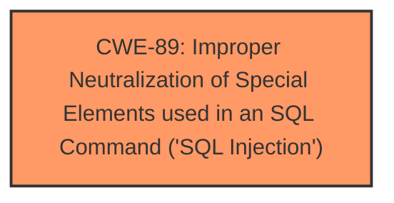

# Analysis for CVE-2025-1648

# Summary
| CWE ID | CWE Name | Confidence | CWE Abstraction Level | CWE Vulnerability Mapping Label | CWE-Vulnerability Mapping Notes |
|---|---|---|---|---|---|
| CWE-89 | Improper Neutralization of Special Elements used in an SQL Command ('SQL Injection') | 1.0 | Base | Primary | Allowed |

## Evidence and Confidence

*   **Confidence Score:** 1.0
*   **Evidence Strength:** HIGH

## Relationship Analysis
The primary relationship is that CWE-89 is a base-level CWE. The vulnerability description clearly states that the root cause is **insufficient escaping on the user supplied parameter and lack of sufficient preparation on the existing SQL query** which directly leads to **SQL Injection**. CWE-564, *SQL Injection: Hibernate*, is a variant of CWE-89, but the description doesn't specify Hibernate, so the base CWE is more appropriate.

## Vulnerability Chain
The chain of events is as follows:
1.  **Root Cause:** **Insufficient escaping on the user supplied parameter and lack of sufficient preparation on the existing SQL query** (CWE-89)
2.  **Impact:** Allows unauthenticated attackers to append additional SQL queries and extract sensitive information.

## Summary of Analysis
The vulnerability description explicitly mentions **insufficient escaping on the user supplied parameter and lack of sufficient preparation on the existing SQL query**, which is a clear indicator of CWE-89, *Improper Neutralization of Special Elements used in an SQL Command ('SQL Injection')*. The description also details how this allows attackers to manipulate SQL queries to extract sensitive data. The confidence is high because the description aligns perfectly with the definition and characteristics of CWE-89. The Retriever Results listed CWE-89 as the top result, further supporting this classification.

The following CWEs were considered but not selected:

*   CWE-116 (*Improper Encoding or Escaping of Output*): While related to escaping, this CWE is more general. CWE-89 is a more specific description of the vulnerability.
*   CWE-90 (*Improper Neutralization of Special Elements used in an LDAP Query ('LDAP Injection')*): This CWE is specific to LDAP, while the vulnerability is related to SQL.
*   CWE-352 (*Cross-Site Request Forgery (CSRF)*): This CWE is not applicable because the vulnerability is an SQL injection, not a CSRF issue.
*   CWE-790 (*Improper Filtering of Special Elements*): While filtering could be a mitigation, the core issue is improper neutralization in SQL.
*   CWE-943 (*Improper Neutralization of Special Elements in Data Query Logic*): This is a class-level CWE. CWE-89 is a more specific base-level CWE.
*   CWE-502 (*Deserialization of Untrusted Data*): This CWE is not applicable as the vulnerability does not involve deserialization of untrusted data.
*   CWE-138 (*Improper Neutralization of Special Elements*): This is a class-level CWE and is too general.
*   CWE-564 (*SQL Injection: Hibernate*): While related, this is specific to Hibernate, which is not specified in the vulnerability description.
*   CWE-425 (*Direct Request ('Forced Browsing')*): This CWE is not applicable as the vulnerability is not related to direct requests or forced browsing.

The selected CWE, CWE-89, is at the optimal level of specificity because it directly addresses the **root cause** of the vulnerability: the **improper neutralization of special elements used in an SQL command**, leading to **SQL injection**.