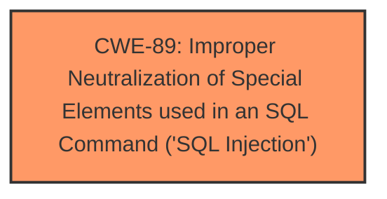

# Analysis Report for CVE-2025-1670

# Vulnerability Analysis Report: CVE-2025-1670

## Description

The School Management System WPSchoolPress plugin for WordPress is vulnerable to SQL Injection via the cid parameter in all versions up to, and including, 2.2.16 due to **insufficient escaping on the user supplied parameter and lack of sufficient preparation on the existing SQL query**. This makes it possible for authenticated attackers, with Custom-level access and above, to append additional SQL queries into already existing queries that can be used to extract sensitive information from the database.

## Vulnerability Description Key Phrases

- **Rootcause:** insufficient escaping on the user supplied parameter and lack of sufficient preparation on the existing SQL query
- **Weakness:** SQL injection
- **Impact:** ["['extract sensitive information from the database'", "'execute SQL queries']"]
- **Attacker:** authenticated attackers
- **Product:** School Management System WPSchoolPress plugin for WordPress
- **Version:** up to and including 2.2.16
- **Component:** cid parameter

## Analysis (with Relationship Data)

# Summary

| CWE ID | CWE Name | Confidence | CWE Abstraction Level | CWE Vulnerability Mapping Label | CWE-Vulnerability Mapping Notes |
|---|---|---|---|---|---|
| CWE-89 | Improper Neutralization of Special Elements used in an SQL Command ('SQL Injection') | 1.0 | Base | Allowed | Primary CWE |

## Evidence and Confidence

*   **Confidence Score:** 1.0
*   **Evidence Strength:** HIGH

## Relationship Analysis
The primary relationship that influenced the selection was the direct match of the vulnerability description to the definition of CWE-89 [CWE-89: Improper Neutralization of Special Elements used in an SQL Command ('SQL Injection')]. No other CWEs were necessary to fully describe this vulnerability.



## Vulnerability Chain
The vulnerability chain consists of:
1.  **Root Cause:** **insufficient escaping on the user supplied parameter and lack of sufficient preparation on the existing SQL query**
2.  **Weakness:** SQL Injection
3.  **Impact:** Attackers can extract sensitive information from the database.

## Summary of Analysis
The vulnerability description clearly indicates an **SQL injection** vulnerability due to **insufficient escaping** and **lack of sufficient preparation** of the SQL query. The description explicitly states this leads to the ability to extract sensitive information.

The retriever results strongly suggest CWE-89 [CWE-89: Improper Neutralization of Special Elements used in an SQL Command ('SQL Injection')], with a score of 1.0. This CWE directly addresses the **improper neutralization of special elements** used in an SQL command, which aligns perfectly with the vulnerability description.

The other CWEs were not selected because they did not accurately represent the **root cause** of the vulnerability. For example, CWE-116 [CWE-116: Improper Encoding or Escaping of Output] is a more general weakness, while CWE-89 [CWE-89: Improper Neutralization of Special Elements used in an SQL Command ('SQL Injection')] is specific to SQL injection.

The selection of CWE-89 [CWE-89: Improper Neutralization of Special Elements used in an SQL Command ('SQL Injection')] is at the optimal level of specificity because it directly addresses the **root cause** of the vulnerability and is a base level CWE.


## CWE Relationship Analysis

Current CWEs represent these abstraction levels: .


### Vulnerability Chain Analysis

**Chain starting from CWE-89:**
- 89 (Improper Neutralization of Special Elements used in an SQL Command ('SQL Injection')) - ROOT


**Chain starting from CWE-116:**
- 116 (Improper Encoding or Escaping of Output) - ROOT


### CWE Relationship Diagram

```mermaid
graph TD
    classDef primary fill:#f96,stroke:#333,stroke-width:2px
    classDef secondary fill:#69f,stroke:#333
    classDef tertiary fill:#9e9,stroke:#333
```


*Report generated on 2025-07-14 07:36:54*
