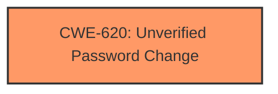

# Enhanced Analysis for CVE-2025-1688

# Summary
| CWE ID | CWE Name | Confidence | CWE Abstraction Level | CWE Vulnerability Mapping Label | CWE-Vulnerability Mapping Notes |
|---|---|---|---|---|---|
| CWE-620 | Unverified Password Change | 0.8 | Base | Primary CWE | Allowed |

## Evidence and Confidence

*   **Confidence Score:** 0.8
*   **Evidence Strength:** LOW

## Relationship Analysis
The primary CWE selected is CWE-620, which is a Base level CWE. There are no direct parent-child or chain relationships that significantly influence the decision given the limited evidence. The other CWEs identified are either too broad or related to different aspects of security vulnerabilities.



## Vulnerability Chain
The vulnerability chain starts with the **incorrect** password reset mechanism during the upgrade process, leading to an **impact** of the system configuration password being reset without proper verification.
  - **ROOT CAUSE:** **Incorrect** password reset mechanism (Implied)
  - **IMPACT:** System configuration password reset without verification

## Summary of Analysis
The analysis is heavily based on the provided vulnerability description, as there is no CVE Reference Links Content Summary to provide detailed evidence of the **root cause** of the weakness. The vulnerability description indicates that the Milestone XProtect installer resets the system configuration password after upgrading from older versions using specific installers.

The Retriever Results suggest CWE-620 as a potential candidate with a relatively high score.

*   **CWE-620 (Unverified Password Change):** The description states that the system configuration password is reset, implying that the password change is not verified. This aligns with the definition of CWE-620: "When setting a new password for a user, the product does not require knowledge of the original password, or using another form of authentication."

Due to the limited evidence, the assessment relies on the vulnerability description and the suggested CWE from the retriever results.

Relevant CWE Information:

# Enhanced Context (25 CWEs)
The following CWEs were identified as potentially relevant to this vulnerability:

## CWE-620: Unverified Password Change
**Abstraction Level**: Base
**Similarity Score**: 0.73
**Source**: dense

**Description**:
When setting a new password for a user, the product does not require knowledge of the original password, or using another form of authentication.

**Mapping Guidance**:
- Usage: Allowed
- Rationale: This CWE entry is at the Base level of abstraction, which is a preferred level of abstraction for mapping to the root causes of vulnerabilities.


## CWE Relationship Analysis

Current CWEs represent these abstraction levels: .


### Vulnerability Chain Analysis

**Chain starting from CWE-620:**
- 620 (Unverified Password Change) - ROOT


### CWE Relationship Diagram

```mermaid
graph TD
    classDef primary fill:#f96,stroke:#333,stroke-width:2px
    classDef secondary fill:#69f,stroke:#333
    classDef tertiary fill:#9e9,stroke:#333
```