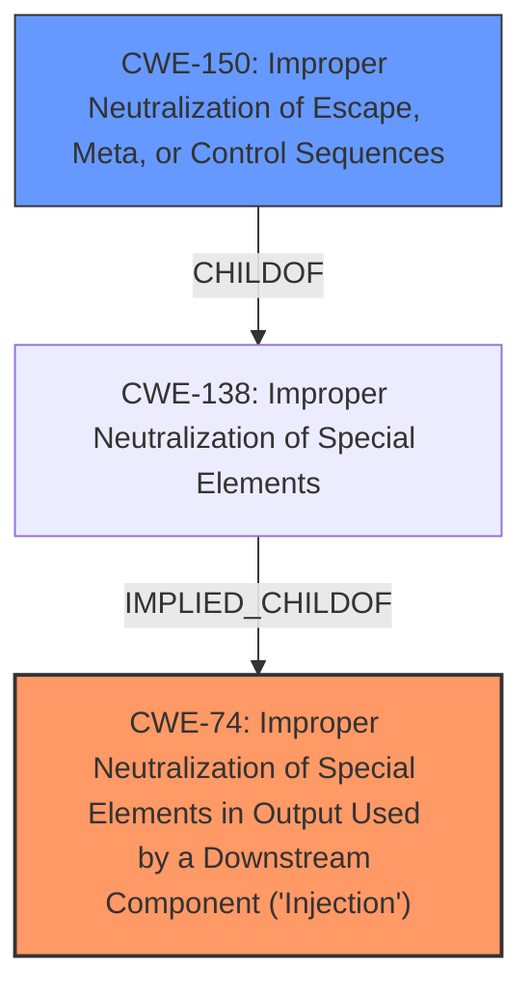

# Analysis for CVE-2025-1691

# Summary
| CWE ID | CWE Name | Confidence | CWE Abstraction Level | CWE Vulnerability Mapping Label | CWE-Vulnerability Mapping Notes |
|---|---|---|---|---|---|
| CWE-74 | Improper Neutralization of Special Elements in Output Used by a Downstream Component ('Injection') | 0.9 | Class | Primary | Allowed-with-Review |
| CWE-150 | Improper Neutralization of Escape, Meta, or Control Sequences | 0.7 | Variant | Secondary | Allowed |

## Evidence and Confidence

*   **Confidence Score:** 0.8
*   **Evidence Strength:** MEDIUM

## Relationship Analysis
The primary weakness is CWE-74, which is a class-level CWE for injection vulnerabilities. A more specific variant CWE considered was CWE-150, which deals with improper neutralization of escape, meta, or control sequences. CWE-150 is a child of CWE-138 (Improper Neutralization of Special Elements), which is a broader class. CWE-74 is a parent of CWE-78 (OS Command Injection) and CWE-89 (SQL Injection), but those are not appropriate here.

## Vulnerability Chain
The vulnerability chain starts with the attacker controlling the `mongosh` autocomplete feature and preparing malicious autocompletion data. The user then triggers the vulnerability by using the 'tab' key. This leads to the injection of **control characters** into the `mongosh` shell, allowing the attacker to run obfuscated malicious text.
  - Root cause: Improper handling of **control characters** in the autocompletion feature, leading to injection.
  - Impact: Execution of obfuscated malicious text.

## Summary of Analysis
The primary weakness is the **control character injection** facilitated by the autocomplete feature in `mongosh`. The vulnerability description and the CVE Reference Links Content Summary indicate that an attacker can inject malicious text through the autocomplete feature, leading to the execution of arbitrary commands.

The CVE Reference Links Content Summary explicitly mentions CWE-74 (Improper Neutralization of Special Elements in Output Used by a Downstream Component ('Injection')).
> Weaknesses/vulnerabilities present:
> *   CWE-74: Improper Neutralization of Special Elements in Output Used by a Downstream Component ('Injection')
> *   Control Character Injection

While the ideal mapping would be to a more specific CWE related to **control character injection**, CWE-74 is the closest match given the information available. CWE-150 is also considered a valid candidate since the vulnerability description mentions the ability to inject and run obfuscated malicious text by leveraging **control characters** which are not properly neutralized.

# Relevant CWE Information:

## CWE-88: Improper Neutralization of Argument Delimiters in a Command ('Argument Injection')
**Abstraction Level**: Base
**Similarity Score**: 0.73
**Source**: dense

**Description**:
The product constructs a string for a command to be executed by a separate component
in another control sphere, but it does not properly delimit the
intended arguments, options, or switches within that command string.

**Mapping Guidance**:
- Usage: Allowed
- Rationale: This CWE entry is at the Base level of abstraction, which is a preferred level of abstraction for mapping to the root causes of vulnerabilities.

**Analysis**:
CWE-88 is about argument injection, but this vulnerability is more general, where it can inject arbitrary malicious text through autocompletion.

## CWE-80: Improper Neutralization of Script-Related HTML Tags in a Web Page (Basic XSS)
**Abstraction Level**: Variant
**Similarity Score**: 0.73
**Source**: dense

**Description**:
The product receives input from an upstream component, but it does not neutralize or incorrectly neutralizes special characters such as "<", ">", and "&" that could be interpreted as web-scripting elements when they are sent to a downstream component that processes web pages.

**Mapping Guidance**:
- Usage: Allowed
- Rationale: This CWE entry is at the Variant level of abstraction, which is a preferred level of abstraction for mapping to the root causes of vulnerabilities.

**Analysis**:
CWE-80 is for XSS, which is not relevant here.

## CWE-93: Improper Neutralization of CRLF Sequences ('CRLF Injection')
**Abstraction Level**: Base
**Similarity Score**: 0.72
**Source**: dense

**Description**:
The product uses CRLF (carriage return line feeds) as a special element, e.g. to separate lines or records, but it does not neutralize or incorrectly neutralizes CRLF sequences from inputs.

**Mapping Guidance**:
- Usage: Allowed
- Rationale: This CWE entry is at the Base level of abstraction, which is a preferred level of abstraction for mapping to the root causes of vulnerabilities.

**Analysis**:
CWE-93 is for CRLF injection, which is not relevant here.

## CWE-138: Improper Neutralization of Special Elements
**Abstraction Level**: Class
**Similarity Score**: 0.72
**Source**: dense

**Description**:
The product receives input from an upstream component, but it does not neutralize or incorrectly neutralizes special elements that could be interpreted as control elements or syntactic markers when they are sent to a downstream component.

**Mapping Guidance**:
- Usage: Discouraged
- Rationale: This CWE entry is a level-1 Class (i.e., a child of a Pillar). It might have lower-level children that would be more appropriate

**Analysis**:
CWE-138 is too broad and lacks specificity.

## CWE-74: Improper Neutralization of Special Elements in Output Used by a Downstream Component ('Injection')
**Abstraction Level**: Class
**Similarity Score**: 0.72
**Source**: dense

**Description**:
The product constructs all or part of a command, data structure, or record using externally-influenced input from an upstream component, but it does not neutralize or incorrectly neutralizes special elements that could modify how it is parsed or interpreted when it is sent to a downstream component.

**Mapping Guidance**:
- Usage: Discouraged
- Rationale: CWE-74 is high-level and often misused when lower-level weaknesses are more appropriate.

**Analysis**:
CWE-74 is a good candidate, as it deals with **improper neutralization** leading to injection.

## CWE-212: Improper Removal of Sensitive Information Before Storage or Transfer
**Abstraction Level**: Base
**Similarity Score**: 0.71
**Source**: dense

**Description**:
The product stores, transfers, or shares a resource that contains sensitive information, but it does not properly remove that information before the product makes the resource available to unauthorized actors.

**Mapping Guidance**:
- Usage: Allowed
- Rationale: This CWE entry is at the Base level of abstraction, which is a preferred level of abstraction for mapping to the root causes of vulnerabilities.

**Analysis**:
CWE-212 is not relevant here.

## CWE-116: Improper Encoding or Escaping of Output
**Abstraction Level**: Class
**Similarity Score**: 0.71
**Source**: dense

**Description**:
The product prepares a structured message for communication with another component, but encoding or escaping of the data is either missing or done incorrectly. As a result, the intended structure of the message is not preserved.

**Mapping Guidance**:
- Usage: Allowed-with-Review
- Rationale: This CWE entry is a Class and might have Base-level children that would be more appropriate

**Analysis**:
CWE-116 is about encoding/escaping issues, not directly relevant to the **control character injection** described.

## CWE-1286: Improper Validation of Syntactic Correctness of Input
**Abstraction Level**: Base
**Similarity Score**: 0.70
**Source**: dense

**Description**:
The product receives input that is expected to be well-formed - i.e., to comply with a certain syntax - but it does not validate or incorrectly validates that the input complies with the syntax.

**Mapping Guidance**:
- Usage: Allowed
- Rationale: This CWE entry is at the Base level of abstraction, which is a preferred level of abstraction for mapping to the root causes of vulnerabilities.

**Analysis**:
CWE-1286 could be related, but the core issue is the **improper neutralization**, not necessarily the lack of syntactic validation.

## CWE-79: Improper Neutralization of Input During Web Page Generation ('Cross-site Scripting')
**Abstraction Level**: Base
**Similarity Score**: 0.70
**Source**: dense

**Description