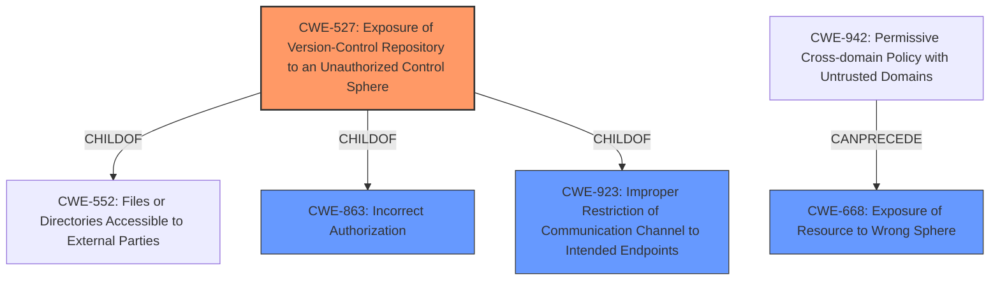

# Analysis for CVE-2025-1767

# Summary
| CWE ID | CWE Name | Confidence | CWE Abstraction Level | CWE Vulnerability Mapping Label | CWE-Vulnerability Mapping Notes |
|---|---|---|---|---|---|
| CWE-527 | Exposure of Version-Control Repository to an Unauthorized Control Sphere | 0.8 | Variant | Allowed | Primary CWE |
| CWE-668 | Exposure of Resource to Wrong Sphere | 0.6 | Class | Discouraged | Secondary Candidate |
| CWE-863 | Incorrect Authorization | 0.5 | Class | Allowed-with-Review | Secondary Candidate |

## Evidence and Confidence

*   **Confidence Score:** 0.8
*   **Evidence Strength:** MEDIUM

## Relationship Analysis
The primary relationship influencing the selection was the ChildOf relationship between CWE-527 and CWE-552 (Files or Directories Accessible to External Parties), indicating that exposure of a version control repository is a specific type of file/directory exposure. Additionally, the CanPrecede relationship between CWE-942 and CWE-668 highlights a potential chain where a permissive cross-domain policy could lead to exposure of resources to the wrong sphere. The abstraction levels guided the selection towards the more specific Variant (CWE-527) over the broader Class (CWE-668).

## Vulnerability Chain
The vulnerability chain starts with the **in-tree gitRepo volume** feature which allows pods to clone git repositories from other pods on the same node. A user with "create pod" permission can then exploit this by gaining access to local git repositories belonging to other pods. This leads to **Exposure of Version-Control Repository to an Unauthorized Control Sphere (CWE-527)**. The root cause is the permissive configuration of the gitRepo volume, and the impact is unauthorized access to version control data.

## Summary of Analysis
The analysis is primarily based on the provided CVE description and the "CVE Reference Links Content Summary". The description clearly states that the vulnerability involves unauthorized access to git repositories due to the in-tree gitRepo volume feature.

The most relevant CWE is **CWE-527: Exposure of Version-Control Repository to an Unauthorized Control Sphere**. This CWE directly addresses the core issue: a user with create pod permission can access local git repositories belonging to other pods on the same node. The retriever identified this CWE as a good candidate. The description of CWE-527 precisely matches the vulnerability: a version-control repository (the git repository) is exposed to an unauthorized control sphere (a pod with create permissions).

CWE-668 was considered but deemed less specific. While the vulnerability does involve exposing a resource to the wrong sphere, CWE-527 more accurately describes *what* resource is being exposed (a version control repository). According to the mapping guidance, CWE-668 is discouraged, and child elements are preferred.

CWE-863 (Incorrect Authorization) was also considered. The vulnerability arises from the fact that the "create pod" permission, in conjunction with the gitRepo volume feature, allows unintended access. However, CWE-527 focuses more on what is being exposed, not the specific authorization flaw.

The provided mitigations (using init containers, restricting gitRepo volumes) further support the mapping to CWE-527, as they are designed to prevent unauthorized access to the git repositories.

Relevant CWE Information:

# Enhanced Context (25 CWEs)
The following CWEs were identified as potentially relevant to this vulnerability:

## CWE-88: Improper Neutralization of Argument Delimiters in a Command ('Argument Injection')
**Abstraction Level**: Base
**Similarity Score**: 0.74
**Source**: dense

**Description**:
The product constructs a string for a command to be executed by a separate component
in another control sphere, but it does not properly delimit the
intended arguments, options, or switches within that command string.

**Mapping Guidance**:
- Usage: Allowed
- Rationale: This CWE entry is at the Base level of abstraction, which is a preferred level of abstraction for mapping to the root causes of vulnerabilities.

*Not selected*: Not related to the description.

## CWE-212: Improper Removal of Sensitive Information Before Storage or Transfer
**Abstraction Level**: Base
**Similarity Score**: 0.73
**Source**: dense

**Description**:
The product stores, transfers, or shares a resource that contains sensitive information, but it does not properly remove that information before the product makes the resource available to unauthorized actors.

**Mapping Guidance**:
- Usage: Allowed
- Rationale: This CWE entry is at the Base level of abstraction, which is a preferred level of abstraction for mapping to the root causes of vulnerabilities.

*Not selected*: Not related to the description.

## CWE-1286: Improper Validation of Syntactic Correctness of Input
**Abstraction Level**: Base
**Similarity Score**: 0.71
**Source**: dense

**Description**:
The product receives input that is expected to be well-formed - i.e., to comply with a certain syntax - but it does not validate or incorrectly validates that the input complies with the syntax.

**Mapping Guidance**:
- Usage: Allowed
- Rationale: This CWE entry is at the Base level of abstraction, which is a preferred level of abstraction for mapping to the root causes of vulnerabilities.

*Not selected*: Not related to the description.

## CWE-538: Insertion of Sensitive Information into Externally-Accessible File or Directory
**Abstraction Level**: Base
**Similarity Score**: 0.71
**Source**: dense

**Description**:
The product places sensitive information into files or directories that are accessible to actors who are allowed to have access to the files, but not to the sensitive information.

**Mapping Guidance**:
- Usage: Allowed
- Rationale: This CWE entry is at the Base level of abstraction, which is a preferred level of abstraction for mapping to the root causes of vulnerabilities.

*Not selected*: Not related to the description.

## CWE-497: Exposure of Sensitive System Information to an Unauthorized Control Sphere
**Abstraction Level**: Base
**Similarity Score**: 0.71
**Source**: dense

**Description**:
The product does not properly prevent sensitive system-level information from being accessed by unauthorized actors who do not have the same level of access to the underlying system as the product does.

**Mapping Guidance**:
- Usage: Allowed
- Rationale: This CWE entry is at the Base level of abstraction, which is a preferred level of abstraction for mapping to the root causes of vulnerabilities.

*Not selected*: Not related to the description.

## CWE-267: Privilege Defined With Unsafe Actions
**Abstraction Level**: Base
**Similarity Score**: 0.70
**Source**: dense

**Description**:
A particular privilege, role, capability, or right can be used to perform unsafe actions that were not intended, even when it is assigned to the correct entity.

**Mapping Guidance**:
- Usage: Allowed
- Rationale: This CWE entry is at the Base level of abstraction, which is a preferred level of abstraction for mapping to the root causes of vulnerabilities.

*Not selected*: Not related to the description.

## CWE-532: Insertion of Sensitive Information into Log File
**Abstraction Level**: Base
**Similarity Score**: 0.70
**Source**: dense

**Description**:
The product writes sensitive information to a log file.

**Mapping Guidance**:
- Usage: Allowed
- Rationale: This CWE entry is at the Base level of abstraction, which is a preferred level of abstraction for mapping to the root causes of vulnerabilities.

*Not selected*: Not related to the description.

## CWE-923: Improper Restriction of Communication Channel to Intended Endpoints
**Abstraction Level**: Class
**Similarity Score**: 0.70
**Source**: dense

**Description**:
The product establishes a communication channel to (or from) an endpoint for privileged or protected operations, but it does not properly ensure that it is communicating with the correct endpoint.

**Mapping Guidance**:
- Usage: Allowed-with-Review
- Rationale: This CWE entry is a Class and might