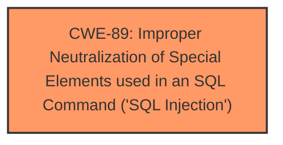

# Analysis for CVE-2025-1797

# Summary
| CWE ID | CWE Name | Confidence | CWE Abstraction Level | CWE Vulnerability Mapping Label | CWE-Vulnerability Mapping Notes |
|---|---|---|---|---|---|
| CWE-89 | Improper Neutralization of Special Elements used in an SQL Command ('SQL Injection') | 1.0 | Base | Allowed | Primary CWE. The vulnerability description explicitly mentions SQL injection. |

## Evidence and Confidence

*   **Confidence Score:** 1.0
*   **Evidence Strength:** HIGH

## Relationship Analysis
The primary identified CWE is CWE-89, which stands alone without any need for parent-child or chain relationships based on the current evidence. It is a Base level CWE, which is the preferred level of abstraction.

## Vulnerability Chain
The vulnerability chain consists of:
1.  **Root Cause:** CWE-89 - Improper Neutralization of Special Elements used in an SQL Command ('SQL Injection'). The **SQL injection** is due to the **improper neutralization** of the `huid` argument.
2.  **Impact:** Remote attackers can manipulate the SQL query, potentially leading to unauthorized data access, modification, or deletion.

## Summary of Analysis
The vulnerability description clearly states that the manipulation of the `huid` argument leads to **SQL injection** in the `/wuser/anyUserBoundHouse.php` file. The retriever results also strongly suggest CWE-89 as the most appropriate mapping.

The decision is based on the explicit mention of "sql injection" in the vulnerability description.

Relevant CWE Information:

# Enhanced Context (25 CWEs)
## CWE-89: Improper Neutralization of Special Elements used in an SQL Command ('SQL Injection')
**Abstraction Level**: Base
**Similarity Score**: 0.75
**Source**: dense

**Description**:
The product constructs all or part of an SQL command using externally-influenced input from an upstream component, but it does not neutralize or incorrectly neutralizes special elements that could modify the intended SQL command when it is sent to a downstream component. Without sufficient removal or quoting of SQL syntax in user-controllable inputs, the generated SQL query can cause those inputs to be interpreted as SQL instead of ordinary user data.

**Mapping Guidance**:
- Usage: Allowed
- Rationale: This CWE entry is at the Base level of abstraction, which is a preferred level of abstraction for mapping to the root causes of vulnerabilities.

### Not Used:
*   CWE-79: Improper Neutralization of Input During Web Page Generation ('Cross-site Scripting') - This is not relevant as the vulnerability is specifically an **SQL Injection**, not a Cross-site Scripting issue.
*   CWE-434: Unrestricted Upload of File with Dangerous Type - This is not relevant as the vulnerability is specifically an **SQL Injection**, not an unrestricted file upload.
*   CWE-74: Improper Neutralization of Special Elements in Output Used by a Downstream Component ('Injection') - This is a high-level CWE and CWE-89 is a more specific, better fit.
*   CWE-73: External Control of File Name or Path - This is not relevant as the vulnerability is specifically an **SQL Injection**, not related to file path manipulation.