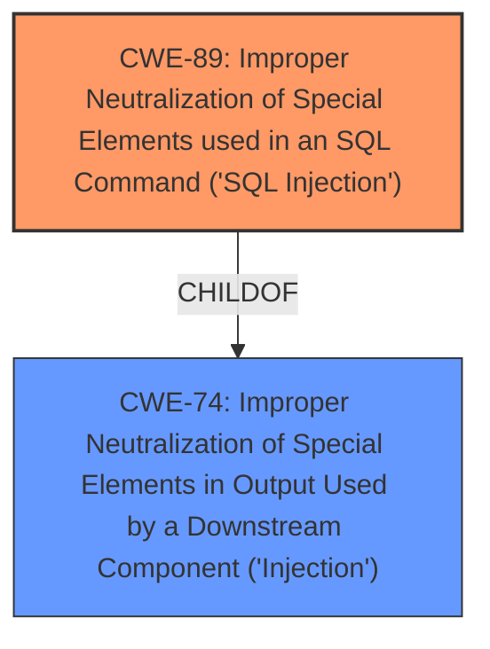

# Raw Analyzer Response for CVE-2025-1811

# Summary
| CWE ID | CWE Name | Confidence | CWE Abstraction Level | CWE Vulnerability Mapping Label | CWE-Vulnerability Mapping Notes |
|---|---|---|---|---|---|
| CWE-89 | Improper Neutralization of Special Elements used in an SQL Command ('SQL Injection') | 1.0 | Base | Allowed | Primary CWE. The vulnerability description explicitly states that the manipulation of the argument txtUsuario leads to **sql injection**. |

## Evidence and Confidence

*   **Confidence Score:** 1.0
*   **Evidence Strength:** HIGH

## Relationship Analysis
The primary relationship that impacts the decision is that CWE-89 is a base CWE, providing a good level of specificity for the identified vulnerability, and it's a child of the class CWE-74 (Improper Neutralization of Special Elements in Output Used by a Downstream Component ('Injection')). No other relationships significantly altered the decision, as the description clearly points to SQL Injection.

## Vulnerability Chain
The vulnerability chain consists of the following:
1.  The product **/login.aspx** endpoint receives input via the **txtUsuario** argument.
2.  The product **fails to properly neutralize special elements** in this input.
3.  An attacker injects SQL commands via the **txtUsuario** argument (**SQL Injection**).

The root cause is the **improper neutralization**, leading to the impact of SQL Injection.

## Summary of Analysis
The initial analysis and the retriever results both strongly suggest CWE-89 as the primary weakness. The vulnerability description explicitly mentions **"sql injection"** due to the manipulation of the **txtUsuario** argument in **/login.aspx**, providing strong evidence. The retriever results also list CWE-89 as the top candidate with a score of 1.0.

The graph relationships support the selection of CWE-89, as it is a base-level CWE, providing sufficient specificity.

The selected CWE, CWE-89, is at the optimal level of specificity because it directly addresses the root cause of the vulnerability: the **improper neutralization** of special elements leading to SQL injection.

Relevant CWE Information:

# Enhanced Context (25 CWEs)
The following CWEs were identified as potentially relevant to this vulnerability:

## CWE-303: Incorrect Implementation of Authentication Algorithm
**Abstraction Level**: Base
**Similarity Score**: 0.75
**Source**: dense

**Description**:
The requirements for the product dictate the use of an established authentication algorithm, but the implementation of the algorithm is incorrect.
- *Reason for not using*: While authentication is involved in the /login.aspx endpoint, the vulnerability is specifically SQL Injection, not an authentication algorithm implementation issue.

## CWE-89: Improper Neutralization of Special Elements used in an SQL Command ('SQL Injection')
**Abstraction Level**: Base
**Similarity Score**: 0.75
**Source**: dense

**Description**:
The product constructs all or part of an SQL command using externally-influenced input from an upstream component, but it does not neutralize or incorrectly neutralizes special elements that could modify the intended SQL command when it is sent to a downstream component. Without sufficient removal or quoting of SQL syntax in user-controllable inputs, the generated SQL query can cause those inputs to be interpreted as SQL instead of ordinary user data.
- *Reason for using*: Matches the provided information about **SQL injection** in the login functionality.

## CWE-80: Improper Neutralization of Script-Related HTML Tags in a Web Page (Basic XSS)
**Abstraction Level**: Variant
**Similarity Score**: 0.74
**Source**: dense

**Description**:
The product receives input from an upstream component, but it does not neutralize or incorrectly neutralizes special characters such as "<", ">", and "&" that could be interpreted as web-scripting elements when they are sent to a downstream component that processes web pages.
- *Reason for not using*: The vulnerability description does not provide any information about Cross-Site Scripting (XSS).

## CWE-472: External Control of Assumed-Immutable Web Parameter
**Abstraction Level**: Base
**Similarity Score**: 0.73
**Source**: dense

**Description**:
The web application does not sufficiently verify inputs that are assumed to be immutable but are actually externally controllable, such as hidden form fields.
- *Reason for not using*: The vulnerability description doesn't specify reliance on immutable web parameters.

## CWE-79: Improper Neutralization of Input During Web Page Generation ('Cross-site Scripting')
**Abstraction Level**: Base
**Similarity Score**: 0.73
**Source**: dense

**Description**:
The product does not neutralize or incorrectly neutralizes user-controllable input before it is placed in output that is used as a web page that is served to other users.
- *Reason for not using*: The vulnerability description does not provide any information about Cross-Site Scripting (XSS).

## CWE-425: Direct Request ('Forced Browsing')
**Abstraction Level**: Base
**Similarity Score**: 0.73
**Source**: dense

**Description**:
The web application does not adequately enforce appropriate authorization on all restricted URLs, scripts, or files.
- *Reason for not using*: This vulnerability is not about unauthorized access to resources, but about SQL injection.

## CWE-294: Authentication Bypass by Capture-replay
**Abstraction Level**: Base
**Similarity Score**: 0.72
**Source**: dense

**Description**:
A capture-replay flaw exists when the design of the product makes it possible for a malicious user to sniff network traffic and bypass authentication by replaying it to the server in question to the same effect as the original message (or with minor changes).
- *Reason for not using*: This vulnerability is not about bypassing authentication by replaying captured traffic.

## CWE-434: Unrestricted Upload of File with Dangerous Type
**Abstraction Level**: Base
**Similarity Score**: 0.72
**Source**: dense

**Description**:
The product allows the upload or transfer of dangerous file types that are automatically processed within its environment.
- *Reason for not using*: There is no file upload functionality mentioned in the vulnerability description.

## CWE-790: Improper Filtering of Special Elements
**Abstraction Level**: Class
**Similarity Score**: 0.72
**Source**: dense

**Description**:
The product receives data from an upstream component, but does not filter or incorrectly filters special elements before sending it to a downstream component.
- *Reason for not using*: While this is related, CWE-89 is more specific to SQL injection.

## CWE-74: Improper Neutralization of Special Elements in Output Used by a Downstream Component ('Injection')
**Abstraction Level**: Class
**Similarity Score**: 0.72
**Source**: dense

**Description**:
The product constructs all or part of a command, data structure, or record using externally-influenced input from an upstream component, but it does not neutralize or incorrectly neutralizes special elements that could modify how it is parsed or interpreted when it is sent to a downstream component.
- *Reason for not using*: While CWE-74 is a parent of CWE-89, CWE-89 is the better, more specific fit.

## CWE-89: Improper Neutralization of Special Elements used in an SQL Command ('SQL Injection')
**Abstraction Level**: Base
**Similarity Score**: 620.55
**Source**: sparse

**Description**:
The product constructs all or part of an SQL command using externally-influenced input from an upstream component, but it does not neutralize or incorrectly neutralizes special elements that could modify the intended SQL command when it is sent to a downstream component. Without sufficient removal or quoting of SQL syntax in user-controllable inputs, the generated SQL query can cause those inputs to be interpreted as SQL instead of ordinary user data.
- *Reason for using*: As mentioned before, the vulnerability is **SQL injection**.

## CWE-79: Improper Neutralization of Input During Web Page Generation ('Cross-site Scripting')
**Abstraction Level**: Base
**Similarity Score**: 593.02
**Source**: sparse

**Description**:
The product does not neutralize or incorrectly neutralizes user-controllable input before it is placed in output that is used as a web page that is served to other users.
- *Reason for not using*: The description explicitly states **SQL injection**, not XSS.

## CWE-80: Improper Neutralization of Script-Related HTML Tags in a Web Page (Basic XSS)
**Abstraction Level**: Variant
**Similarity Score**: 576.79
**Source**: sparse

**Description**:
The product receives input from an upstream component, but it does not neutralize or incorrectly neutralizes special characters such as "<", ">", and "&" that could