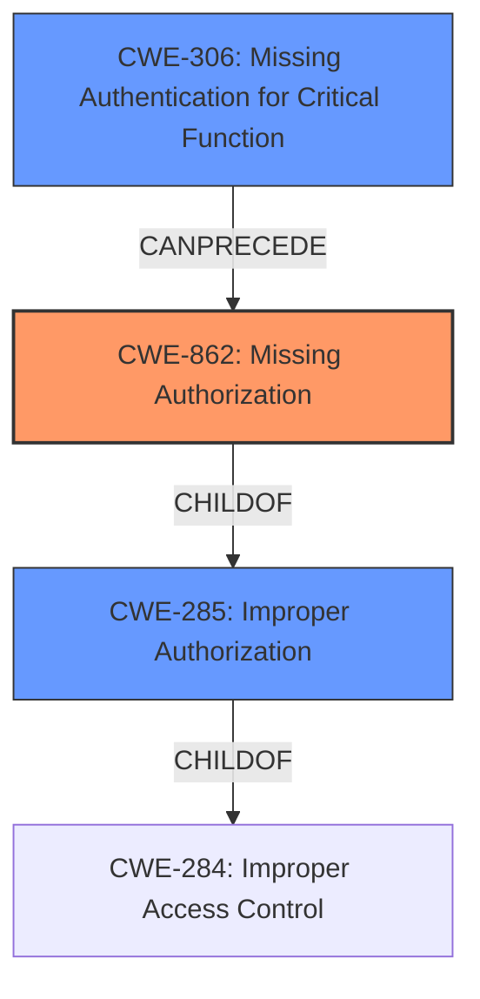

# Analysis for CVE-2025-1815

# Summary
| CWE ID  | CWE Name                                                                    | Confidence | CWE Abstraction Level | CWE Vulnerability Mapping Label | CWE-Vulnerability Mapping Notes |
| :-------- | :-------------------------------------------------------------------------- | :--------- | :-------------------- | :------------------------------ | :-------------------------------- |
| CWE-862   | Missing Authorization                                                       | 0.9        | Class                 | Primary CWE                     | Allowed-with-Review               |
| CWE-306   | Missing Authentication for Critical Function                                | 0.6        | Base                  | Secondary Candidate             | Allowed                           |
| CWE-285   | Improper Authorization                                                      | 0.5        | Class                 | Secondary Candidate             | Discouraged                       |

## Evidence and Confidence

*   **Confidence Score:** 0.8
*   **Evidence Strength:** HIGH

## Relationship Analysis

The primary CWE is CWE-862 (Missing Authorization). This is a class-level CWE. The analysis also considered CWE-306 (Missing Authentication for Critical Function) and CWE-285 (Improper Authorization). CWE-862 is chosen because the vulnerability description indicates an authorization issue, where the system fails to check if the user has the necessary permissions to perform an action after authentication. If no authentication is present, CWE-306 would be more applicable. CWE-285 is a more general term that is discouraged for use when a more specific CWE is available.

## Vulnerability Chain

The vulnerability chain starts with the **improper authorization**, specifically a **missing authorization** check. This leads to unauthorized access to user information. The root cause is the **missing authorization** in the HrmsDB function when handling the 'user\_cookie' argument.

## Summary of Analysis

The initial analysis focused on identifying the root cause of the vulnerability. The vulnerability description and CVE reference links clearly indicate that the vulnerability stems from an **improper authorization** issue. The system **fails to properly verify permissions** during database queries, allowing attackers to bypass authorization checks by manipulating the 'user\_cookie' argument.

The key evidence supporting this classification comes from the **Vulnerability Description Key Phrases**, which identifies **improper authorization** as the root cause. The **CVE Reference Links Content Summary** provides further details, stating that the **vulnerability stems from a flaw in the system's permission verification during database queries**.

Given this evidence, CWE-862 (Missing Authorization) is the most appropriate primary CWE. It accurately describes the core weakness: the product does not perform an authorization check when an actor attempts to access a resource or perform an action.

CWE-306 was considered because if no authentication was implemented, then this would be the case. There is no evidence of that here.

CWE-285 (Improper Authorization) was also considered but is a more general class. Since the vulnerability specifically involves **missing authorization**, CWE-862 is more precise.

The choice of CWE-862 is at the optimal level of specificity because it directly addresses the **missing authorization** check, which is the root cause of the vulnerability. The relationship analysis highlights that CWE-862 is a child of CWE-285, making it a more specific and appropriate choice. The MITRE mapping guidance also suggests using more specific child CWEs when available.