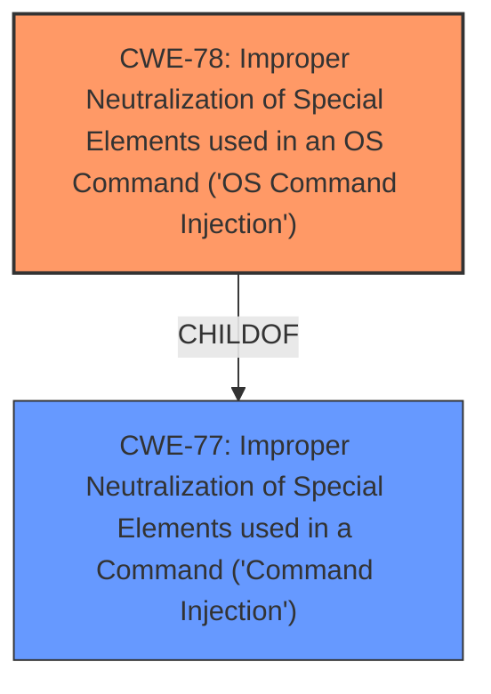

# Raw Analyzer Response for CVE-2025-1819

# Summary
| CWE ID | CWE Name | Confidence | CWE Abstraction Level | CWE Vulnerability Mapping Label | CWE-Vulnerability Mapping Notes |
|---|---|---|---|---|---|
| CWE-78 | Improper Neutralization of Special Elements used in an OS Command ('OS Command Injection') | 1.0 | Base | Allowed | Primary CWE. The vulnerability description explicitly states "**os command injection**" due to manipulation of the argument lan_ip in the TendaTelnet function. |

## Evidence and Confidence

*   **Confidence Score:** 1.0
*   **Evidence Strength:** HIGH

## Relationship Analysis
The primary relationship that influenced the decision was the direct match of the vulnerability description's "**os command injection**" to CWE-78. While other CWEs such as CWE-77 (Improper Neutralization of Special Elements used in a Command ('Command Injection')) were considered, CWE-78 is more specific and therefore more appropriate.

## Vulnerability Chain
The vulnerability chain is straightforward:

1.  **Root Cause:** Improper neutralization of special elements in the `lan_ip` argument within the `TendaTelnet` function. (CWE-78)
2.  **Impact:** Remote attackers can inject OS commands.

## Summary of Analysis
The vulnerability description clearly indicates "**os command injection**" as the root cause due to the **improper handling of the `lan_ip` argument** in the `TendaTelnet` function. This maps directly to CWE-78, which describes the **improper neutralization of special elements used in an OS command**. The retriever results strongly support this with a score of 1.0 for CWE-78 using alternate terms. The relationship analysis confirms that while CWE-77 is a parent, CWE-78 is more specific and accurately reflects the nature of the vulnerability. The evidence is strong and directly supports the selection of CWE-78 as the primary weakness.

Relevant CWE Information:

# Enhanced Context (25 CWEs)
The following CWEs were identified as potentially relevant to this vulnerability:

## CWE-78: Improper Neutralization of Special Elements used in an OS Command ('OS Command Injection')
**Abstraction Level**: Base
**Similarity Score**: 0.75
**Source**: dense

**Description**:
The product constructs all or part of an OS command using externally-influenced input from an upstream component, but it does not neutralize or incorrectly neutralizes special elements that could modify the intended OS command when it is sent to a downstream component.

**Mapping Guidance**:
- Usage: Allowed
- Rationale: This CWE entry is at the Base level of abstraction, which is a preferred level of abstraction for mapping to the root causes of vulnerabilities.

## CWE-77: Improper Neutralization of Special Elements used in a Command ('Command Injection')
**Abstraction Level**: Class
**Similarity Score**: 0.80
**Source**: alternate_terms

**Description**:
The product constructs all or part of a command using externally-influenced input from an upstream component, but it does not neutralize or incorrectly neutralizes special elements that could modify the intended command when it is sent to a downstream component. The command is interpreted as a command by the operating system (OS).

**Mapping Guidance**:
- Usage: Allowed-with-Review
- Rationale: This CWE entry is a Class and might have Base-level children that would be more appropriate

### Other CWEs Considered and Rejected:

*   **CWE-77:** While related to command injection, it's a broader category. CWE-78 is more specific to OS command injection, aligning perfectly with the vulnerability description.
*   **CWE-89, CWE-79, CWE-1336, CWE-93:** These relate to SQL Injection, Cross-Site Scripting, Template Injection and CRLF Injection respectively. These are not applicable as the vulnerability is specifically an OS command injection.
*   **CWE-259:** This relates to hardcoded passwords, which isn't mentioned in the vulnerability.
*   **CWE-184:** This relates to an incomplete list of disallowed inputs, but the primary issue here is the lack of proper neutralization, not the incompleteness of a blacklist.