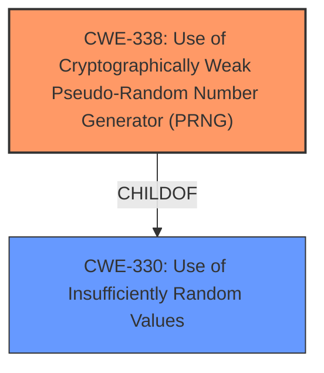

# Enhanced Analysis for CVE-2025-1828

# Summary
| CWE ID | CWE Name | Confidence | CWE Abstraction Level | CWE Vulnerability Mapping Label | CWE-Vulnerability Mapping Notes |
|---|---|---|---|---|---|
| CWE-338 | Use of Cryptographically Weak Pseudo-Random Number Generator (PRNG) | 0.9 | Base | Primary CWE | Allowed |
| CWE-330 | Use of Insufficiently Random Values | 0.7 | Class | Secondary Candidate | Discouraged |

## Evidence and Confidence

*   **Confidence Score:** 0.9
*   **Evidence Strength:** HIGH

## Relationship Analysis
The primary CWE is CWE-338 which is a child of CWE-330. Choosing CWE-338 provides a more specific classification than its parent.



## Vulnerability Chain
The vulnerability chain starts with the **use of rand() function** which is **insecure CryptRandomrand provider**. This results in the use of a cryptographically weak PRNG.

## Summary of Analysis
The analysis is based on the provided vulnerability description and CVE reference content. The description explicitly mentions the **use of rand() function**, which is not cryptographically strong, leading to the selection of CWE-338. The CVE reference confirms this by stating the root cause is the use of a non-cryptographically secure random number generator. This evidence supports the choice of CWE-338 as the primary weakness. The retriever results also list CWE-338 with a high score, further validating the choice. CWE-338 is at the Base level of abstraction, which is preferred.

Relevant CWE Information:

# Enhanced Context (25 CWEs)
The following CWEs were identified as potentially relevant to this vulnerability:

## CWE-338: Use of Cryptographically Weak Pseudo-Random Number Generator (PRNG)
**Abstraction Level**: Base
**Similarity Score**: 0.83
**Source**: dense

**Description**:
The product uses a Pseudo-Random Number Generator (PRNG) in a security context, but the PRNG's algorithm is not cryptographically strong.

**Mapping Guidance**:
- Usage: Allowed
- Rationale: This CWE entry is at the Base level of abstraction, which is a preferred level of abstraction for mapping to the root causes of vulnerabilities.

**Relationships**:
- CHILDOF -> CWE-330
- CHILDOF -> CWE-330
- PARENTOF -> CWE-338

## CWE-330: Use of Insufficiently Random Values
**Abstraction Level**: Class
**Similarity Score**: 0.80
**Source**: dense

**Description**:
The product uses insufficiently random numbers or values in a security context that depends on unpredictable numbers.

**Mapping Guidance**:
- Usage: Discouraged
- Rationale: This CWE entry is a level-1 Class (i.e., a child of a Pillar). It might have lower-level children that would be more appropriate

**Relationships**:
- PARENTOF -> CWE-804
- CHILDOF -> CWE-1390
- CHILDOF -> CWE-863
- CHILDOF -> CWE-331
- CHILDOF -> CWE-331
- CHILDOF -> CWE-335
- CHILDOF -> CWE-335
- CHILDOF -> CWE-338
- CHILDOF -> CWE-338
- CHILDOF -> CWE-1204
- CHILDOF -> CWE-1204
- PARENTOF -> CWE-330
- PARENTOF -> CWE-330

### Detailed Analysis of Selected CWEs:

*   **CWE-338: Use of Cryptographically Weak Pseudo-Random Number Generator (PRNG)**
    *   **Explanation:** The vulnerability description explicitly states that the `rand()` function, used by the CryptRandom Perl package, is not cryptographically strong. This directly aligns with the definition of CWE-338, which focuses on the use of PRNGs that are inadequate for security-sensitive contexts.
    *   **Security Implications:** Using a weak PRNG can lead to predictable or biased random numbers, compromising cryptographic operations that rely on randomness. This can result in weakened encryption, predictable keys, and potential compromise of security protocols.
    *   **Relationships:** CWE-338 is a child of CWE-330 (Use of Insufficiently Random Values). While CWE-330 is more general, CWE-338 is more specific because it explicitly refers to cryptographic contexts and PRNGs.
    *   **Mapping Guidance:** The mapping guidance for CWE-338 allows its use, and the rationale states that it is at the Base level of abstraction.
    *   **Evidence:** "CryptRandom Perl package 1.05 through 1.55 may use rand() function, which is not cryptographically strong, for cryptographic functions."
    *   **Confidence:** 0.9

*   **CWE-330: Use of Insufficiently Random Values**
    *   **Explanation:** This CWE broadly covers the use of values that are not random enough for their intended purpose. While the primary issue is the use of a cryptographically weak PRNG, CWE-330 could be considered as a broader categorization.
    *   **Security Implications:** If random values are predictable, attackers can potentially bypass security mechanisms that rely on unpredictability, such as generating session IDs, nonces, or salts.
    *   **Relationships:** CWE-330 is a parent of CWE-338.
    *   **Mapping Guidance:** The mapping guidance for CWE-330 discourages its use directly because it might have more specific children.
    *   **Evidence:** The problem is the **use of rand() function** for cryptographic functions, so the the random values are not sufficiently random.
    *   **Confidence:** 0.7

### CWEs Considered but Not Used:

*   **CWE-335: Incorrect Usage of Seeds in Pseudo-Random Number Generator (PRNG):** While the vulnerability involves a PRNG, there is no specific mention of incorrect seed usage. The primary issue is the weakness of the `rand()` function itself, not how it's seeded.
*   **CWE-1204: Generation of Weak Initialization Vector (IV):** The vulnerability description does not mention initialization vectors directly. While a weak PRNG *could* lead to weak IVs, the description focuses on the PRNG itself, not its specific application to IV generation.
*   **CWE-327: Use of a Broken or Risky Cryptographic Algorithm:** This is too broad. The specific issue is the PRNG, not a general cryptographic algorithm.
*   **CWE-1391: Use of Weak Credentials:** Not relevant as the vulnerability doesn't involve credentials.
*   **CWE-347: Improper Verification of Cryptographic Signature:** Not relevant as the vulnerability doesn't involve cryptographic signatures.
*   **CWE-95: Improper Neutralization of Directives in Dynamically Evaluated Code ('Eval Injection'):** Not relevant.
*   **CWE-1241: Use of Predictable Algorithm in Random Number Generator:** This is similar to CWE-338, but CWE-338 is more specific to *cryptographically weak* PRNGs.
*   **CWE-208: Observable Timing Discrepancy:** Not relevant.


## CWE Relationship Analysis

Current CWEs represent these abstraction levels: .


### Vulnerability Chain Analysis

**Chain starting from CWE-1390:**
- 1390 (Weak Authentication) - ROOT


**Chain starting from CWE-863:**
- 863 (Incorrect Authorization) - ROOT


### CWE Relationship Diagram

```mermaid
graph TD
    classDef primary fill:#f96,stroke:#333,stroke-width:2px
    classDef secondary fill:#69f,stroke:#333
    classDef tertiary fill:#9e9,stroke:#333
```