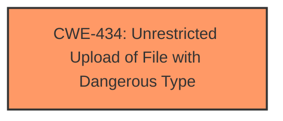

# Raw Analyzer Response for CVE-2025-1834

# Summary

| CWE ID | CWE Name | Confidence | CWE Abstraction Level | CWE Vulnerability Mapping Label | CWE-Vulnerability Mapping Notes |
|---|---|---|---|---|---|
| CWE-434 | Unrestricted Upload of File with Dangerous Type | 1.0 | Base | Allowed | Primary CWE |

## Evidence and Confidence

*   **Confidence Score:** 1.0
*   **Evidence Strength:** HIGH

## Relationship Analysis

The primary relationship considered was the direct match of the vulnerability description to the definition of CWE-434. No other relationships significantly influenced the selection.

## Vulnerability Chain

The vulnerability chain is direct: **Unrestricted Upload** (CWE-434) leads to potential remote code execution and system compromise.

## Summary of Analysis

The analysis is based on the provided evidence, specifically the vulnerability description mentioning "**unrestricted upload**". This directly aligns with the definition of CWE-434. The retriever results also listed CWE-434 as a highly relevant candidate. This vulnerability involves a critical function in `/resolve` that is affected by the manipulation of the `file` argument. Because the vendor did not respond, the issue may remain unresolved.

Relevant CWE Information:

# Enhanced Context (25 CWEs)

## CWE-434: Unrestricted Upload of File with Dangerous Type
**Abstraction Level**: Base
**Similarity Score**: 0.79
**Source**: dense

**Description**:
The product allows the upload or transfer of dangerous file types that are automatically processed within its environment.

**Mapping Guidance**:
- Usage: Allowed
- Rationale: This CWE entry is at the Base level of abstraction, which is a preferred level of abstraction for mapping to the root causes of vulnerabilities.

CWE-434 is the most appropriate choice because the vulnerability description explicitly states "**unrestricted upload**". This directly matches the description of CWE-434, "The product allows the upload or transfer of dangerous file types that are automatically processed within its environment." The confidence level is high because the description directly mirrors the CWE definition. The retriever results also listed it as a top candidate.

Other CWEs Considered:

*   CWE-89: Improper Neutralization of Special Elements used in an SQL Command ('SQL Injection') - This was not selected because the vulnerability description does not mention SQL injection.
*   CWE-79: Improper Neutralization of Input During Web Page Generation ('Cross-site Scripting') - This was not selected because the vulnerability description does not mention Cross-site Scripting.
*   CWE-306: Missing Authentication for Critical Function - This was not selected, but could be a secondary weakness, because the description does not explicitly say authentication is missing, but it is implied.
*   CWE-22: Improper Limitation of a Pathname to a Restricted Directory ('Path Traversal') - This was not selected because the vulnerability description does not mention path traversal.
*   CWE-1336: Improper Neutralization of Special Elements Used in a Template Engine - This was not selected because the vulnerability description does not mention template engine usage.