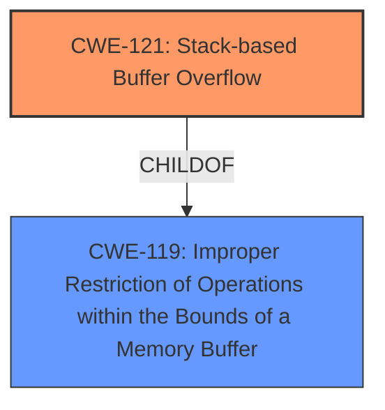

# Analysis Report for CVE-2025-1851

# Vulnerability Analysis Report: CVE-2025-1851

## Description

A vulnerability, which was classified as critical, was found in Tenda AC7 up to 15.03.06.44. This affects the function formSetFirewallCfg of the file /goform/SetFirewallCfg. The manipulation of the argument firewallEn leads to **stack-based buffer overflow**. It is possible to initiate the attack remotely. The exploit has been disclosed to the public and may be used.

## Vulnerability Description Key Phrases

- **Weakness:** stack-based buffer overflow
- **Product:** Tenda AC7
- **Version:** up to 15.03.06.44
- **Component:** formSetFirewallCfg of the file /goform/SetFirewallCfg

## Analysis (with Relationship Data)

# Summary
| CWE ID | CWE Name | Confidence | CWE Abstraction Level | CWE Vulnerability Mapping Label | CWE-Vulnerability Mapping Notes |
|---|---|---|---|---|---|
| CWE-121 | Stack-based Buffer Overflow | 1.0 | Variant | Primary | Allowed |

## Evidence and Confidence

*   **Confidence Score:** 1.0
*   **Evidence Strength:** HIGH

## Relationship Analysis
The primary CWE is CWE-121, which is a variant of CWE-119 (Improper Restriction of Operations within the Bounds of a Memory Buffer). CWE-121 is a specific type of buffer overflow that occurs on the stack.



## Vulnerability Chain
The vulnerability chain starts with the **stack-based buffer overflow** due to manipulation of the argument firewallEn, leading to a critical impact.

## Summary of Analysis
The vulnerability description clearly states that the weakness is a **stack-based buffer overflow**. The `Vulnerability Description Key Phrases` section also identifies **stack-based buffer overflow** as the weakness. Therefore, CWE-121 is the most appropriate CWE.

Relevant CWE Information:

# Enhanced Context (25 CWEs)
The following CWEs were identified as potentially relevant to this vulnerability:

## CWE-121: Stack-based Buffer Overflow
**Abstraction Level**: Variant
**Similarity Score**: 0.74
**Source**: dense

**Description**:
A stack-based buffer overflow condition is a condition where the buffer being overwritten is allocated on the stack (i.e., is a local variable or, rarely, a parameter to a function).

**Mapping Guidance**:
- Usage: Allowed
- Rationale: This CWE entry is at the Variant level of abstraction, which is a preferred level of abstraction for mapping to the root causes of vulnerabilities.

### CWE-121: Stack-based Buffer Overflow
**Abstraction Level**: Variant
**Similarity Score**: 534.61
**Source**: sparse

**Description**:
A stack-based buffer overflow condition is a condition where the buffer being overwritten is allocated on the stack (i.e., is a local variable or, rarely, a parameter to a function).

**Mapping Guidance**:
- Usage: Allowed
- Rationale: This CWE entry is at the Variant level of abstraction, which is a preferred level of abstraction for mapping to the root causes of vulnerabilities.

**CWE-121: Stack-based Buffer Overflow** is the primary candidate. The description mentions a **stack-based buffer overflow** condition. The CWE description matches this vulnerability description perfectly. The Abstraction Level is Variant, which is desired.

CWE-119 was considered, but it is a Class-level CWE and less specific than CWE-121. While CWE-119 is a parent of CWE-121, the vulnerability description provides enough detail to choose the more specific CWE-121.

CWE-120 was also considered, but it is for cases where the size of the input is not checked before copying to a buffer. The vulnerability description does not provide enough detail to know if the size was not checked, so it is less appropriate than CWE-121.


## CWE Relationship Analysis

Current CWEs represent these abstraction levels: .


### Vulnerability Chain Analysis

**Chain starting from CWE-119:**
- 119 (Improper Restriction of Operations within the Bounds of a Memory Buffer) - ROOT


**Chain starting from CWE-121:**
- 121 (Stack-based Buffer Overflow) - ROOT


### CWE Relationship Diagram

```mermaid
graph TD
    classDef primary fill:#f96,stroke:#333,stroke-width:2px
    classDef secondary fill:#69f,stroke:#333
    classDef tertiary fill:#9e9,stroke:#333
```


*Report generated on 2025-07-14 07:54:20*
