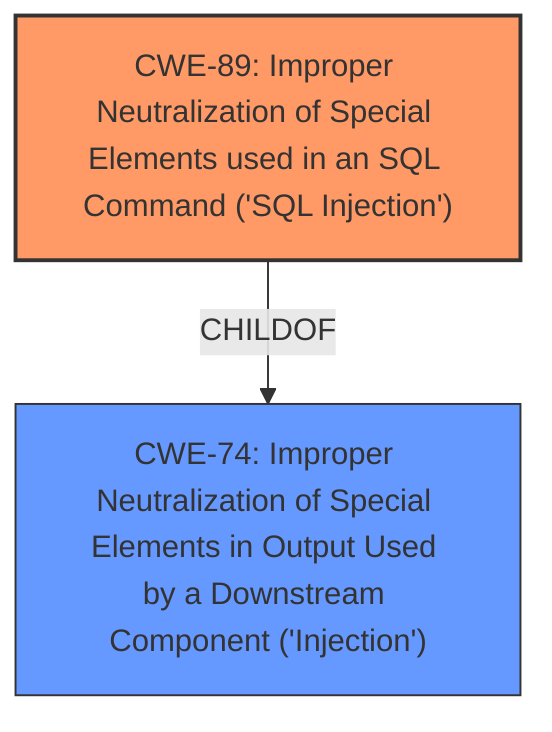

# Analysis for CVE-2025-1855

# Summary
| CWE ID | CWE Name | Confidence | CWE Abstraction Level | CWE Vulnerability Mapping Label | CWE-Vulnerability Mapping Notes |
|---|---|---|---|---|---|
| CWE-89 | Improper Neutralization of Special Elements used in an SQL Command ('SQL Injection') | 1.0 | Base | Primary | Allowed |

## Evidence and Confidence

*   **Confidence Score:** 1.0
*   **Evidence Strength:** HIGH

## Relationship Analysis
The primary relationship is that CWE-89 is a base-level weakness, which is the preferred level of abstraction. There are no direct parent-child relationships that influence the selection in this case. Other CWEs such as CWE-79, CWE-74, and CWE-94 are related to injection, but CWE-89 is the most specific and directly relevant to the vulnerability description, which clearly states "**sql injection**".

## Vulnerability Chain
The vulnerability chain starts with the **improper neutralization** of special elements used in an SQL command (CWE-89), leading directly to the ability to perform **SQL injection**. The root cause is the **lack of proper input validation** or sanitization of the `quality/price/value/name/summary/review` arguments, which allows an attacker to inject malicious SQL code.

## Summary of Analysis
The analysis is based on the provided vulnerability description, which explicitly mentions "**sql injection**" as the weakness. The vulnerability occurs due to the **improper handling of the `quality/price/value/name/summary/review` arguments in the `/product-details.php` file**, leading to a critical security flaw.

The Retriever Results strongly suggest CWE-89 as the most relevant CWE, with a score of 1.0. The other CWEs like CWE-79, CWE-434, and CWE-1336 were considered, but they are not as directly related to **SQL injection** as CWE-89.

CWE-89 is at the optimal level of specificity (Base) for this vulnerability.

Relevant CWE Information:

# Enhanced Context (25 CWEs)
The following CWEs were identified as potentially relevant to this vulnerability:

## CWE-89: Improper Neutralization of Special Elements used in an SQL Command ('SQL Injection')
**Abstraction Level**: Base
**Similarity Score**: 0.76
**Source**: dense

**Description**:
The product constructs all or part of an SQL command using externally-influenced input from an upstream component, but it does not neutralize or incorrectly neutralizes special elements that could modify the intended SQL command when it is sent to a downstream component. Without sufficient removal or quoting of SQL syntax in user-controllable inputs, the generated SQL query can cause those inputs to be interpreted as SQL instead of ordinary user data.

**Mapping Guidance**:
- Usage: Allowed
- Rationale: This CWE entry is at the Base level of abstraction, which is a preferred level of abstraction for mapping to the root causes of vulnerabilities.

## CWE-89: Improper Neutralization of Special Elements used in an SQL Command ('SQL Injection')
**Abstraction Level**: Base
**Similarity Score**: 656.14
**Source**: sparse

**Description**:
The product constructs all or part of an SQL command using externally-influenced input from an upstream component, but it does not neutralize or incorrectly neutralizes special elements that could modify the intended SQL command when it is sent to a downstream component. Without sufficient removal or quoting of SQL syntax in user-controllable inputs, the generated SQL query can cause those inputs to be interpreted as SQL instead of ordinary user data.

**Mapping Guidance**:
- Usage: Allowed
- Rationale: This CWE entry is at the Base level of abstraction, which is a preferred level of abstraction for mapping to the root causes of vulnerabilities.