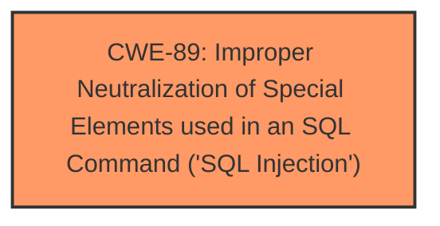

# Analysis Report for CVE-2025-1858

# Vulnerability Analysis Report: CVE-2025-1858

## Description

A vulnerability classified as critical was found in Codezips Online Shopping Website 1.0. This vulnerability affects unknown code of the file /success.php. The manipulation of the argument id leads to **sql injection**. The attack can be initiated remotely. The exploit has been disclosed to the public and may be used.

## Vulnerability Description Key Phrases

- **Weakness:** sql injection
- **Vector:** manipulation of id argument
- **Product:** Codezips Online Shopping Website
- **Version:** 1
- **Component:** /success.php

## Analysis (with Relationship Data)

# Summary
| CWE ID | CWE Name | Confidence | CWE Abstraction Level | CWE Vulnerability Mapping Label | CWE-Vulnerability Mapping Notes |
|---|---|---|---|---|---|
| CWE-89 | Improper Neutralization of Special Elements used in an SQL Command ('SQL Injection') | 1.0 | Base | Allowed | Primary CWE |

## Evidence and Confidence

*   **Confidence Score:** 1.0
*   **Evidence Strength:** HIGH

## Relationship Analysis
The primary identified CWE is CWE-89, which is a base-level CWE. This is the most specific and appropriate level of abstraction given the provided vulnerability details, as it directly addresses the **SQL injection** vulnerability. No parent or child relationships influence this decision, as the description clearly indicates an **SQL injection** issue, making CWE-89 the most accurate classification.



## Vulnerability Chain
The vulnerability chain consists of a single point:

1.  **Root Cause:** Improper neutralization of special elements in an SQL command (CWE-89) due to the manipulation of the id argument in `/success.php`.

## Summary of Analysis
The vulnerability description explicitly states that the manipulation of the "id" argument in the `/success.php` file leads to an **SQL injection** vulnerability in Codezips Online Shopping Website 1.0. The key phrase "sql injection" confirms the nature of the vulnerability. The retriever results list CWE-89 as the top candidate, with a perfect score of 1.0 based on alternate terms.

The evidence is strong and directly supports the classification of CWE-89 as the primary weakness. No other CWEs are necessary to describe the vulnerability accurately. The selection of CWE-89 is at the optimal level of specificity.


## CWE Relationship Analysis

Current CWEs represent these abstraction levels: .


### Vulnerability Chain Analysis

**Chain starting from CWE-89:**
- 89 (Improper Neutralization of Special Elements used in an SQL Command ('SQL Injection')) - ROOT


### CWE Relationship Diagram

```mermaid
graph TD
    classDef primary fill:#f96,stroke:#333,stroke-width:2px
    classDef secondary fill:#69f,stroke:#333
    classDef tertiary fill:#9e9,stroke:#333
```


*Report generated on 2025-07-14 07:56:23*
