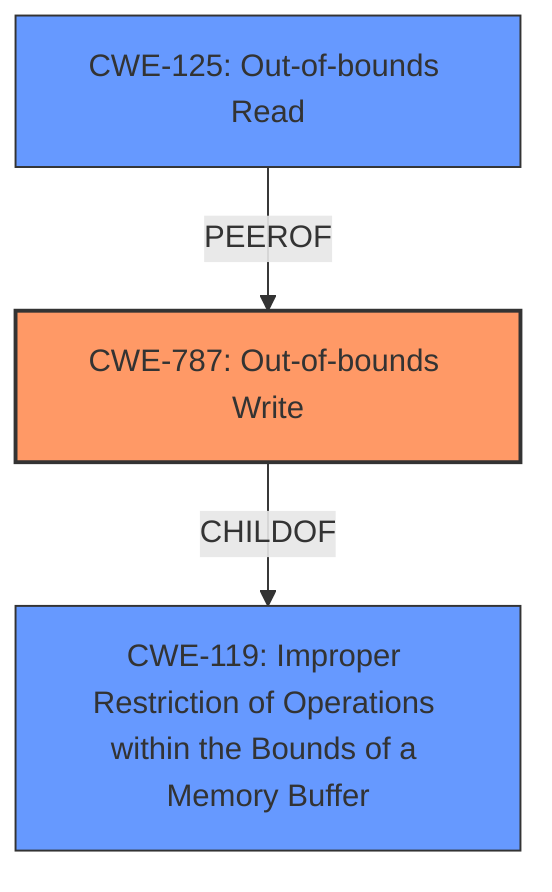

# Analysis for CVE-2025-1864

# Summary
| CWE ID | CWE Name | Confidence | CWE Abstraction Level | CWE Vulnerability Mapping Label | CWE-Vulnerability Mapping Notes |
|---|---|---|---|---|---|
| CWE-787 | Out-of-bounds Write | 0.9 | Base | Primary CWE | Allowed |
| CWE-125 | Out-of-bounds Read | 0.5 | Base | Secondary Candidate | Allowed |
| CWE-119 | Improper Restriction of Operations within the Bounds of a Memory Buffer | 0.4 | Class | Secondary Candidate | Discouraged |

## Evidence and Confidence

*   **Confidence Score:** 0.7
*   **Evidence Strength:** MEDIUM

## Relationship Analysis
The primary relationship that impacted my decision was the parent-child relationship between CWE-119 and CWE-787, and the peer relationship between CWE-125 and CWE-787. CWE-787 is a more specific case of CWE-119, where the operation that is improperly restricted results in an out-of-bounds write. The evidence supports the more specific CWE-787.

## Vulnerability Chain
The vulnerability chain starts with **Improper Restriction of Operations within the Bounds of a Memory Buffer** which leads to **Overflow Buffers**, finally resulting in an **Out-of-bounds Write**.

## Summary of Analysis
The initial assessment, based on the vulnerability description and key phrases, pointed towards CWE-119 (Improper Restriction of Operations within the Bounds of a Memory Buffer) as a potential root cause. However, the more detailed CVE Reference Links Content Summary provided stronger evidence for a more specific weakness: an **Out-of-bounds Write**.

The evidence includes the vulnerability description indicating "**Improper Restriction of Operations within the Bounds of a Memory Buffer** vulnerability in radareorg radare2 allows **Overflow Buffers**." Also, the CVE Reference Links Content Summary section states, "The vulnerability is an improper restriction of operations within the bounds of a memory buffer, leading to overflow buffers in radareorg radare2". However, the summary also mentions the fix applying the patch from `file/file@6713ca4` to radare2 addresses a missing security patch in the `magic_file_check_mem()` function, implying a potential for writing beyond buffer boundaries.

The retriever results also favored CWE-787 (Out-of-bounds Write). Therefore, I conclude that CWE-787 is the most accurate representation of the vulnerability.

I considered CWE-119 (Improper Restriction of Operations within the Bounds of a Memory Buffer) but it is a broader category, and CWE-787 provides a more precise description of the **Out-of-bounds Write** vulnerability.

I also considered CWE-125 (Out-of-bounds Read), because it is a peer of CWE-787. However, the description mentions "write", so CWE-787 is a better fit.

Relevant CWE Information:

*   **CWE-787: Out-of-bounds Write**
    *   **Technical Explanation:** This CWE describes a situation where the software writes data past the end, or before the beginning, of the intended buffer.
    *   **Security Implications:** This can lead to corruption of adjacent memory, potentially causing a crash or allowing an attacker to execute arbitrary code.
    *   **Relationship Explanation:** CWE-787 is a child of CWE-119 (Improper Restriction of Operations within the Bounds of a Memory Buffer), making it a more specific type of buffer error.
    *   **Mapping Guidance Influence:** The "Usage: Allowed" guidance supports the use of this CWE.
*   **CWE-125: Out-of-bounds Read**
    *   **Technical Explanation:** This CWE describes a situation where the software reads data past the end, or before the beginning, of the intended buffer.
    *   **Security Implications:** This can lead to information disclosure.
    *   **Relationship Explanation:** CWE-125 is a peer of CWE-787.
    *   **Mapping Guidance Influence:** The "Usage: Allowed" guidance supports the use of this CWE.
*   **CWE-119: Improper Restriction of Operations within the Bounds of a Memory Buffer**
    *   **Technical Explanation:** This CWE describes the general case where a program doesn't properly confine its operations to the boundaries of a memory buffer.
    *   **Security Implications:** This can lead to various issues, including buffer overflows, information leaks, and crashes.
    *   **Relationship Explanation:** CWE-119 is a parent of CWE-787.
    *   **Mapping Guidance Influence:** The "Usage: Discouraged" guidance suggests using more specific CWEs when available.