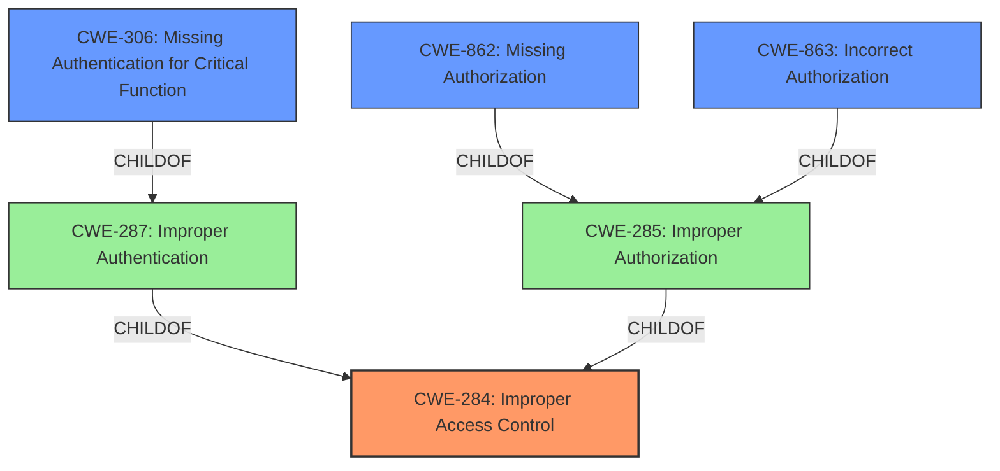

# Analysis Report for CVE-2025-1882

# Vulnerability Analysis Report: CVE-2025-1882

## Description

A vulnerability was found in i-Drive i11 and i12 up to 20250227. It has been rated as critical. Affected by this issue is some unknown functionality of the component Device Setting Handler. The manipulation leads to **improper access control** for register interface. The attack needs to be done within the local network. The complexity of an attack is rather high. The exploitation is known to be difficult. It was not possible to identify the current maintainer of the product. It must be assumed that the product is end-of-life.

## Vulnerability Description Key Phrases

- **Rootcause:** improper access control
- **Product:** i-Drive i11 and i12
- **Version:** up to 20250227
- **Component:** Device Setting Handler

## Analysis (with Relationship Data)

# Summary
| CWE ID    | CWE Name                                                                                             | Confidence | CWE Abstraction Level | CWE Vulnerability Mapping Label | CWE-Vulnerability Mapping Notes |
| :-------- | :--------------------------------------------------------------------------------------------------- | :--------- | :---------------------- | :------------------------------ | :------------------------------ |
| CWE-284   | Improper Access Control                                                                                | 0.9        | Pillar                  | Primary CWE                     | Discouraged                    |
| CWE-306   | Missing Authentication for Critical Function                                                         | 0.7        | Base                    | Secondary Candidate             | Allowed                        |
| CWE-862   | Missing Authorization                                                                                  | 0.7        | Base                    | Secondary Candidate             | Allowed                        |
| CWE-863   | Incorrect Authorization                                                                                | 0.7        | Base                    | Secondary Candidate             | Allowed-with-Review            |

## Evidence and Confidence

*   **Confidence Score:** 0.9
*   **Evidence Strength:** HIGH

## Relationship Analysis
The primary CWE chosen is CWE-284, Improper Access Control, which is a high-level category. Given more specific information, it could be refined to CWE-306 (Missing Authentication), CWE-862 (Missing Authorization), or CWE-863 (Incorrect Authorization). The vulnerability description mentions "**improper access control**" directly, supporting the use of CWE-284 as a starting point. The analysis of CVE-2025-1882 suggests authentication weaknesses, making CWE-306, CWE-862, and CWE-863 relevant candidates.



## Vulnerability Chain
The vulnerability chain starts with the **improper access control** (CWE-284). The analysis suggests that this could be due to missing authentication (CWE-306), missing authorization (CWE-862), or incorrect authorization (CWE-863). Successful exploitation leads to exposure of sensitive information, manipulation of device settings, and potential battery drain.

## Summary of Analysis
The initial assessment points to CWE-284 due to the direct mention of "**improper access control**" in the vulnerability description. The analysis of the CVE reference link content reveals that authentication and authorization issues contribute to this **improper access control**, suggesting that CWE-306, CWE-862, and CWE-863 could also be relevant.

CWE-284 is selected as the primary CWE because it directly reflects the stated **improper access control**. While more specific CWEs such as CWE-306, CWE-862, and CWE-863 could be applicable, the current evidence doesn't definitively point to one over the others, making the broader CWE-284 the most appropriate choice. The other CWEs are secondary candidates.

Relevant CWE Information:

*   **CWE-284: Improper Access Control**: This is a high-level category used when the access control failure exists but the root cause is unclear. It aligns with the general description of "**improper access control**" in the vulnerability.

*   **CWE-306: Missing Authentication for Critical Function**: The analysis of CVE-2025-1882 points to weaknesses in the authentication mechanism, specifically related to device pairing using MAC address spoofing.

*   **CWE-862: Missing Authorization**: Given the remote access to settings and configuration, it's possible that authorization checks are missing after a user is authenticated.

*   **CWE-863: Incorrect Authorization**: The device pairing mechanism might be flawed, leading to incorrect authorization decisions.

CWEs Considered but Not Used:

*   CWE-79 (Improper Neutralization of Input During Web Page Generation ('Cross-site Scripting')): While listed in the Retriever Results, there is no indication of XSS in the vulnerability description or CVE analysis.
*   CWE-89 (Improper Neutralization of Special Elements used in an SQL Command ('SQL Injection')): Similarly, there is no evidence of SQL injection.
*   CWE-113 (Improper Neutralization of CRLF Sequences in HTTP Headers ('HTTP Request/Response Splitting')): There is no mention of HTTP header manipulation.
*   CWE-125 (Out-of-bounds Read): There is no evidence of out-of-bounds reads.
*   CWE-266 (Incorrect Privilege Assignment): There is no specific information about incorrect privilege assignments.
*   CWE-287 (Improper Authentication): While related to authentication, CWE-306 is more specific as it addresses missing authentication.
*   CWE-927 (Use of Implicit Intent for Sensitive Communication): This is not relevant based on the description.
*   CWE-1391 (Use of Weak Credentials): The MAC address spoofing doesn't necessarily indicate weak credentials.


## CWE Relationship Analysis

Current CWEs represent these abstraction levels: .


### Vulnerability Chain Analysis

**Chain starting from CWE-863:**
- 863 (Incorrect Authorization) - ROOT


**Chain starting from CWE-89:**
- 89 (Improper Neutralization of Special Elements used in an SQL Command ('SQL Injection')) - ROOT


### CWE Relationship Diagram

```mermaid
graph TD
    classDef primary fill:#f96,stroke:#333,stroke-width:2px
    classDef secondary fill:#69f,stroke:#333
    classDef tertiary fill:#9e9,stroke:#333
```


*Report generated on 2025-07-14 07:59:59*
