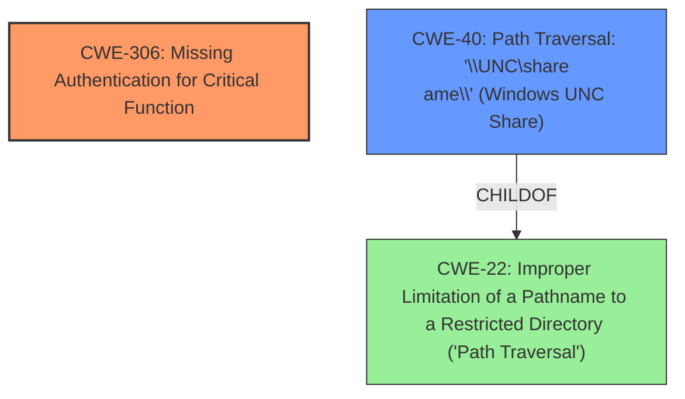

# Analysis Report for CVE-2025-1887

# Vulnerability Analysis Report: CVE-2025-1887

## Description

**SMB forced authentication vulnerability** in versions prior to 2025.35.000 of Sage 200 Spain. This vulnerability allows an authenticated attacker with administrator privileges to obtain NTLMv2-SSP Hash by changing any of the paths to a UNC path pointing to a server controlled by the attacker.

## Vulnerability Description Key Phrases

- **Vector:** changing paths to UNC path pointing to server controlled by attacker
- **Weakness:** SMB forced authentication vulnerability
- **Product:** Sage 200 Spain
- **Impact:** NTLMv2-SSP Hash, obtain NTLMv2-SSP Hash
- **Attacker:** authenticated attacker with administrator privileges
- **Version:** prior to 2025.35.000

## Analysis (with Relationship Data)

# Summary
| CWE ID | CWE Name | Confidence | CWE Abstraction Level | CWE Vulnerability Mapping Label | CWE-Vulnerability Mapping Notes |
|---|---|---|---|---|---|
| CWE-306 | Missing Authentication for Critical Function | 0.7 | Base | Primary CWE | Allowed |
| CWE-40 | Path Traversal: '\\UNC\share\name\' (Windows UNC Share) | 0.6 | Variant | Secondary Candidate | Allowed |

## Evidence and Confidence

*   **Confidence Score:** 0.7
*   **Evidence Strength:** MEDIUM

## Relationship Analysis
The primary CWE selected is CWE-306, which represents a missing authentication for a critical function. The secondary CWE is CWE-40, which is a type of path traversal. CWE-306 is more specific to the root cause of the vulnerability, where there is no check for a valid user.



## Vulnerability Chain
The vulnerability chain starts with a **missing authentication** check (CWE-306). This allows an attacker to change paths to a UNC path, leading to forced SMB authentication and ultimately obtaining the NTLMv2-SSP Hash.

## Summary of Analysis
The primary assessment is based on the vulnerability description indicating a **SMB forced authentication vulnerability**, which implies the absence of proper authentication mechanisms. The retriever results suggested CWE-425 (Direct Request) and CWE-40 (Path Traversal), but these are secondary to the root cause. The vulnerability chain highlights the lack of authentication (CWE-306) as the initial flaw that enables further exploitation. The selection of CWE-306 is at the base level of abstraction, representing the core issue of missing authentication for a critical function. This is based on the "Vulnerability Description Key Phrases" stating "**weakness:** **SMB forced authentication vulnerability**".

Relevant CWE Information:

# Enhanced Context (25 CWEs)
The following CWEs were identified as potentially relevant to this vulnerability:

## CWE-425: Direct Request ('Forced Browsing')

## CWE-40: Path Traversal: '\\UNC\share\name\' (Windows UNC Share)
**Abstraction Level**: Variant
**Similarity Score**: 0.76
**Source**: dense

**Description**:
The product permits the attacker to supply a Windows-based UNC share pathname, which then triggers the client to send authentication information (including hashes) to an arbitrary server.

**Mapping Guidance**:
- Usage: Allowed
- Rationale: This CWE entry is at the Variant level of abstraction, which is a preferred level of abstraction for mapping to the root causes of vulnerabilities.

## CWE-22: Improper Limitation of a Pathname to a Restricted Directory ('Path Traversal')

## CWE-200: Exposure of Sensitive Information to an Unauthorized Actor

## CWE-522: Insufficiently Protected Credentials

## CWE-287: Improper Authentication

## CWE-259: Use of Hard-coded Password

## CWE-427: Uncontrolled Search Path Element

## CWE-288: Authentication Bypass Using an Alternate Path or Channel

## CWE-471: Modification of Assumed-Immutable Data (MAID)

## CWE-306: Missing Authentication for Critical Function
**Abstraction Level**: Base
**Similarity Score**: 2251.21
**Source**: sparse

**Description**:
The product does not perform any authentication for functionality that requires a provable user identity or consumes a significant amount of resources.

**Mapping Guidance**:
- Usage: Allowed
- Rationale: This CWE entry is at the Base level of abstraction, which is a preferred level of abstraction for mapping to the root causes of vulnerabilities.

### Technical Explanation for CWE-306:
CWE-306 (Missing Authentication for Critical Function) applies because the vulnerability stems from the product's failure to implement proper authentication checks for a critical function, allowing unauthorized access. The security implication is that an attacker can bypass authentication and perform actions they should not be able to, such as gaining unauthorized access to sensitive data or resources. This CWE is a base-level weakness, focusing on the root cause of the missing authentication.

### Technical Explanation for CWE-40:
CWE-40 (Path Traversal: '\\UNC\share\name\' (Windows UNC Share)) applies because the attack vector involves changing paths to a UNC path, which is a specific type of path traversal. The vulnerability allows an attacker to force authentication to an arbitrary server, potentially capturing the NTLMv2-SSP Hash. The security implication is that an attacker can steal credentials or gain unauthorized access to systems. This CWE is a variant of path traversal, providing a more specific categorization of the vulnerability.

CWE-425 (Direct Request ('Forced Browsing')), CWE-22 (Improper Limitation of a Pathname to a Restricted Directory ('Path Traversal')), CWE-200 (Exposure of Sensitive Information to an Unauthorized Actor), CWE-522 (Insufficiently Protected Credentials), CWE-287 (Improper Authentication), CWE-259 (Use of Hard-coded Password), CWE-427 (Uncontrolled Search Path Element), CWE-288 (Authentication Bypass Using an Alternate Path or Channel), and CWE-471 (Modification of Assumed-Immutable Data (MAID)) were considered but not selected as primary CWEs because they do not directly address the root cause of the vulnerability, which is the **missing authentication** for a critical function. They might be secondary consequences or contributing factors, but the primary issue is the lack of authentication.


## CWE Relationship Analysis

Current CWEs represent these abstraction levels: .


### Vulnerability Chain Analysis

**Chain starting from CWE-288:**
- 288 (Authentication Bypass Using an Alternate Path or Channel) - ROOT


**Chain starting from CWE-471:**
- 471 (Modification of Assumed-Immutable Data (MAID)) - ROOT


### CWE Relationship Diagram

```mermaid
graph TD
    classDef primary fill:#f96,stroke:#333,stroke-width:2px
    classDef secondary fill:#69f,stroke:#333
    classDef tertiary fill:#9e9,stroke:#333
```


*Report generated on 2025-07-14 08:00:18*
