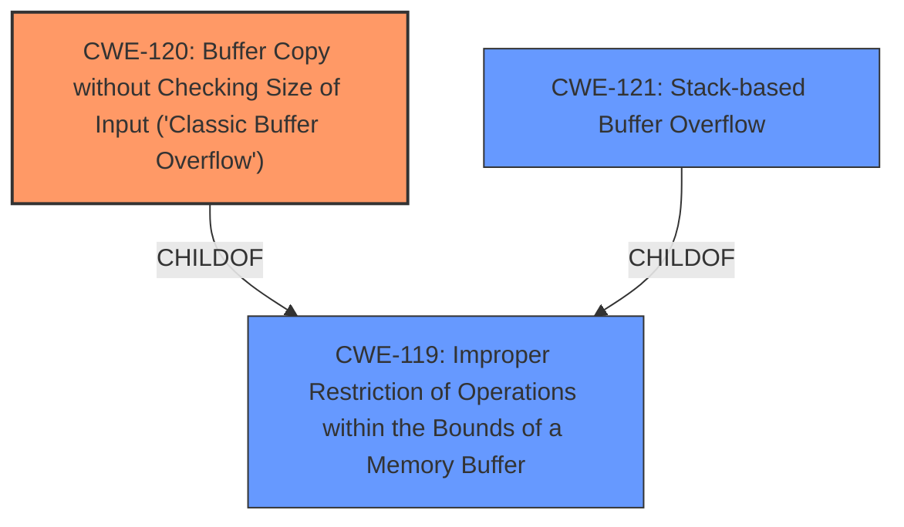

# Analysis for CVE-2025-1895

# Summary
| CWE ID | CWE Name | Confidence | CWE Abstraction Level | CWE Vulnerability Mapping Label | CWE-Vulnerability Mapping Notes |
|---|---|---|---|---|---|
| CWE-120 | Buffer Copy without Checking Size of Input ('Classic Buffer Overflow') | 0.9 | Base | Allowed-with-Review | Primary CWE |
| CWE-121 | Stack-based Buffer Overflow | 0.6 | Variant | Allowed | Secondary Candidate |
| CWE-119 | Improper Restriction of Operations within the Bounds of a Memory Buffer | 0.5 | Class | Discouraged | Secondary Candidate |

## Evidence and Confidence

*   **Confidence Score:** 0.8
*   **Evidence Strength:** MEDIUM

## Relationship Analysis
The primary relationship that influenced the selection was the parent-child relationship between CWE-119 (Improper Restriction of Operations within the Bounds of a Memory Buffer) and CWE-120 (Buffer Copy without Checking Size of Input). CWE-120 is a more specific type of buffer overflow, making it a better fit for the vulnerability description. CWE-121 (Stack-based Buffer Overflow) was considered as a further refinement of CWE-120 but lacked sufficient evidence.

## Vulnerability Chain
The vulnerability chain starts with a **buffer overflow** due to the manipulation of the `deviceList` argument in `/goform/setMacFilterCfg`. This leads to a potential remote attack.

## Summary of Analysis
The vulnerability description clearly states that the vulnerability is a **buffer overflow**. The retriever results also highlight CWE-119, CWE-120, and CWE-121 as potential candidates. Given the information, CWE-120 is the most appropriate because it describes a "Buffer Copy without Checking Size of Input," which is a common cause of buffer overflows. The description mentions that the manipulation of the `deviceList` argument leads to the overflow, suggesting that the size of the input is not being adequately checked before being copied to a buffer.

CWE-119 is too general, as it encompasses any operation outside the bounds of a memory buffer. While the vulnerability is technically a type of CWE-119, CWE-120 provides more specific information about the root cause.

CWE-121 (Stack-based Buffer Overflow) could be a more specific mapping if there was evidence that the buffer was allocated on the stack. The description does not provide enough details to confirm this.

The primary CWE is CWE-120 because the **buffer overflow** occurs because of a buffer copy operation without checking the size of the input.

Relevant CWE Information:

# Enhanced Context (25 CWEs)
The following CWEs were identified as potentially relevant to this vulnerability:

## CWE-121: Stack-based Buffer Overflow
**Abstraction Level**: Variant
**Similarity Score**: 0.73
**Source**: dense

**Description**:
A stack-based buffer overflow condition is a condition where the buffer being overwritten is allocated on the stack (i.e., is a local variable or, rarely, a parameter to a function).

**Mapping Guidance**:
- Usage: Allowed
- Rationale: This CWE entry is at the Variant level of abstraction, which is a preferred level of abstraction for mapping to the root causes of vulnerabilities.

## CWE-120: Buffer Copy without Checking Size of Input ('Classic Buffer Overflow')
**Abstraction Level**: base
**Similarity Score**: 3.65
**Source**: graph

**Description**:
CWE-120: Buffer Copy without Checking Size of Input ('Classic Buffer Overflow')

**Mapping Guidance**:
- Usage: Allowed-with-Review
- Rationale: There are some indications that this CWE ID might be misused and selected simply because it mentions "buffer overflow" - an increasingly vague term. This CWE entry is only appropriate for "Buffer Copy" operations (not buffer reads), in which where there is no "Checking [the] Size of Input", and (by implication of the copy) writing past the end of the buffer.

**Relationships**:
- PARENTOF -> CWE-785
- CANFOLLOW -> CWE-456
- CANFOLLOW -> CWE-416
- CANFOLLOW -> CWE-231
- CANFOLLOW -> CWE-170

## CWE-119: Improper Restriction of Operations within the Bounds of a Memory Buffer
**Abstraction Level**: Class
**Similarity Score**: 0.70
**Source**: dense

**Description**:
The product performs operations on a memory buffer, but it reads from or writes to a memory location outside the buffer's intended boundary. This may result in read or write operations on unexpected memory locations that could be linked to other variables, data structures, or internal program data.

**Mapping Guidance**:
- Usage: Discouraged
- Rationale: CWE-119 is commonly misused in low-information vulnerability reports when lower-level CWEs could be used instead, or when more details about the vulnerability are available.

**CWE-78:** Improper Neutralization of Special Elements used in an OS Command ('OS Command Injection') was not selected because there was no mention of command injection.

**CWE-79:** Improper Neutralization of Input During Web Page Generation ('Cross-site Scripting') was not selected because there was no mention of web page generation.

**CWE-89:** Improper Neutralization of Special Elements used in an SQL Command ('SQL Injection') was not selected because there was no mention of SQL commands.

**CWE-190:** Integer Overflow or Wraparound was not selected because there was no mention of integer overflows.

**CWE-434:** Unrestricted Upload of File with Dangerous Type was not selected because there was no mention of file uploads.

**CWE-125:** Out-of-bounds Read was not selected because the vulnerability is a **buffer overflow** (write), not a read.

**CWE-128:** Wrap-around Error was not selected because there was no mention of any wraparound error.