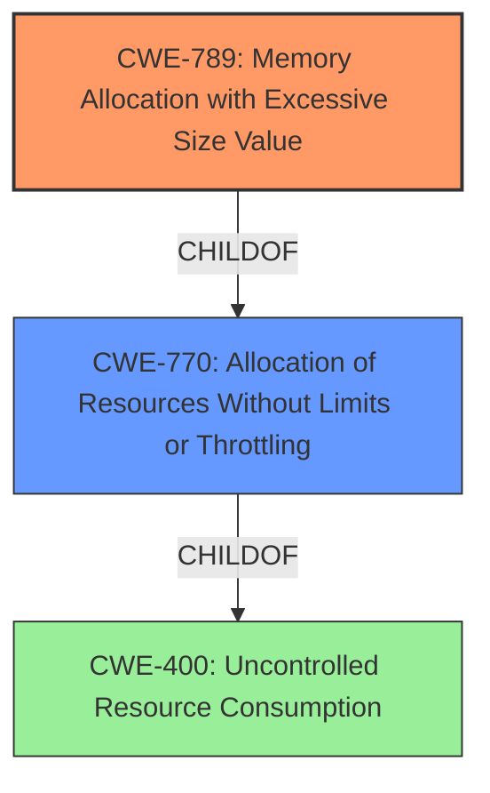

# Enhanced Analysis for CVE-2025-1948

# Summary

| CWE ID | CWE Name | Confidence | CWE Abstraction Level | CWE Vulnerability Mapping Label | CWE-Vulnerability Mapping Notes |
|---|---|---|---|---|---|
| CWE-789 | Memory Allocation with Excessive Size Value | 0.9 | Variant | Allowed | Primary CWE.  The server allocates memory based on an untrusted size value without proper validation. |
| CWE-770 | Allocation of Resources Without Limits or Throttling | 0.7 | Base | Allowed | Secondary CWE. The server allocates resources without proper limits, leading to potential resource exhaustion. |

## Evidence and Confidence

*   **Confidence Score:** 0.8
*   **Evidence Strength:** HIGH

## Relationship Analysis
The primary CWE is CWE-789 (Memory Allocation with Excessive Size Value), a variant of CWE-770 (Allocation of Resources Without Limits or Throttling). CWE-789 is a more specific case of uncontrolled resource allocation. The vulnerability involves the server's failure to validate the `SETTINGS_MAX_HEADER_LIST_SIZE` parameter, leading to excessive memory allocation and potential OOM errors.



## Vulnerability Chain
The vulnerability chain starts with the **lack of validation** of the `SETTINGS_MAX_HEADER_LIST_SIZE` parameter, which leads to **excessive memory allocation** and can result in an **OutOfMemoryError** or JVM process exit, ultimately causing a Denial of Service.

## Summary of Analysis
The analysis is based on the vulnerability description and the CVE reference content, which clearly state that the Jetty HTTP/2 server **does not perform validation** on the `SETTINGS_MAX_HEADER_LIST_SIZE` parameter, leading to excessive memory allocation.

The selection of CWE-789 is based on the fact that it is a specific variant of CWE-770, which accurately describes the vulnerability. The graph relationships confirm this, with CWE-789 being a child of CWE-770.

The evidence supporting this decision is:

*   "The Jetty HTTP/2 server **does not validate** the `SETTINGS_MAX_HEADER_LIST_SIZE` parameter sent by an HTTP/2 client."
*   "This allows a malicious client to specify a very large value. The server then attempts to allocate a ByteBuffer of this size, leading to an OutOfMemoryError (OOM) or JVM process exit."

The selected CWEs are at the optimal level of specificity because they accurately describe the **root cause** and the immediate consequence of the vulnerability.

Relevant CWE Information:

# Enhanced Context (25 CWEs)
The following CWEs were identified as potentially relevant to this vulnerability:

## CWE-789: Memory Allocation with Excessive Size Value
**Abstraction Level**: Variant
**Similarity Score**: 0.76
**Source**: dense

**Description**:
The product allocates memory based on an untrusted, large size value, but it **does not ensure that the size is within expected limits**, allowing arbitrary amounts of memory to be allocated.

**Mapping Guidance**:
- Usage: Allowed
- Rationale: This CWE entry is at the Variant level of abstraction, which is a preferred level of abstraction for mapping to the root causes of vulnerabilities.

## CWE-770: Allocation of Resources Without Limits or Throttling
**Abstraction Level**: Base
**Similarity Score**: 0.72
**Source**: dense

**Description**:
The product allocates a reusable resource or group of resources on behalf of an actor **without imposing any restrictions** on the size or number of resources that can be allocated, in violation of the intended security policy for that actor.

**Mapping Guidance**:
- Usage: Allowed
- Rationale: This CWE entry is at the Base level of abstraction, which is a preferred level of abstraction for mapping to the root causes of vulnerabilities.

## CWE-1284: Improper Validation of Specified Quantity in Input
**Abstraction Level**: Base
**Similarity Score**: 938.68
**Source**: sparse

**Description**:
The product receives input that is expected to specify a quantity (such as size or length), but it **does not validate or incorrectly validates** that the quantity has the required properties.

**Mapping Guidance**:
- Usage: Allowed
- Rationale: This CWE entry is at the Base level of abstraction, which is a preferred level of abstraction for mapping to the root causes of vulnerabilities.

### Other CWEs Considered but Not Used:

*   CWE-20 (Improper Input Validation): While the vulnerability does involve **improper input validation**, CWE-789 and CWE-770 are more specific and provide a better description of the vulnerability.
*   CWE-400 (Uncontrolled Resource Consumption): This is a high-level class that describes the impact of the vulnerability, but not the **root cause**. The **root cause** is the **lack of validation** leading to excessive memory allocation.
*   CWE-1284 (Improper Validation of Specified Quantity in Input): Although it involves improper validation, CWE-789 is more specific to memory allocation with excessive size, making it a better fit.


## CWE Relationship Analysis

Current CWEs represent these abstraction levels: .


### Vulnerability Chain Analysis

**Chain starting from CWE-1284:**
- 1284 (Improper Validation of Specified Quantity in Input) - ROOT


**Chain starting from CWE-400:**
- 400 (Uncontrolled Resource Consumption) - ROOT


### CWE Relationship Diagram

```mermaid
graph TD
    classDef primary fill:#f96,stroke:#333,stroke-width:2px
    classDef secondary fill:#69f,stroke:#333
    classDef tertiary fill:#9e9,stroke:#333
```