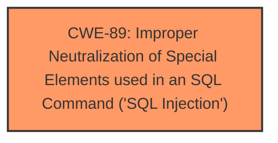

# Enhanced Analysis for CVE-2025-1961

# Summary

| CWE ID | CWE Name | Confidence | CWE Abstraction Level | CWE Vulnerability Mapping Label | CWE-Vulnerability Mapping Notes |
|---|---|---|---|---|---|
| CWE-89 | Improper Neutralization of Special Elements used in an SQL Command ('SQL Injection') | 1.0 | Base | Primary CWE | Allowed |

## Evidence and Confidence

*   **Confidence Score:** 1.0
*   **Evidence Strength:** HIGH

## Relationship Analysis
The primary relationship identified is that CWE-89 is a Base level CWE, which is the preferred level for mapping. There are no identified parent or child relationships. There are other injection-style CWEs which are peer relationships.



## Vulnerability Chain
The vulnerability chain starts with the **improper neutralization** of special elements used in an SQL command, leading to **SQL Injection**.

## Summary of Analysis
The vulnerability description clearly states that the manipulation of the argument encryption leads to **sql injection** in SourceCodester Best Church Management Software 1.1. The key phrase "sql injection" and the vector "manipulation of argument encryption" directly align with the characteristics of CWE-89, which involves constructing an SQL command using externally-influenced input without proper neutralization of special elements. This leads to the input being interpreted as SQL code, resulting in **SQL Injection**.

The Retriever Results also list CWE-89 as the top combined result with a score of 1.000, reinforcing the selection. The other CWEs were considered but deemed less relevant as they address different types of weaknesses such as Cross-Site Scripting (CWE-79) or Unrestricted File Uploads (CWE-434).

Relevant CWE Information:

# Enhanced Context (25 CWEs)

## CWE-89: Improper Neutralization of Special Elements used in an SQL Command ('SQL Injection')
**Abstraction Level**: Base
**Similarity Score**: 0.77
**Source**: dense

**Description**:
The product constructs all or part of an SQL command using externally-influenced input from an upstream component, but it does not neutralize or incorrectly neutralizes special elements that could modify the intended SQL command when it is sent to a downstream component. Without sufficient removal or quoting of SQL syntax in user-controllable inputs, the generated SQL query can cause those inputs to be interpreted as SQL instead of ordinary user data.

**Mapping Guidance**:
- Usage: Allowed
- Rationale: This CWE entry is at the Base level of abstraction, which is a preferred level of abstraction for mapping to the root causes of vulnerabilities.


## CWE Relationship Analysis

Current CWEs represent these abstraction levels: .


### Vulnerability Chain Analysis

**Chain starting from CWE-89:**
- 89 (Improper Neutralization of Special Elements used in an SQL Command ('SQL Injection')) - ROOT


**Chain starting from CWE-79:**
- 79 (Improper Neutralization of Input During Web Page Generation ('Cross-site Scripting')) - ROOT


### CWE Relationship Diagram

```mermaid
graph TD
    classDef primary fill:#f96,stroke:#333,stroke-width:2px
    classDef secondary fill:#69f,stroke:#333
    classDef tertiary fill:#9e9,stroke:#333
```