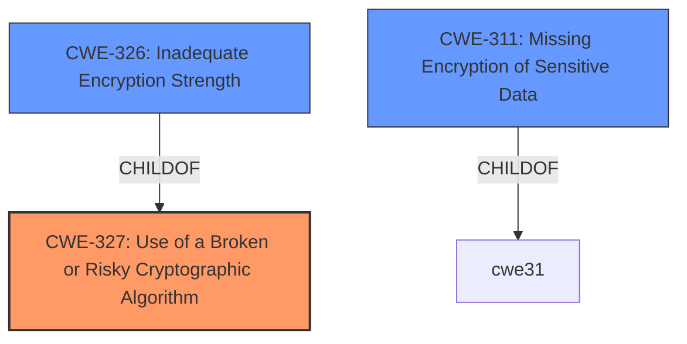

# Raw Analyzer Response for CVE-2025-1993

# Summary
| CWE ID | CWE Name | Confidence | CWE Abstraction Level | CWE Vulnerability Mapping Label | CWE-Vulnerability Mapping Notes |
|---|---|---|---|---|---|
| CWE-327 | Use of a Broken or Risky Cryptographic Algorithm | 1 | Class | Primary | Allowed-with-Review |
| CWE-326 | Inadequate Encryption Strength | 0.8 | Class | Secondary | Allowed-with-Review |
| CWE-311 | Missing Encryption of Sensitive Data | 0.7 | Class | Secondary | Discouraged |

## Evidence and Confidence

*   **Confidence Score:** 0.9
*   **Evidence Strength:** HIGH

## Relationship Analysis
The primary relationship influencing the CWE selection is the hierarchical relationship. CWE-327 (Use of a Broken or Risky Cryptographic Algorithm) is a class-level CWE, and its children include CWE-326 (Inadequate Encryption Strength) and others related to specific cryptographic weaknesses. Since the vulnerability description indicates a **weaker than expected cryptographic algorithm**, CWE-327 is the most appropriate initial choice. CWE-326 is considered as a secondary option because it represents a more specific case of using algorithms that aren't strong enough. CWE-311 is included because it deals with the encryption of sensitive data.

## Vulnerability Chain
The vulnerability chain starts with the **root cause**: the use of **weaker than expected cryptographic algorithms** (CWE-327). This leads to the potential impact: a local user being able to decrypt flows, resulting in a loss of confidentiality.

## Summary of Analysis
The initial assessment, based on the vulnerability description and CVE details, points towards CWE-327 (Use of a Broken or Risky Cryptographic Algorithm) as the primary weakness. The description explicitly states that the flows are protected by "**weaker than expected cryptographic algorithms**," which aligns directly with CWE-327's definition. The "CVE Reference Links Content Summary" reinforces this by stating, "IBM App Connect Enterprise Certified Container DesignerAuthoring instances store their flows in a database protected by weaker than expected cryptographic algorithms."

The graph relationships support this choice, as CWE-327 is a class-level CWE that encompasses various specific cryptographic weaknesses. The selection of CWE-327 is made at the optimal level of specificity because the description does not specify the exact type of broken or risky algorithm used, making a more specific child CWE inappropriate.

The selection is primarily based on the provided evidence from the vulnerability description and CVE summary.

Relevant CWE Information:

# Enhanced Context (25 CWEs)
The following CWEs were identified as potentially relevant to this vulnerability:

## CWE-1391: Use of Weak Credentials
**Abstraction Level**: Class
**Similarity Score**: 0.74
**Source**: dense

**Description**:
The product uses weak credentials (such as a default key or hard-coded password) that can be calculated, derived, reused, or guessed by an attacker.

**Mapping Guidance**:
- Usage: Allowed-with-Review
- Rationale: This CWE entry is a Class and might have Base-level children that would be more appropriate

*Not Used:* Although weak credentials could be a component of weak cryptography, the description does not indicate that the **weakness** lies in the credentials themselves.

## CWE-311: Missing Encryption of Sensitive Data
**Abstraction Level**: Class
**Similarity Score**: 0.73
**Source**: dense

**Description**:
The product does not encrypt sensitive or critical information before storage or transmission.

**Mapping Guidance**:
- Usage: Discouraged
- Rationale: CWE-311 is high-level with more precise children available. It is a level-1 Class (i.e., a child of a Pillar).

*Potentially Used:* This CWE describes the scenario where encryption is altogether missing. While this isn't the primary issue, it is relevant because the encryption that *is* present is insufficient.

## CWE-303: Incorrect Implementation of Authentication Algorithm
**Abstraction Level**: Base
**Similarity Score**: 0.71
**Source**: dense

**Description**:
The requirements for the product dictate the use of an established authentication algorithm, but the implementation of the algorithm is incorrect.

**Mapping Guidance**:
- Usage: Allowed
- Rationale: This CWE entry is at the Base level of abstraction, which is a preferred level of abstraction for mapping to the root causes of vulnerabilities.

*Not Used:* This CWE is focused on authentication algorithms. The vulnerability is about encryption algorithms and the protection of data.

## CWE-326: Inadequate Encryption Strength
**Abstraction Level**: Class
**Similarity Score**: 0.71
**Source**: dense

**Description**:
The product stores or transmits sensitive data using an encryption scheme that is theoretically sound, but is not strong enough for the level of protection required.

**Mapping Guidance**:
- Usage: Allowed-with-Review
- Rationale: This CWE entry is a Class and might have Base-level children that would be more appropriate

*Potentially Used:* This is a strong secondary candidate, because the description says the algorithms are "**weaker than expected**", meaning they do have some strength, but not enough.

## CWE-327: Use of a Broken or Risky Cryptographic Algorithm
**Abstraction Level**: Class
**Similarity Score**: 0.71
**Source**: dense

**Description**:
The product uses a broken or risky cryptographic algorithm or protocol.

**Mapping Guidance**:
- Usage: Allowed-with-Review
- Rationale: This CWE entry is a Class and might have Base-level children that would be more appropriate

*Used:* The vulnerability description specifically mentions "**weaker than expected cryptographic algorithms**", which aligns directly with this CWE.

## CWE-807: Reliance on Untrusted Inputs in a Security Decision
**Abstraction Level**: Base
**Similarity Score**: 0.71
**Source**: dense

**Description**:
The product uses a protection mechanism that relies on the existence or values of an input, but the input can be modified by an untrusted actor in a way that bypasses the protection mechanism.

**Mapping Guidance**:
- Usage: Allowed
- Rationale: This CWE entry is at the Base level of abstraction, which is a preferred level of abstraction for mapping to the root causes of vulnerabilities.

*Not Used:* This CWE is related to untrusted inputs in security decisions, not the strength of the algorithm.

## CWE-209: Generation of Error Message Containing Sensitive Information
**Abstraction Level**: Base
**Similarity Score**: 0.71
**Source**: dense

**Description**:
The product generates an error message that includes sensitive information about its environment, users, or associated data.

**Mapping Guidance**:
- Usage: Allowed
- Rationale: This CWE entry is at the Base level of abstraction, which is a preferred level of abstraction for mapping to the root causes of vulnerabilities.

*Not Used:* This CWE is about information leakage through error messages, which is not related to the vulnerability.

## CWE-497: Exposure of Sensitive System Information to an Unauthorized Control Sphere
**Abstraction Level**: Base
**Similarity Score**: 0.71
**Source**: dense

**Description**:
The product does not properly prevent sensitive system-level information from being accessed by unauthorized actors who do not have the same level of access to the underlying system as the product does.

**Mapping Guidance**:
- Usage: Allowed
- Rationale: This CWE entry is at the Base level of abstraction, which is a preferred level of abstraction for mapping to the root causes of vulnerabilities.

*Not Used:* This CWE is about broader system information exposure, not specifically cryptographic algorithm issues.

## CWE-345: Insufficient Verification of Data Authenticity
**Abstraction Level**: Class
**Similarity Score**: 0.70
**Source**: dense

**Description**:
The product does not sufficiently verify the origin or authenticity of data, in a way that causes it to accept invalid data.

**Mapping Guidance**:
- Usage: Discouraged
- Rationale: This CWE entry is a level-1 Class (i.e., a child of a Pillar). It might have lower-level children that would be more appropriate

*Not Used:* This CWE is not about cryptographic algorithms or encryption, but about data authenticity.

## CWE-319: Cleartext Transmission of Sensitive Information
**Abstraction Level**: Base
**Similarity Score**: 0.70
**Source**: dense

**Description**:
The product transmits sensitive or security-critical data in cleartext in a communication channel that can be sniffed by unauthorized actors.