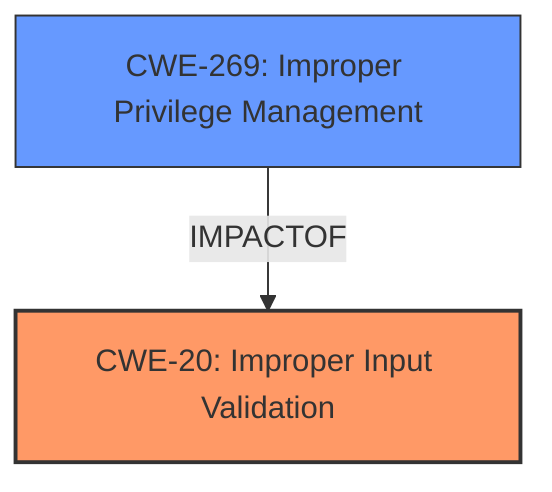

# Enhanced Analysis for CVE-2025-20197

# Summary
| CWE ID | CWE Name | Confidence | CWE Abstraction Level | CWE Vulnerability Mapping Label | CWE-Vulnerability Mapping Notes |
|---|---|---|---|---|---|
| CWE-20 | Improper Input Validation | 1.0 | Class | Primary CWE | Discouraged |
| CWE-269 | Improper Privilege Management | 0.7 | Class | Secondary Candidate | Discouraged |

## Evidence and Confidence

*   **Confidence Score:** 0.85
*   **Evidence Strength:** HIGH

## Relationship Analysis
The primary relationship influencing the CWE selection is that CWE-20 is a high-level class, but directly addresses the identified root cause "**insufficient input validation**." While more specific CWEs might exist, the provided information does not give enough details to narrow it down further. CWE-269, Improper Privilege Management, is also considered, as the impact of the vulnerability is privilege escalation, but it's a consequence of the input validation issue.



## Vulnerability Chain
The vulnerability chain starts with **insufficient input validation** (CWE-20) when processing configuration commands. This leads to the ability to inject crafted input. The final impact is privilege escalation to root on the operating system, potentially allowing undetected actions.
  - The **Primary CWE** identifies the issue that led to the vulnerability i.e. the first in the "Vulnerability Chain"

## Summary of Analysis
The initial assessment identified CWE-20 as the primary weakness due to the stated root cause of "**insufficient input validation**". The retriever results support this, with CWE-20 having the highest score. The guidance suggests it is discouraged but appropriate as the root cause. CWE-269 was considered due to the privilege escalation impact but is a secondary effect. The final selection is primarily based on the evidence from the vulnerability description and CVE summary, which explicitly states the root cause.

Relevant CWE Information:

# Enhanced Context (25 CWEs)
The following CWEs were identified as potentially relevant to this vulnerability:

## CWE-20: Improper Input Validation
**Abstraction Level**: class
**Similarity Score**: 2.55
**Source**: graph

**Description**:
CWE-20: Improper Input Validation

**Mapping Guidance**:
- Usage: Discouraged
- Rationale: CWE-20 is commonly misused in low-information vulnerability reports when lower-level CWEs could be used instead, or when more details about the vulnerability are available [REF-1287]. It is not useful for trend analysis. It is also a level-1 Class (i.e., a child of a Pillar).

**Relationships**:
- CHILDOF -> CWE-707
- PEEROF -> CWE-345
- CANPRECEDE -> CWE-22
- CANPRECEDE -> CWE-41
- CANPRECEDE -> CWE-74

## CWE-269: Improper Privilege Management
**Abstraction Level**: Class
**Similarity Score**: 1892.09
**Source**: sparse

**Description**:
The product does not properly assign, modify, track, or check privileges for an actor, creating an unintended sphere of control for that actor.

**Mapping Guidance**:
- Usage: Discouraged
- Rationale: CWE-269 is commonly misused. It can be conflated with "privilege escalation," which is a technical impact that is listed in many low-information vulnerability reports [REF-1287]. It is not useful for trend analysis.

## Vulnerability Analysis

### CWE-20: Improper Input Validation
- **Explanation:** The vulnerability description clearly states "**insufficient input validation**" as the root cause. An attacker can include crafted input in specific configuration commands to exploit this weakness.
- **Match:** This directly matches the description of CWE-20: "The product receives input or data, but it does not validate or incorrectly validates that the input has the properties that are required to process the data safely and correctly."
- **Security Implications:** **Improper Input Validation** can lead to various vulnerabilities, including command injection, buffer overflows, and privilege escalation (as seen in this case).
- **Relationships:** CWE-20 is a class-level CWE. While more specific input validation flaws might exist, they aren't evident from the provided information.
- **Usage:** The mapping guidance discourages using CWE-20 in low-information reports but is appropriate here because it directly reflects the stated root cause.
- **Confidence:** 1.0

### CWE-269: Improper Privilege Management
- **Explanation:** The impact of the vulnerability is privilege escalation to root.
- **Match:** CWE-269 describes scenarios where privileges are not properly managed, leading to unintended control.
- **Security Implications:** Allows an attacker to perform actions beyond their intended privileges, potentially compromising the entire system.
- **Relationships:** CWE-269 is a class-level CWE. It is considered a consequence of **improper input validation** rather than the root cause.
- **Usage:** The mapping guidance discourages using CWE-269 as it is often misused, and the root cause is known.
- **Confidence:** 0.7

### Other CWEs Considered But Not Used

- **CWE-266, CWE-250, CWE-284, CWE-285**: These CWEs relate to privilege and permission issues. While relevant to the impact, they don't represent the root cause of the vulnerability, which is **insufficient input validation**. Therefore, they are not the primary focus.
- **CWE-78: Improper Neutralization of Special Elements used in an OS Command ('OS Command Injection')**: This could be a potential outcome of **insufficient input validation**, however the evidence does not specifically point to OS Command Injection.
- **CWE-22: Improper Limitation of a Pathname to a Restricted Directory ('Path Traversal')**: This is not directly relevant as the vulnerability does not involve pathnames or directory traversal.


## CWE Relationship Analysis

Current CWEs represent these abstraction levels: .


### Vulnerability Chain Analysis

**Chain starting from CWE-345:**
- 345 (Insufficient Verification of Data Authenticity) - ROOT


**Chain starting from CWE-22:**
- 22 (Improper Limitation of a Pathname to a Restricted Directory ('Path Traversal')) - ROOT


### CWE Relationship Diagram

```mermaid
graph TD
    classDef primary fill:#f96,stroke:#333,stroke-width:2px
    classDef secondary fill:#69f,stroke:#333
    classDef tertiary fill:#9e9,stroke:#333
```