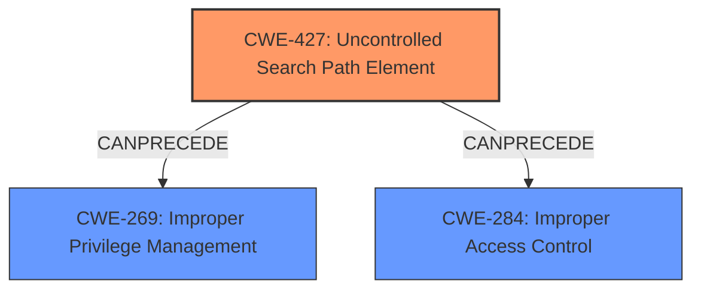

# Analysis Report for CVE-2025-20206

# Vulnerability Analysis Report: CVE-2025-20206

## Description

A vulnerability in the interprocess communication (IPC) channel of Cisco Secure Client for Windows could allow an authenticated, local attacker to perform a **DLL hijacking** attack on an affected device if the Secure Firewall Posture Engine, formerly HostScan, is installed on Cisco Secure Client. This vulnerability is due to **insufficient validation of resources that are loaded by the application at run time**. An attacker could exploit this vulnerability by sending a crafted IPC message to a specific Cisco Secure Client process. A successful exploit could allow the attacker to execute arbitrary code on the affected machine with SYSTEM privileges. To exploit this vulnerability, the attacker must have valid user credentials on the Windows system.

## Vulnerability Description Key Phrases

- **Component:** interprocess communication (IPC) channel
- **Rootcause:** insufficient validation of resources that are loaded by the application at run time
- **Vector:** crafted IPC message to a specific Cisco Secure Client process
- **Weakness:** DLL hijacking
- **Product:** Cisco Secure Client for Windows
- **Impact:** execute arbitrary code, execute arbitrary code with SYSTEM privileges
- **Attacker:** authenticated local attacker

## Analysis (with Relationship Data)

# Summary
| CWE ID | CWE Name | Confidence | CWE Abstraction Level | CWE Vulnerability Mapping Label | CWE-Vulnerability Mapping Notes |
|---|---|---|---|---|---|
| CWE-427 | Uncontrolled Search Path Element | 0.9 | Base | Allowed | Primary CWE. The application loads resources from an uncontrolled search path, leading to DLL hijacking. |
| CWE-269 | Improper Privilege Management | 0.6 | Class | Discouraged | Secondary candidate. The vulnerability ultimately leads to execution with SYSTEM privileges, suggesting a problem in privilege management. However, CWE-427 is the more direct root cause. |
| CWE-284 | Improper Access Control | 0.4 | Pillar | Discouraged | Secondary candidate. The crafted IPC message circumvents the intended access control mechanisms. However, this is a high-level categorization. |

## Evidence and Confidence

*   **Confidence Score:** 0.9
*   **Evidence Strength:** HIGH

## Relationship Analysis
The primary weakness is CWE-427, which directly explains the DLL hijacking vulnerability. CWE-269 and CWE-284 are higher-level classifications that describe the impact of the vulnerability. The child-parent relationship between CWE-427 and its parent CWEs (e.g., those related to access control) were considered, but CWE-427 provides the most specific description of the root cause.



## Vulnerability Chain
The vulnerability chain starts with the **insufficient validation of resources** (which leads to **CWE-427 Uncontrolled Search Path Element**), enabling **DLL hijacking**, ultimately resulting in the execution of arbitrary code with SYSTEM privileges.

## Summary of Analysis
The primary CWE is CWE-427 (Uncontrolled Search Path Element) due to the **insufficient validation of resources that are loaded by the application at run time**, which directly enables the **DLL hijacking** attack. This aligns with the description of CWE-427, where the product uses a search path that can be controlled by unintended actors. The vulnerability description explicitly states that the issue lies in the **insufficient validation of resources**, which is a clear indication of an uncontrolled search path.

The retriever results strongly support CWE-427 as the primary CWE. The description and CVE reference summary highlight the root cause as a failure to properly validate resources loaded at runtime, making the system vulnerable to DLL hijacking. This is a direct consequence of an uncontrolled search path, where a malicious DLL can be placed and loaded by the application.

CWE-269 (Improper Privilege Management) was considered because the ultimate impact is execution with SYSTEM privileges. However, CWE-427 is a more direct representation of the root cause. Similarly, CWE-284 (Improper Access Control) is a higher-level categorization and less specific than CWE-427.

The choice of CWE-427 is at the appropriate level of specificity (Base) as it directly describes the weakness.
Relevant CWE Information:

# Enhanced Context (25 CWEs)
The following CWEs were identified as potentially relevant to this vulnerability:

## CWE-41: Improper Resolution of Path Equivalence
**Abstraction Level**: Base
**Similarity Score**: 0.79
**Source**: dense

**Description**:
The product is vulnerable to file system contents disclosure through path equivalence. Path equivalence involves the use of special characters in file and directory names. The associated manipulations are intended to generate multiple names for the same object.

**Mapping Guidance**:
- Usage: Allowed
- Rationale: This CWE entry is at the Base level of abstraction, which is a preferred level of abstraction for mapping to the root causes of vulnerabilities.


## CWE-668: Exposure of Resource to Wrong Sphere
**Abstraction Level**: Class
**Similarity Score**: 0.79
**Source**: dense

**Description**:
The product exposes a resource to the wrong control sphere, providing unintended actors with inappropriate access to the resource.

**Mapping Guidance**:
- Usage: Discouraged
- Rationale: CWE-668 is high-level and is often misused as a catch-all when lower-level CWE IDs might be applicable. It is sometimes used for low-information vulnerability reports [REF-1287]. It is a level-1 Class (i.e., a child of a Pillar). It is not useful for trend analysis.


## CWE-59: Improper Link Resolution Before File Access ('Link Following')
**Abstraction Level**: Base
**Similarity Score**: 0.79
**Source**: dense

**Description**:
The product attempts to access a file based on the filename, but it does not properly prevent that filename from identifying a link or shortcut that resolves to an unintended resource.

**Mapping Guidance**:
- Usage: Allowed
- Rationale: This CWE entry is at the Base level of abstraction, which is a preferred level of abstraction for mapping to the root causes of vulnerabilities.


## CWE-266: Incorrect Privilege Assignment
**Abstraction Level**: Base
**Similarity Score**: 0.79
**Source**: dense

**Description**:
A product incorrectly assigns a privilege to a particular actor, creating an unintended sphere of control for that actor.

**Mapping Guidance**:
- Usage: Allowed
- Rationale: This CWE entry is at the Base level of abstraction, which is a preferred level of abstraction for mapping to the root causes of vulnerabilities.


## CWE-280: Improper Handling of Insufficient Permissions or Privileges 
**Abstraction Level**: Base
**Similarity Score**: 0.79
**Source**: dense

**Description**:
The product does not handle or incorrectly handles when it has insufficient privileges to access resources or functionality as specified by their permissions. This may cause it to follow unexpected code paths that may leave the product in an invalid state.

**Mapping Guidance**:
- Usage: Allowed
- Rationale: This CWE entry is at the Base level of abstraction, which is a preferred level of abstraction for mapping to the root causes of vulnerabilities.


## CWE-497: Exposure of Sensitive System Information to an Unauthorized Control Sphere
**Abstraction Level**: Base
**Similarity Score**: 0.79
**Source**: dense

**Description**:
The product does not properly prevent sensitive system-level information from being accessed by unauthorized actors who do not have the same level of access to the underlying system as the product does.

**Mapping Guidance**:
- Usage: Allowed
- Rationale: This CWE entry is at the Base level of abstraction, which is a preferred level of abstraction for mapping to the root causes of vulnerabilities.


## CWE-274: Improper Handling of Insufficient Privileges
**Abstraction Level**: Base
**Similarity Score**: 0.78
**Source**: dense

**Description**:
The product does not handle or incorrectly handles when it has insufficient privileges to perform an operation, leading to resultant weaknesses.

**Mapping Guidance**:
- Usage: Discouraged
- Rationale: This CWE entry could be deprecated in a future version of CWE.


## CWE-267: Privilege Defined With Unsafe Actions
**Abstraction Level**: Base
**Similarity Score**: 0.78
**Source**: dense

**Description**:
A particular privilege, role, capability, or right can be used to perform unsafe actions that were not intended, even when it is assigned to the correct entity.

**Mapping Guidance**:
- Usage: Allowed
- Rationale: This CWE entry is at the Base level of abstraction, which is a preferred level of abstraction for mapping to the root causes of vulnerabilities.


## CWE-427: Uncontrolled Search Path Element
**Abstraction Level**: Base
**Similarity Score**: 0.78
**Source**: dense

**Description**:
The product uses a fixed or controlled search path to find resources, but one or more locations in that path can be under the control of unintended actors.

**Mapping Guidance**:
- Usage: Allowed
- Rationale: This CWE entry is at the Base level of abstraction, which is a preferred level of abstraction for mapping to the root causes of vulnerabilities.


## CWE-755: Improper Handling of Exceptional Conditions
**Abstraction Level**: Class
**Similarity Score**: 0.78
**Source**: dense

**Description**:
The product does not handle or incorrectly handles an exceptional condition.

**Mapping Guidance**:
- Usage: Discouraged
- Rationale: This CWE entry is a level-1 Class (i.e., a child of a Pillar). It might have lower-level children that would be more appropriate


## CWE-269: Improper Privilege Management
**Abstraction Level**: Class
**Similarity Score**: 1629.99
**Source**: sparse

**Description**:
The product does


## CWE Relationship Analysis

Current CWEs represent these abstraction levels: .


### Vulnerability Chain Analysis

**Chain starting from CWE-274:**
- 274 (Improper Handling of Insufficient Privileges) - ROOT


**Chain starting from CWE-280:**
- 280 (Improper Handling of Insufficient Permissions or Privileges ) - ROOT


### CWE Relationship Diagram

```mermaid
graph TD
    classDef primary fill:#f96,stroke:#333,stroke-width:2px
    classDef secondary fill:#69f,stroke:#333
    classDef tertiary fill:#9e9,stroke:#333
```


*Report generated on 2025-07-14 08:25:57*
