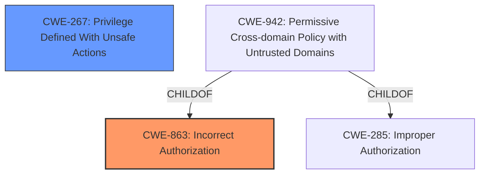

# Analysis Report for CVE-2025-20232

# Vulnerability Analysis Report: CVE-2025-20232

## Description

In Splunk Enterprise versions below 9.3.3, 9.2.5, and 9.1.8 and Splunk Cloud Platform versions below 9.3.2408.103, 9.2.2406.108, 9.2.2403.113, 9.1.2312.208 and 9.1.2308.212, a low-privileged user that does not hold the admin or power Splunk roles could run a saved search with a risky command using the permissions of a higher-privileged user to bypass the SPL safeguards for risky commands on the /app/search/search endpoint through its s parameter. The vulnerability requires the attacker to phish the victim by tricking them into initiating a request within their browser. The authenticated user should not be able to exploit the vulnerability at will.

## Vulnerability Description Key Phrases

- **Product:** Splunk Enterprise, Splunk Cloud Platform
- **Impact:** bypass the SPL safeguards for risky commands on the /app/search/search endpoint
- **Attacker:** low-privileged user that does not hold the admin or power Splunk roles
- **Version:** below 9.3.3, 9.2.5, 9.1.8, below 9.3.2408.103, 9.2.2406.108, 9.2.2403.113, 9.1.2312.208, 9.1.2308.212

## Analysis (with Relationship Data)

# Summary
| CWE ID | CWE Name | Confidence | CWE Abstraction Level | CWE Vulnerability Mapping Label | CWE-Vulnerability Mapping Notes |
|---|---|---|---|---|---|
| CWE-863 | Incorrect Authorization | 0.9 | Class | Primary CWE | Allowed-with-Review |
| CWE-267 | Privilege Defined With Unsafe Actions | 0.7 | Base | Secondary Candidate | Allowed |

## Evidence and Confidence

*   **Confidence Score:** 0.8
*   **Evidence Strength:** HIGH

## Relationship Analysis
The primary relationship influencing the decision is the hierarchical structure within CWE, specifically the parent-child relationship between classes like CWE-863 and more specific base-level CWEs. The analysis also considered chain relationships, particularly how improper authorization can lead to the execution of risky commands. Abstraction levels were crucial in selecting the most appropriate level of detail for the vulnerability.



## Vulnerability Chain
The vulnerability chain starts with **Incorrect Authorization** (CWE-863), where a low-privileged user is not correctly authorized to execute certain commands with elevated privileges. This leads to the **bypass of SPL safeguards for risky commands**, effectively allowing the unauthorized execution. This can also involve **Privilege Defined With Unsafe Actions** (CWE-267) if the risky commands are associated with privileges that should not be accessible to the low-privileged user.

## Summary of Analysis
The primary assessment is based on the provided evidence, which clearly indicates an authorization issue. The key phrase "bypass the SPL safeguards for risky commands using the permissions of a higher-privileged user" directly supports the selection of **CWE-863 Incorrect Authorization**, as it highlights a failure in the authorization mechanism that allows a low-privileged user to perform actions they should not be permitted to do.

The graph relationships influenced the selection by highlighting the connections between authorization flaws and potential consequences. The chosen CWEs are at the optimal level of specificity because they accurately represent the root cause of the vulnerability (incorrect authorization) and a contributing factor (unsafe actions associated with privileges).

Relevant CWE Information:

# Enhanced Context (25 CWEs)
The following CWEs were identified as potentially relevant to this vulnerability:

## CWE-267: Privilege Defined With Unsafe Actions
**Abstraction Level**: Base
**Similarity Score**: 0.79
**Source**: dense

**Description**:
A particular privilege, role, capability, or right can be used to perform unsafe actions that were not intended, even when it is assigned to the correct entity.

**Mapping Guidance**:
- Usage: Allowed
- Rationale: This CWE entry is at the Base level of abstraction, which is a preferred level of abstraction for mapping to the root causes of vulnerabilities.


## CWE-668: Exposure of Resource to Wrong Sphere
**Abstraction Level**: Class
**Similarity Score**: 0.78
**Source**: dense

**Description**:
The product exposes a resource to the wrong control sphere, providing unintended actors with inappropriate access to the resource.

**Mapping Guidance**:
- Usage: Discouraged
- Rationale: CWE-668 is high-level and is often misused as a catch-all when lower-level CWE IDs might be applicable. It is sometimes used for low-information vulnerability reports [REF-1287]. It is a level-1 Class (i.e., a child of a Pillar). It is not useful for trend analysis.


## CWE-266: Incorrect Privilege Assignment
**Abstraction Level**: Base
**Similarity Score**: 0.78
**Source**: dense

**Description**:
A product incorrectly assigns a privilege to a particular actor, creating an unintended sphere of control for that actor.

**Mapping Guidance**:
- Usage: Allowed
- Rationale: This CWE entry is at the Base level of abstraction, which is a preferred level of abstraction for mapping to the root causes of vulnerabilities.


## CWE-497: Exposure of Sensitive System Information to an Unauthorized Control Sphere
**Abstraction Level**: Base
**Similarity Score**: 0.78
**Source**: dense

**Description**:
The product does not properly prevent sensitive system-level information from being accessed by unauthorized actors who do not have the same level of access to the underlying system as the product does.

**Mapping Guidance**:
- Usage: Allowed
- Rationale: This CWE entry is at the Base level of abstraction, which is a preferred level of abstraction for mapping to the root causes of vulnerabilities.


## CWE-41: Improper Resolution of Path Equivalence
**Abstraction Level**: Base
**Similarity Score**: 0.77
**Source**: dense

**Description**:
The product is vulnerable to file system contents disclosure through path equivalence. Path equivalence involves the use of special characters in file and directory names. The associated manipulations are intended to generate multiple names for the same object.

**Mapping Guidance**:
- Usage: Allowed
- Rationale: This CWE entry is at the Base level of abstraction, which is a preferred level of abstraction for mapping to the root causes of vulnerabilities.


## CWE-212: Improper Removal of Sensitive Information Before Storage or Transfer
**Abstraction Level**: Base
**Similarity Score**: 0.77
**Source**: dense

**Description**:
The product stores, transfers, or shares a resource that contains sensitive information, but it does not properly remove that information before the product makes the resource available to unauthorized actors.

**Mapping Guidance**:
- Usage: Allowed
- Rationale: This CWE entry is at the Base level of abstraction, which is a preferred level of abstraction for mapping to the root causes of vulnerabilities.


## CWE-59: Improper Link Resolution Before File Access ('Link Following')
**Abstraction Level**: Base
**Similarity Score**: 0.77
**Source**: dense

**Description**:
The product attempts to access a file based on the filename, but it does not properly prevent that filename from identifying a link or shortcut that resolves to an unintended resource.

**Mapping Guidance**:
- Usage: Allowed
- Rationale: This CWE entry is at the Base level of abstraction, which is a preferred level of abstraction for mapping to the root causes of vulnerabilities.


## CWE-280: Improper Handling of Insufficient Permissions or Privileges 
**Abstraction Level**: Base
**Similarity Score**: 0.77
**Source**: dense

**Description**:
The product does not handle or incorrectly handles when it has insufficient privileges to access resources or functionality as specified by their permissions. This may cause it to follow unexpected code paths that may leave the product in an invalid state.

**Mapping Guidance**:
- Usage: Allowed
- Rationale: This CWE entry is at the Base level of abstraction, which is a preferred level of abstraction for mapping to the root causes of vulnerabilities.


## CWE-274: Improper Handling of Insufficient Privileges
**Abstraction Level**: Base
**Similarity Score**: 0.77
**Source**: dense

**Description**:
The product does not handle or incorrectly handles when it has insufficient privileges to perform an operation, leading to resultant weaknesses.

**Mapping Guidance**:
- Usage: Discouraged
- Rationale: This CWE entry could be deprecated in a future version of CWE.


## CWE-74: Improper Neutralization of Special Elements in Output Used by a Downstream Component ('Injection')
**Abstraction Level**: Class
**Similarity Score**: 0.76
**Source**: dense

**Description**:
The product constructs all or part of a command, data structure, or record using externally-influenced input from an upstream component, but it does not neutralize or incorrectly neutralizes special elements that could modify how it is parsed or interpreted when it is sent to a downstream component.

**Mapping Guidance**:
- Usage: Discouraged
- Rationale: CWE-74 is high-level and often misused when lower-level weaknesses are more appropriate.


## CWE-863: Incorrect Authorization
**Abstraction Level**: Class
**Similarity Score**: 1869.10
**Source**: sparse

**Description**:
The product performs an authorization check when an actor attempts to access a resource or perform an action, but it does not correctly perform the check.

**Mapping Guidance**:
- Usage: Allowed-with-Review
- Rationale: This CWE entry is a Class and might have Base-level children that would be more appropriate


**Explanation:** The description directly states that a low-privileged user can bypass safeguards and run risky commands using higher-privileged user permissions. This aligns perfectly with the definition of **CWE-863 Incorrect Authorization**, which involves a flawed authorization check that allows unauthorized actions.
**Security Implications:** This can lead to privilege escalation, where


## CWE Relationship Analysis

Current CWEs represent these abstraction levels: .


### Vulnerability Chain Analysis

**Chain starting from CWE-274:**
- 274 (Improper Handling of Insufficient Privileges) - ROOT


**Chain starting from CWE-863:**
- 863 (Incorrect Authorization) - ROOT


### CWE Relationship Diagram

```mermaid
graph TD
    classDef primary fill:#f96,stroke:#333,stroke-width:2px
    classDef secondary fill:#69f,stroke:#333
    classDef tertiary fill:#9e9,stroke:#333
```


*Report generated on 2025-07-14 08:29:29*
