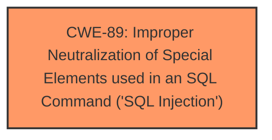

# Analysis Report for CVE-2025-2033

# Vulnerability Analysis Report: CVE-2025-2033

## Description

A vulnerability, which was classified as critical, was found in code-projects Blood Bank Management System 1.0. Affected is an unknown function of the file /user_dashboard/view_donor.php. The manipulation of the argument donor_id leads to **sql injection**. It is possible to launch the attack remotely. The exploit has been disclosed to the public and may be used.

## Vulnerability Description Key Phrases

- **Weakness:** sql injection
- **Product:** code-projects Blood Bank Management System
- **Version:** 1.0
- **Component:** /user_dashboard/view_donor.php

## Analysis (with Relationship Data)

# Summary
| CWE ID | CWE Name | Confidence | CWE Abstraction Level | CWE Vulnerability Mapping Label | CWE-Vulnerability Mapping Notes |
|---|---|---|---|---|---|
| CWE-89 | Improper Neutralization of Special Elements used in an SQL Command ('SQL Injection') | 1.0 | Base | Allowed | Primary CWE: The vulnerability description explicitly states that the manipulation of the argument `donor_id` leads to **sql injection**. |

## Evidence and Confidence

*   **Confidence Score:** 1.0
*   **Evidence Strength:** HIGH

## Relationship Analysis
The primary relationship to consider is that CWE-89 is a Base level CWE, which is appropriate for direct mapping. There are no child or parent relationships that are relevant in refining this selection based on the provided information. The other suggested CWEs do not fit as well as CWE-89.



## Vulnerability Chain
The vulnerability chain consists of a single step:

1.  Improper handling of the `donor_id` argument leads directly to **SQL Injection** (CWE-89).

There are no other weaknesses mentioned or implied in the description. The vulnerability description focuses entirely on the **SQL Injection** root cause.

## Summary of Analysis
The initial assessment correctly identified CWE-89 as the primary weakness based on the explicit mention of "**sql injection**" in the vulnerability description. The description clearly states that manipulating the `donor_id` argument leads to this vulnerability.

The evidence provided is strong and directly supports the selection of CWE-89. The retriever results also strongly support this selection, with a score of 1.0 for the alternate_terms retriever. The CWE is at the appropriate level of specificity (Base).

All of the following CWEs were considered but were not a good fit:
*   CWE-79, CWE-80: These relate to Cross-Site Scripting (XSS), but the vulnerability is explicitly **SQL Injection**, not XSS.
*   CWE-434: This relates to unrestricted file uploads, which is not relevant to this vulnerability.
*   CWE-1336: This is for template injection, not SQL injection.
*   CWE-116: Improper Encoding or Escaping of Output, this is too generic. It could lead to SQL Injection, but is not the root cause.
*   CWE-73: External Control of File Name or Path, this is not related to the described vulnerability.
*   CWE-78: Improper Neutralization of Special Elements used in an OS Command ('OS Command Injection'), this is not related to the described vulnerability.
*   CWE-184: Incomplete List of Disallowed Inputs, this is not related to the described vulnerability.
*   CWE-494: Download of Code Without Integrity Check, this is not related to the described vulnerability.

Relevant CWE Information:


## CWE Relationship Analysis

Current CWEs represent these abstraction levels: .


### Vulnerability Chain Analysis

**Chain starting from CWE-89:**
- 89 (Improper Neutralization of Special Elements used in an SQL Command ('SQL Injection')) - ROOT


**Chain starting from CWE-116:**
- 116 (Improper Encoding or Escaping of Output) - ROOT


### CWE Relationship Diagram

```mermaid
graph TD
    classDef primary fill:#f96,stroke:#333,stroke-width:2px
    classDef secondary fill:#69f,stroke:#333
    classDef tertiary fill:#9e9,stroke:#333
```


*Report generated on 2025-07-14 08:31:44*
