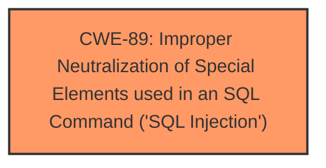

# Analysis Report for CVE-2025-2058

# Vulnerability Analysis Report: CVE-2025-2058

## Description

A vulnerability has been found in PHPGurukul Emergency Ambulance Hiring Portal 1.0 and classified as critical. Affected by this vulnerability is an unknown functionality of the file /admin/search.php. The manipulation of the argument searchdata leads to **sql injection**. The attack can be launched remotely. The exploit has been disclosed to the public and may be used.

## Vulnerability Description Key Phrases

- **Weakness:** sql injection
- **Product:** PHPGurukul Emergency Ambulance Hiring Portal
- **Version:** 1
- **Component:** /admin/search.php

## Analysis (with Relationship Data)

# Summary
| CWE ID | CWE Name | Confidence | CWE Abstraction Level | CWE Vulnerability Mapping Label | CWE-Vulnerability Mapping Notes |
|---|---|---|---|---|---|
| CWE-89 | Improper Neutralization of Special Elements used in an SQL Command ('SQL Injection') | 1.0 | Base | Allowed | Primary CWE. The vulnerability description clearly states that the manipulation of the argument searchdata leads to **sql injection**. |

## Evidence and Confidence

*   **Confidence Score:** 1.0
*   **Evidence Strength:** HIGH

## Relationship Analysis
There is a direct match for **SQL Injection** which is CWE-89. No further relationships need to be considered.



## Vulnerability Chain
The vulnerability chain consists of:
1.  **ROOT CAUSE:** CWE-89 - Improper Neutralization of Special Elements used in an SQL Command ('SQL Injection'). The application fails to neutralize special elements in the `searchdata` argument, leading to SQL injection.

## Summary of Analysis
The vulnerability description explicitly states that the manipulation of the `searchdata` argument leads to **SQL Injection** in the `/admin/search.php` file of the PHPGurukul Emergency Ambulance Hiring Portal 1.0. This directly corresponds to CWE-89, "Improper Neutralization of Special Elements used in an SQL Command ('SQL Injection')". The retriever results confirm this with a score of 1.0 for CWE-89.

Relevant CWE Information:

# Enhanced Context (25 CWEs)
The following CWEs were identified as potentially relevant to this vulnerability:

## CWE-89: Improper Neutralization of Special Elements used in an SQL Command ('SQL Injection')
**Abstraction Level**: Base
**Similarity Score**: 0.77
**Source**: dense

**Description**:
The product constructs all or part of an SQL command using externally-influenced input from an upstream component, but it does not neutralize or incorrectly neutralizes special elements that could modify the intended SQL command when it is sent to a downstream component. Without sufficient removal or quoting of SQL syntax in user-controllable inputs, the generated SQL query can cause those inputs to be interpreted as SQL instead of ordinary user data.

**Mapping Guidance**:
- Usage: Allowed
- Rationale: This CWE entry is at the Base level of abstraction, which is a preferred level of abstraction for mapping to the root causes of vulnerabilities.


## CWE Relationship Analysis

Current CWEs represent these abstraction levels: .


### Vulnerability Chain Analysis

**Chain starting from CWE-89:**
- 89 (Improper Neutralization of Special Elements used in an SQL Command ('SQL Injection')) - ROOT


### CWE Relationship Diagram

```mermaid
graph TD
    classDef primary fill:#f96,stroke:#333,stroke-width:2px
    classDef secondary fill:#69f,stroke:#333
    classDef tertiary fill:#9e9,stroke:#333
```


*Report generated on 2025-07-14 08:36:59*
