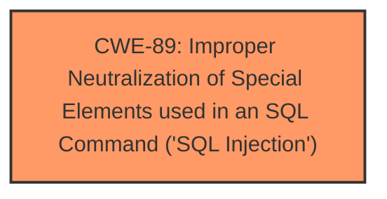

# Analysis Report for CVE-2025-2059

# Vulnerability Analysis Report: CVE-2025-2059

## Description

A vulnerability was found in PHPGurukul Emergency Ambulance Hiring Portal 1.0 and classified as critical. Affected by this issue is some unknown functionality of the file /admin/booking-details.php. The manipulation of the argument ambulanceregnum leads to **sql injection**. The attack may be launched remotely. The exploit has been disclosed to the public and may be used.

## Vulnerability Description Key Phrases

- **Weakness:** sql injection
- **Vector:** manipulation of ambulanceregnum argument
- **Product:** PHPGurukul Emergency Ambulance Hiring Portal
- **Version:** 1.0
- **Component:** /admin/booking-details.php

## Analysis (with Relationship Data)

# Summary
| CWE ID | CWE Name | Confidence | CWE Abstraction Level | CWE Vulnerability Mapping Label | CWE-Vulnerability Mapping Notes |
|---|---|---|---|---|---|
| CWE-89 | Improper Neutralization of Special Elements used in an SQL Command ('SQL Injection') | 1.0 | Base | Allowed | Primary CWE. The vulnerability is due to the application's failure to neutralize special elements in the `ambulanceregnum` parameter when constructing SQL queries. |

## Evidence and Confidence

*   **Confidence Score:** 1.0
*   **Evidence Strength:** HIGH

## Relationship Analysis
The primary relationship that influences the decision is the direct match of the vulnerability description to the definition of CWE-89. The other CWEs considered did not fit as directly.



## Vulnerability Chain
The vulnerability chain starts with the application's **failure to neutralize special elements** in the `ambulanceregnum` parameter, leading to **SQL Injection** and potentially resulting in unauthorized database access, data modification/deletion, sensitive data leakage, potential system control, and service interruption.

## Summary of Analysis
The analysis is based on the provided evidence, which clearly indicates that the root cause of the vulnerability is the application's **failure to properly neutralize special elements** in the `ambulanceregnum` parameter before using it in SQL queries. This directly corresponds to CWE-89, which describes vulnerabilities arising from the **improper neutralization of special elements used in an SQL command**.

The **Vulnerability Description Key Phrases** includes the **weakness**: **sql injection** which aligns directly with CWE-89.

The **CVE Reference Links Content Summary** states the **Root Cause:** **Insufficient user input validation** of the 'ambulanceregnum' parameter. The application directly uses the 'ambulanceregnum' parameter in SQL queries **without proper sanitization**, allowing attackers to inject malicious SQL code.

The other CWEs considered, such as CWE-79 (Cross-Site Scripting) and CWE-434 (Unrestricted Upload of File with Dangerous Type), do not accurately represent the root cause of this vulnerability, as they relate to different types of weaknesses. The selection of CWE-89 is at the optimal level of specificity, as it directly addresses the issue of improper neutralization of special elements in SQL commands.

Relevant CWE Information:

# Enhanced Context (25 CWEs)
The following CWEs were identified as potentially relevant to this vulnerability:

## CWE-89: Improper Neutralization of Special Elements used in an SQL Command ('SQL Injection')
**Technical Explanation:**
The vulnerability in PHPGurukul Emergency Ambulance Hiring Portal 1.0 arises from the **improper neutralization of special elements** used in an SQL command. Specifically, the application **fails to sanitize** the `ambulanceregnum` parameter before incorporating it into SQL queries. This allows an attacker to inject malicious SQL code through the `ambulanceregnum` parameter, potentially leading to unauthorized access, data modification, or other malicious activities.
**Security Implications:**
The security implications of this vulnerability are significant, as it could allow an attacker to gain complete control over the database, potentially leading to sensitive information disclosure, data corruption, or complete system compromise.
**Relationship Analysis:**
CWE-89 is a **Base** level CWE, which is appropriate for this vulnerability as it directly represents the root cause.
**Mapping Guidance Analysis:**
The MITRE mapping guidance **allows** the use of CWE-89, as it is at the Base level of abstraction, which is a preferred level for mapping to the root causes of vulnerabilities.
**Mitigation Analysis:**
The recommended mitigations, such as using prepared statements and input validation, align directly with preventing SQL injection vulnerabilities.

## CWE-79: Improper Neutralization of Input During Web Page Generation ('Cross-site Scripting')
**Explanation for not using:** This CWE relates to Cross-Site Scripting (XSS) vulnerabilities, which involve the injection of malicious scripts into web pages. While the application may have other XSS vulnerabilities, the provided information focuses specifically on SQL injection.

## CWE-434: Unrestricted Upload of File with Dangerous Type
**Explanation for not using:** This CWE relates to the unrestricted upload of dangerous file types, which is not relevant to the described SQL injection vulnerability.

## CWE-1336: Improper Neutralization of Special Elements Used in a Template Engine
**Explanation for not using:** This CWE relates to the improper neutralization of special elements in a template engine, which is not directly related to the SQL injection vulnerability described.

## CWE-117: Improper Output Neutralization for Logs
**Explanation for not using:** This CWE relates to the improper neutralization of output for logs, which is not relevant to the SQL injection vulnerability described.

## CWE-425: Direct Request ('Forced Browsing')
**Explanation for not using:** This CWE relates to the lack of authorization enforcement on restricted URLs, which is not directly related to the SQL injection vulnerability described.


## CWE Relationship Analysis

Current CWEs represent these abstraction levels: .


### Vulnerability Chain Analysis

**Chain starting from CWE-89:**
- 89 (Improper Neutralization of Special Elements used in an SQL Command ('SQL Injection')) - ROOT


**Chain starting from CWE-79:**
- 79 (Improper Neutralization of Input During Web Page Generation ('Cross-site Scripting')) - ROOT


### CWE Relationship Diagram

```mermaid
graph TD
    classDef primary fill:#f96,stroke:#333,stroke-width:2px
    classDef secondary fill:#69f,stroke:#333
    classDef tertiary fill:#9e9,stroke:#333
```


*Report generated on 2025-07-14 08:37:15*
