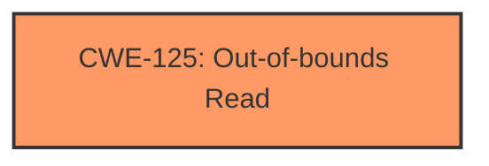

# Analysis Report for CVE-2025-20917

# Vulnerability Analysis Report: CVE-2025-20917

## Description

Out-of-bounds read in applying binary of pdf content in Samsung Notes prior to version 4.4.26.71 allows attackers to read out-of-bounds memory.

## Vulnerability Description Key Phrases

- **Weakness:** out-of-bounds read
- **Attacker:** attackers
- **Product:** Samsung Notes
- **Version:** prior to version 4.4.26.71

## Analysis (with Relationship Data)

# Summary
| CWE ID | CWE Name | Confidence | CWE Abstraction Level | CWE Vulnerability Mapping Label | CWE-Vulnerability Mapping Notes |
|---|---|---|---|---|---|
| CWE-125 | Out-of-bounds Read | 1.0 | Base | Allowed | Primary CWE. The vulnerability description explicitly states "Out-of-bounds read". |

## Evidence and Confidence

*   **Confidence Score:** 1.0
*   **Evidence Strength:** HIGH

## Relationship Analysis
The primary relationship is that CWE-125 [CWE-125: Out-of-bounds Read] is a base CWE. The retriever results contained some candidate CWEs. The vulnerability description explicitly states "Out-of-bounds read" which leads to a direct mapping.



## Vulnerability Chain
The vulnerability chain starts with an **out-of-bounds read** in the application which leads to attackers being able to read out-of-bounds memory.

## Summary of Analysis
The vulnerability description clearly states that there is an **out-of-bounds read**. The "CVE Reference Links Content Summary" section reinforces this by stating that the **root cause of the vulnerability** is an **out-of-bounds read**. The fix involves adding proper input validation. The retriever results listed CWE-125 [CWE-125: Out-of-bounds Read] as the top result. The confidence is high because of the clear evidence.

CWE-193 [CWE-193: Off-by-one Error], CWE-190 [CWE-190: Integer Overflow or Wraparound], CWE-129 [CWE-129: Improper Validation of Array Index], CWE-787 [CWE-787: Out-of-bounds Write], CWE-197 [CWE-197: Numeric Truncation Error], CWE-122 [CWE-122: Heap-based Buffer Overflow], CWE-119 [CWE-119: Improper Restriction of Operations within the Bounds of a Memory Buffer] were not selected because there was no evidence provided to support any of those.


## CWE Relationship Analysis

Current CWEs represent these abstraction levels: .


### Vulnerability Chain Analysis

**Chain starting from CWE-125:**
- 125 (Out-of-bounds Read) - ROOT


**Chain starting from CWE-787:**
- 787 (Out-of-bounds Write) - ROOT


### CWE Relationship Diagram

```mermaid
graph TD
    classDef primary fill:#f96,stroke:#333,stroke-width:2px
    classDef secondary fill:#69f,stroke:#333
    classDef tertiary fill:#9e9,stroke:#333
```


*Report generated on 2025-07-14 08:50:50*
