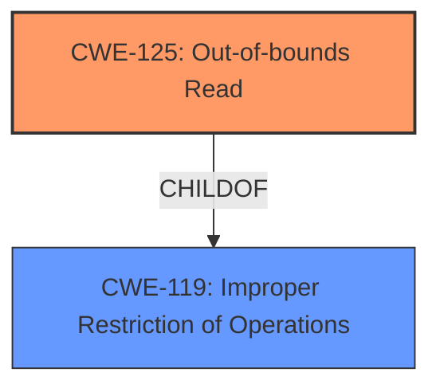

# Analysis for CVE-2025-20919

# Summary

| CWE ID | CWE Name | Confidence | CWE Abstraction Level | CWE Vulnerability Mapping Label | CWE-Vulnerability Mapping Notes |
|---|---|---|---|---|---|
| CWE-125 | Out-of-bounds Read | 1 | Base | Primary | Allowed |

## Evidence and Confidence

*   **Confidence Score:** 1
*   **Evidence Strength:** HIGH

## Relationship Analysis

The primary relationship that influenced the decision was the direct match of the vulnerability description to the definition of CWE-125. While other CWEs like CWE-119 (Improper Restriction of Operations within the Bounds of a Memory Buffer) are related as parents, CWE-125 provides a more specific and accurate representation of the **out-of-bounds read** vulnerability.

## Vulnerability Chain

The vulnerability chain is straightforward:

1.  **Root Cause:** **Out-of-bounds read** when applying binary of video content.
2.  **Impact:** Attackers can read out-of-bounds memory.

## Summary of Analysis

The vulnerability description clearly states an **out-of-bounds read** issue. The CVE Reference Links Content Summary reinforces this, stating "Root cause of vulnerability: Out-of-bounds read in applying binary of video content in Samsung Notes prior to version 4.4.26.71" and "Weaknesses/vulnerabilities present: Out-of-bounds read."

The retriever results also list CWE-125 as the top candidate. The fact that the patch adds proper input validation suggests that the initial cause might be an improper check on the video content. However, the description focuses primarily on the symptom, which is the **out-of-bounds read**.

CWE-125 (Out-of-bounds Read) is a Base level CWE, which is the preferred level of abstraction.

**CWEs considered but not used:**

*   CWE-119 (Improper Restriction of Operations within the Bounds of a Memory Buffer): While related, CWE-125 is a more specific child that directly addresses the **out-of-bounds read** issue.
*   CWE-129 (Improper Validation of Array Index): Could be a contributing factor, but the description does not explicitly mention an array index issue. It's possible that improper index validation leads to the out-of-bounds read, but that level of detail is not provided.
*   CWE-131 (Incorrect Calculation of Buffer Size): Similar to CWE-129, this could be a root cause, but is not explicitly stated.
*   CWE-787 (Out-of-bounds Write): This is the opposite of an out-of-bounds read, so not used.
*   CWE-823 (Use of Out-of-range Pointer Offset): Could be a contributing factor, but the description does not explicitly mention an out-of-range pointer offset.

The decision to use CWE-125 is based on the direct and explicit mention of an **out-of-bounds read** in the vulnerability description and supporting CVE information.