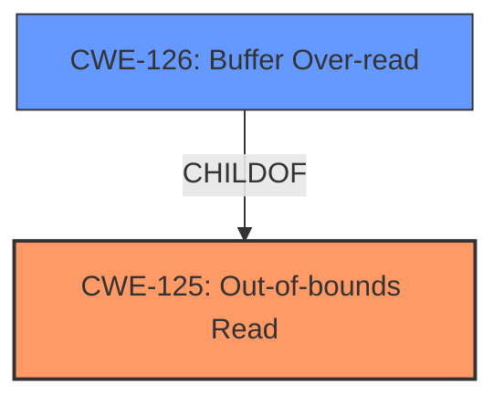

# Raw Analyzer Response for CVE-2025-20927

# Summary
| CWE ID | CWE Name | Confidence | CWE Abstraction Level | CWE Vulnerability Mapping Label | CWE-Vulnerability Mapping Notes |
|---|---|---|---|---|---|
| CWE-125 | Out-of-bounds Read | 1.0 | Base | Allowed | Primary CWE. The vulnerability description explicitly states "**Out-of-bounds read**". |

## Evidence and Confidence

*   **Confidence Score:** 1.0
*   **Evidence Strength:** HIGH

## Relationship Analysis
The primary relationship to consider is that CWE-125 (Out-of-bounds Read) is a base-level CWE. There are some child CWEs (such as CWE-126: Buffer Over-read), but the description doesn't provide enough information to determine a more specific variant.

## Vulnerability Chain
The vulnerability chain is straightforward:
1.  **Root Cause:** **Out-of-bounds read** in parsing image data.
2.  **Impact:** Local attackers can access out-of-bounds memory.

## Summary of Analysis
The vulnerability description explicitly states that the root cause is an **out-of-bounds read**. The "CVE Reference Links Content Summary" also confirms "**Out-of-bounds read** in parsing image data".

CWE-125 (Out-of-bounds Read) perfectly matches this description. It is a base-level CWE, which is appropriate since the description doesn't give specific details about the type of buffer or the context of the read.

Other CWEs were considered but ultimately rejected:

*   CWE-126 (Buffer Over-read): This is a more specific variant of CWE-125, but there isn't sufficient evidence to confirm that it's a buffer over-read specifically.
*   CWE-129 (Improper Validation of Array Index): While an out-of-bounds read *could* be caused by an improper array index validation, the description doesn't specifically mention that, so CWE-125 is a better fit.
*   CWE-787 (Out-of-bounds Write): This is the opposite of what's described, so it's not applicable.
*   CWE-190 (Integer Overflow or Wraparound), CWE-193 (Off-by-one Error): While these could lead to an out-of-bounds read, the description doesn't mention these issues, so CWE-125 is a better fit.

The primary selection of CWE-125 is at the optimal level of specificity, given the information provided.