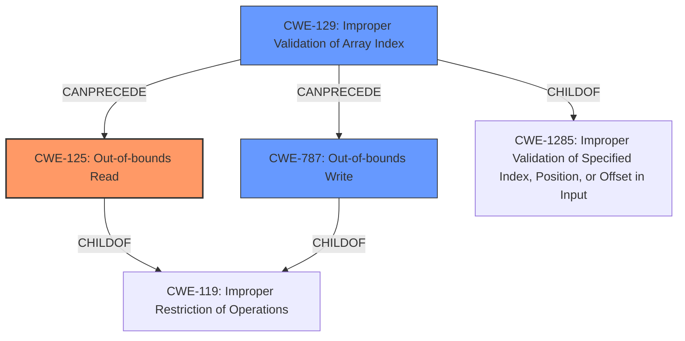

# Analysis Report for CVE-2025-20932

# Vulnerability Analysis Report: CVE-2025-20932

## Description

**Out-of-bounds read** in parsing rle of bmp image in Samsung Notes prior to version 4.4.26.71 allows local attackers toread out-of-bounds memory.

## Vulnerability Description Key Phrases

- **Weakness:** Out-of-bounds read
- **Impact:** read out-of-bounds memory
- **Attacker:** local attackers
- **Product:** Samsung Notes
- **Version:** prior to version 4.4.26.71
- **Component:** parsing rle of bmp image

## Analysis (with Relationship Data)

# Summary
| CWE ID | CWE Name | Confidence | CWE Abstraction Level | CWE Vulnerability Mapping Label | CWE-Vulnerability Mapping Notes |
|---|---|---|---|---|---|
| CWE-125 | Out-of-bounds Read | 1.0 | Base | Allowed | Primary CWE |
| CWE-787 | Out-of-bounds Write | 0.7 | Base | Allowed | Secondary Candidate |

## Evidence and Confidence

*   **Confidence Score:** 0.9
*   **Evidence Strength:** HIGH

## Relationship Analysis
The primary relationship that influenced my decision was the direct identification of an **out-of-bounds read**, which maps directly to CWE-125. While other CWEs such as CWE-129 (Improper Validation of Array Index) and CWE-787 (Out-of-bounds Write) were considered, the description clearly states a read operation, making CWE-125 the most accurate. The relationships between these CWEs highlight the potential for an index validation issue (CWE-129) leading to an out-of-bounds access (CWE-125 or CWE-787).



## Vulnerability Chain
The vulnerability chain starts with parsing an rle of bmp image. This can lead to an **out-of-bounds read**. The impact of this read is that local attackers can read out-of-bounds memory. The patch adds proper input validation.

## Summary of Analysis
The primary weakness identified is **CWE-125 Out-of-bounds Read**. This is based on the vulnerability description that explicitly states "**Out-of-bounds read** in parsing rle of bmp image". The evidence is very strong, leading to high confidence.
The CVE Reference Links Content Summary reinforces the **out-of-bounds read** and identifies a related **out-of-bounds write**, suggesting a potential for both read and write issues. While the primary focus is on the read, the presence of the write vulnerability (CWE-787) in the summary indicates that it might be related.
The Retriever Results also list CWE-125 as the top candidate, further supporting this classification.

Other CWEs considered but not selected:

*   CWE-129 Improper Validation of Array Index: Considered because an invalid array index could lead to an out-of-bounds read, but the description doesn't explicitly mention invalid indices.
*   CWE-787 Out-of-bounds Write: The CVE summary mentions both read and write, but the vulnerability description focuses on the read. Hence, it is listed as a secondary candidate.
*   CWE-190 Integer Overflow or Wraparound: Considered because integer overflows could lead to incorrect buffer sizes or indices, but there's no direct evidence of this in the description.

The selection of CWE-125 is at the optimal level of specificity because it directly describes the **out-of-bounds read** vulnerability.


## CWE Relationship Analysis

Current CWEs represent these abstraction levels: .


### Vulnerability Chain Analysis

**Chain starting from CWE-125:**
- 125 (Out-of-bounds Read) - ROOT


**Chain starting from CWE-787:**
- 787 (Out-of-bounds Write) - ROOT


### CWE Relationship Diagram

```mermaid
graph TD
    classDef primary fill:#f96,stroke:#333,stroke-width:2px
    classDef secondary fill:#69f,stroke:#333
    classDef tertiary fill:#9e9,stroke:#333
```


*Report generated on 2025-07-14 08:55:12*
