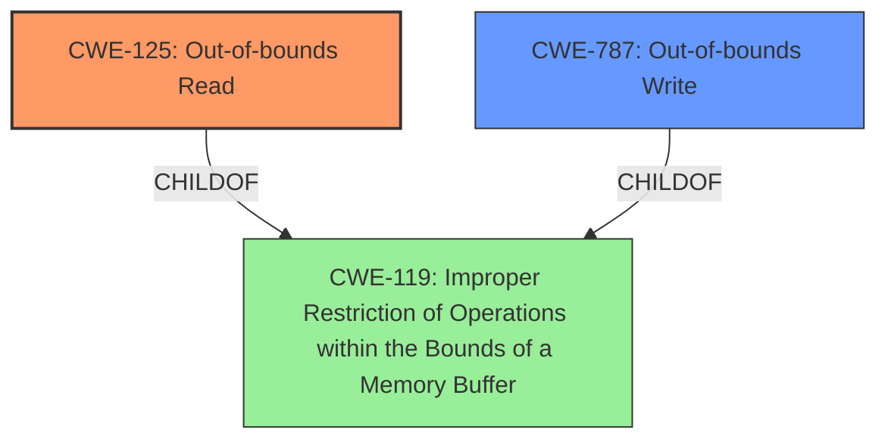

# Raw Analyzer Response for CVE-2025-20933

# Summary
| CWE ID  | CWE Name                      | Confidence | CWE Abstraction Level | CWE Vulnerability Mapping Label | CWE-Vulnerability Mapping Notes |
| :-------- | :---------------------------- | :--------- | :-------------------- | :------------------------------ | :------------------------------ |
| CWE-125   | Out-of-bounds Read            | 1.0        | Base                  | Primary                         | Allowed                         |
| CWE-787   | Out-of-bounds Write           | 0.8        | Base                  | Secondary                       | Allowed                         |

## Evidence and Confidence

*   **Confidence Score:** 0.9
*   **Evidence Strength:** HIGH

## Relationship Analysis
The primary relationship to consider is the co-occurrence of **out-of-bounds read** (CWE-125) and **out-of-bounds write** (CWE-787), suggesting they might be related in the vulnerability. The description indicates an **out-of-bounds read**, but the root cause in the CVE summary indicates an **out-of-bounds write**. Both CWE-125 and CWE-787 are base-level CWEs, providing an appropriate level of specificity. Both are child of the class-level CWE-119.

## Vulnerability Chain
The vulnerability chain starts with an **out-of-bounds write** (CWE-787) in parsing a BMP image. This leads to an **out-of-bounds read** (CWE-125), allowing a local attacker to read out-of-bounds memory. The **out-of-bounds write** is the root cause, while the **out-of-bounds read** is the direct weakness exploited.

## Summary of Analysis
The initial analysis identified CWE-125 (Out-of-bounds Read) as the primary weakness based on the vulnerability description. However, the CVE Reference Links Content Summary indicated that the root cause is an **out-of-bounds write** in parsing a BMP image. Therefore, CWE-787 (Out-of-bounds Write) is included as a secondary CWE to represent the root cause, with CWE-125 remaining the primary weakness as it is what is directly described in the vulnerability. Both CWEs are at the base level, providing an appropriate level of specificity. My assessment is highly based on the provided evidence. The vulnerability description explicitly states "**out-of-bounds read**" and the CVE summary states "**Root cause of vulnerability: Out-of-bounds write in parsing bmp image**".

Relevant CWE Information:

# Enhanced Context (25 CWEs)
The following CWEs were identified as potentially relevant to this vulnerability:

## CWE-125: Out-of-bounds Read
**Abstraction Level**: Base
**Similarity Score**: 0.67
**Source**: dense

**Description**:
The product reads data past the end, or before the beginning, of the intended buffer.

**Mapping Guidance**:
- Usage: Allowed
- Rationale: This CWE entry is at the Base level of abstraction, which is a preferred level of abstraction for mapping to the root causes of vulnerabilities.

**Relationships**:
- CANFOLLOW -> CWE-825
- CANFOLLOW -> CWE-824
- CANFOLLOW -> CWE-823
- CANFOLLOW -> CWE-822
- PARENTOF -> CWE-127

## CWE-787: Out-of-bounds Write
**Abstraction Level**: base
**Similarity Score**: 4.33
**Source**: graph

**Description**:
CWE-787: Out-of-bounds Write

**Mapping Guidance**:
- Usage: Allowed
- Rationale: This CWE entry is at the Base level of abstraction, which is a preferred level of abstraction for mapping to the root causes of vulnerabilities.

**Relationships**:
- CANFOLLOW -> CWE-825
- CANFOLLOW -> CWE-824
- CANFOLLOW -> CWE-823
- CANFOLLOW -> CWE-822
- PARENTOF -> CWE-124

## CWE-129: Improper Validation of Array Index
**Abstraction Level**: Variant
**Similarity Score**: 0.64
**Source**: dense

**Description**:
The product uses untrusted input when calculating or using an array index, but the product does not validate or incorrectly validates the index to ensure the index references a valid position within the array.

**Mapping Guidance**:
- Usage: Allowed
- Rationale: This CWE entry is at the Variant level of abstraction, which is a preferred level of abstraction for mapping to the root causes of vulnerabilities.

**Relationships**:
- CANPRECEDE -> CWE-789
- CANPRECEDE -> CWE-823
- CANPRECEDE -> CWE-119
- CHILDOF -> CWE-20
- CHILDOF -> CWE-1285

## CWE-190: Integer Overflow or Wraparound
**Abstraction Level**: Base
**Similarity Score**: 536.47
**Source**: sparse

**Description**:
The product performs a calculation that can
         produce an integer overflow or wraparound when the logic
         assumes that the resulting value will always be larger than
         the original value. This occurs when an integer value is
         incremented to a value that is too large to store in the
         associated representation. When this occurs, the value may
         become a very small or negative number.

**Mapping Guidance**:
- Usage: Allowed
- Rationale: This CWE entry is at the Base level of abstraction, which is a preferred level of abstraction for mapping to the root causes of vulnerabilities.

**Relationships**:
- PARENTOF -> CWE-680
- CANPRECEDE -> CWE-119
- CHILDOF -> CWE-20
- CHILDOF -> CWE-682
- CHILDOF -> CWE-682

### Other CWEs Considered:

*   CWE-129 (Improper Validation of Array Index): While an improper index could lead to the out-of-bounds read, the description doesn't explicitly state a validation issue.
*   CWE-190 (Integer Overflow or Wraparound): Not directly related to the vulnerability, as there is no mention of integer overflow.
*   CWE-193 (Off-by-one Error): Possible, but not enough information to confirm.
*   CWE-122 (Heap-based Buffer Overflow): Buffer overflows can lead to out-of-bounds reads and writes, but the location of the buffer (heap) is not specified.
*   CWE-823 (Use of Out-of-range Pointer Offset): Similar to CWE-129, but the vulnerability description doesn't explicitly mention pointer arithmetic or offsets.
*   CWE-126 (Buffer Over-read): This is essentially synonymous with CWE-125, so CWE-125 is preferred.
*   CWE-131 (Incorrect Calculation of Buffer Size): While related to buffer overflows, the description doesn't specify that the buffer size calculation is incorrect, so it is not considered.