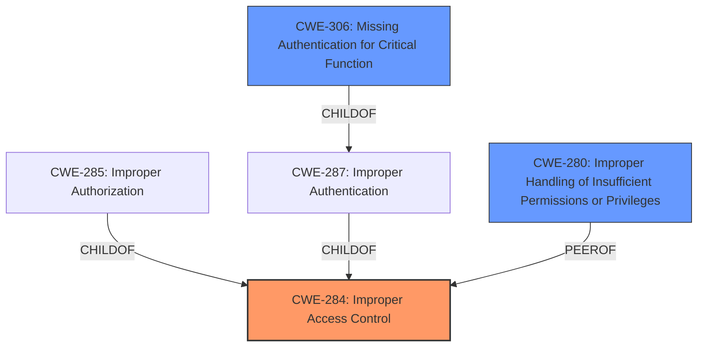

# Raw Analyzer Response for CVE-2025-20938

# Summary
| CWE ID | CWE Name | Confidence | CWE Abstraction Level | CWE Vulnerability Mapping Label | CWE-Vulnerability Mapping Notes |
|---|---|---|---|---|---|
| CWE-284 | Improper Access Control | 0.8 | Pillar | Primary | Allowed if no more specific child CWE is applicable |
| CWE-280 | Improper Handling of Insufficient Permissions or Privileges  | 0.6 | Base | Secondary | Allowed, but less specific than CWE-284 |
| CWE-306 | Missing Authentication for Critical Function | 0.4 | Base | Secondary | Allowed, but less likely given the access control context |

## Evidence and Confidence

*   **Confidence Score:** 0.8
*   **Evidence Strength:** MEDIUM

## Relationship Analysis
The primary relationship influencing the decision is the hierarchical relationship between CWE-284 (Improper Access Control) as a Pillar, and its potential children. Since the provided description only mentions "**improper access control**" without specifying whether it's due to missing authentication (CWE-306) or improper authorization (CWE-285 or its children), CWE-284 is the most appropriate, albeit general, classification. While CWE-280 is also a potential candidate, it's less specific than CWE-284.

## Vulnerability Chain
The vulnerability chain is relatively simple:
1.  **Root Cause:** **Improper access control** (CWE-284)
2.  **Impact:** Local attackers can access protected data in SamsungContacts.

The description lacks details to pinpoint the precise nature of the access control issue (authentication vs. authorization), so a more detailed chain cannot be established.

## Summary of Analysis
The initial analysis focused on identifying the root cause of the vulnerability, which is described as "**improper access control**". The vulnerability description key phrases clearly indicates "**improper access control**" as the root cause.

The primary CWE selection is based on the direct statement of "**Improper access control**" in the vulnerability description. The CWE Classification Guidance also suggests using CWE-284 when the access control failure exists, but the root cause is unclear. The fact that the fix involves adding proper validation logic further supports this, but doesn't give enough information to choose a more specific CWE.

CWE-284 is selected because it is the most accurate representation of the described weakness, given the limited information available. While other CWEs like CWE-280 and CWE-306 were considered, they require more specific evidence that is not provided in the description. The decision to use the Pillar-level CWE reflects the lack of precise details about the nature of the access control failure.