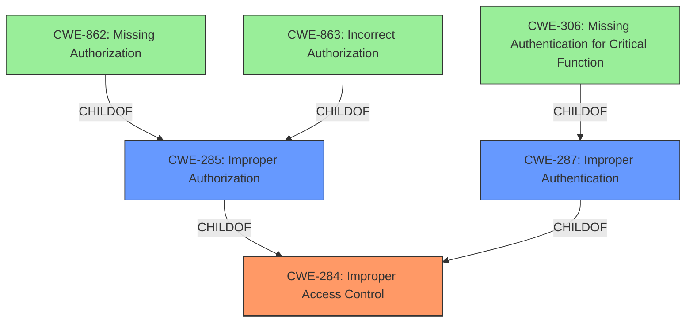

# Raw Analyzer Response for CVE-2025-20945

# Summary
| CWE ID | CWE Name | Confidence | CWE Abstraction Level | CWE Vulnerability Mapping Label | CWE-Vulnerability Mapping Notes |
|---|---|---|---|---|---|
| CWE-284 | Improper Access Control | 0.7 | Pillar | Primary CWE | Discouraged |

## Evidence and Confidence

*   **Confidence Score:** 0.7
*   **Evidence Strength:** LOW

## Relationship Analysis
The primary relationship that influenced the decision was the hierarchical structure of CWEs related to authentication, authorization, and access control. CWE-284 is a high-level category. Since there is no information about whether authentication or authorization is the root cause, the more general CWE-284 is the most appropriate selection, but discouraged because it is a high-level category.

## Vulnerability Chain
The vulnerability chain starts with **improper access control**, leading to local attackers accessing sensitive information.

Improper Access Control -> Access of Sensitive Information

## Summary of Analysis
The initial assessment focused on identifying the root cause of the vulnerability based on the description: "**Improper access control** in Galaxy Watch prior to SMR Apr-2025 Release 1 allows local attackers to access sensitive information of Galaxy watch."

Given the limited information, the primary selection was CWE-284 (Improper Access Control). The vulnerability description indicates a problem with access control, but it does not specify whether the issue is related to authentication (e.g., missing or insufficient authentication) or authorization (e.g., incorrect permission checks). Since the description uses the general term "**Improper access control**," CWE-284 is the most fitting, albeit high-level, choice. The CWE guidance states that this is to be used when the root cause is unclear.

Other CWEs were considered but ultimately not chosen because they were either too specific or did not align with the available information. For instance, CWE-287 (Improper Authentication) and CWE-285 (Improper Authorization) were considered but discarded because the description does not explicitly mention issues related to authentication or authorization mechanisms. Similarly, CWE-306 (Missing Authentication for Critical Function) was not selected because there is no mention of missing authentication.

The decision to use CWE-284 is based on the direct evidence from the vulnerability description, which explicitly mentions "**Improper access control**". The confidence level is moderate (0.7) due to the lack of detailed information, which prevents a more precise classification.

Relevant CWE Information:
- **CWE-284**: *Improper Access Control* – top-level category used when access control failure exists but root cause is unclear. This should be avoided **if** a more specific child CWE like 285, 862, 863, or 306 is appropriate.