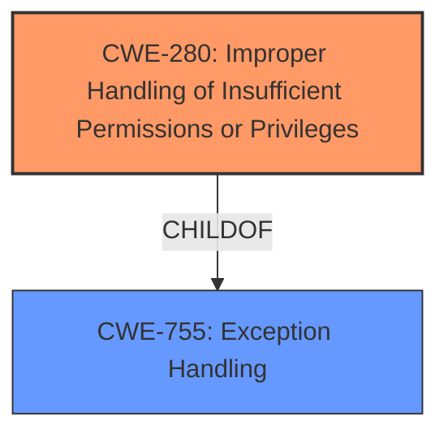

# Raw Analyzer Response for CVE-2025-20960

# Summary

| CWE ID   | CWE Name                                                               | Confidence | CWE Abstraction Level | CWE Vulnerability Mapping Label | CWE-Vulnerability Mapping Notes |
| :------- | :--------------------------------------------------------------------- | :--------- | :-------------------- | :------------------------------ | :------------------------------ |
| CWE-280  | Improper Handling of Insufficient Permissions or Privileges             | 0.9        | Base                  | Primary                         | Allowed                       |

## Evidence and Confidence

*   **Confidence Score:** 0.9
*   **Evidence Strength:** HIGH

## Relationship Analysis

The primary CWE selected, CWE-280, is a Base level CWE, which is the preferred level of abstraction. While several Class and Pillar level CWEs like CWE-285 and CWE-284 were considered, they were deemed too high-level. No specific parent-child or chain relationships significantly influenced the choice, as the description directly points to the **improper handling of insufficient permissions.**

## Vulnerability Chain

The vulnerability chain starts with the **improper handling of insufficient permissions** (CWE-280), leading to the impact of local attackers being able to use the privileged API.

## Summary of Analysis

The primary assessment is based on the explicit statement in the vulnerability description and CVE summary stating "**Improper handling of insufficient permission** in CocktailBarService prior to SMR May-2025 Release 1 allows local attackers to use the privileged api." This directly aligns with the definition of CWE-280, "The product does not handle or incorrectly handles when it has insufficient privileges to access resources or functionality as specified by their permissions." The evidence is strong, and the selection of CWE-280 is at the appropriate level of specificity (Base).

Other CWEs like CWE-285 (Improper Authorization) and CWE-284 (Improper Access Control) were considered but deemed too general. The description specifically mentions permissions, making CWE-280 the most suitable choice.

Relevant CWE Information:

# Enhanced Context (25 CWEs)
The following CWEs were identified as potentially relevant to this vulnerability:

## CWE-280: Improper Handling of Insufficient Permissions or Privileges 
**Abstraction Level**: Base
**Similarity Score**: 0.78
**Source**: dense

**Description**:
The product does not handle or incorrectly handles when it has insufficient privileges to access resources or functionality as specified by their permissions. This may cause it to follow unexpected code paths that may leave the product in an invalid state.

**Mapping Guidance**:
- Usage: Allowed
- Rationale: This CWE entry is at the Base level of abstraction, which is a preferred level of abstraction for mapping to the root causes of vulnerabilities.