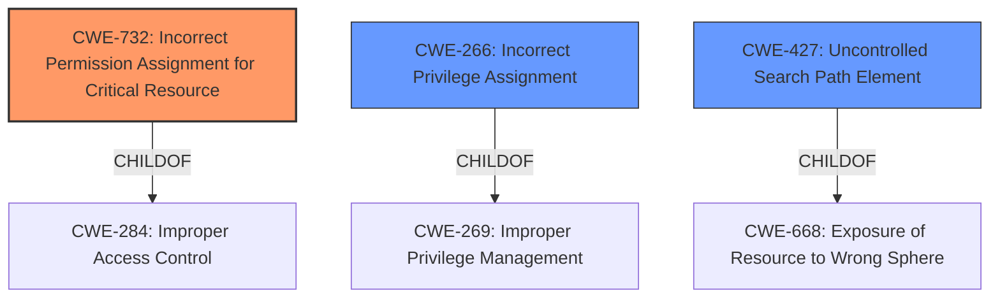

# Analysis for CVE-2025-2098

# Summary
| CWE ID | CWE Name | Confidence | CWE Abstraction Level | CWE Vulnerability Mapping Label | CWE-Vulnerability Mapping Notes |
|---|---|---|---|---|---|
| CWE-732 | Incorrect Permission Assignment for Critical Resource | 0.9 | Class | Allowed-with-Review | Primary CWE. The application was installed with **incorrect file permissions**. |
| CWE-266 | Incorrect Privilege Assignment | 0.7 | Base | Allowed | Secondary candidate. Guest account, other users and applications can exploit this vulnerability for privilege escalation. |
| CWE-427 | Uncontrolled Search Path Element | 0.6 | Base | Allowed | Secondary candidate. This vulnerability allows for **Dylib Hijacking**. |

## Evidence and Confidence

*   **Confidence Score:** 0.8
*   **Evidence Strength:** HIGH

## Relationship Analysis
The primary CWE is CWE-732, which is a Class-level weakness related to incorrect permission assignments. This is supported by the description stating the application was installed with incorrect file permissions. CWE-266 is a Base-level weakness related to incorrect privilege assignment. It is considered due to the potential for privilege escalation. CWE-427 is a Base-level weakness related to uncontrolled search path elements. It is considered due to the possibility of Dylib Hijacking.

## Vulnerability Chain
The vulnerability chain starts with **incorrect file permissions** (CWE-732), leading to a **Dylib Hijacking** vulnerability (CWE-427), and ultimately resulting in privilege escalation (CWE-266).

## Summary of Analysis
The initial assessment identified CWE-732 as the primary weakness due to the **incorrect file permissions** being the root cause. The supporting evidence from the vulnerability description clearly states that "Fast CAD Reader application on MacOS was found to be installed with **incorrect file permissions** (rwxrwxrwx)." The retriever results also list CWE-732 as the top combined result. The guidance on privileges vs. permissions also suggests that when dealing with assignment of permissions for resources, CWE-732 is a good fit.

CWE-266 and CWE-427 are secondary candidates because the **incorrect file permissions** can lead to privilege escalation and **Dylib Hijacking**, respectively. These are consequences of the root cause.

CWE-732 is selected at the Class level because it directly addresses the **incorrect permission assignment**. While more specific variants might exist, the provided information does not offer enough details to narrow down the selection further. CWE-266 and CWE-427 are selected because they are at the Base level of abstraction which is a preferred level of abstraction for mapping to the root causes of vulnerabilities.