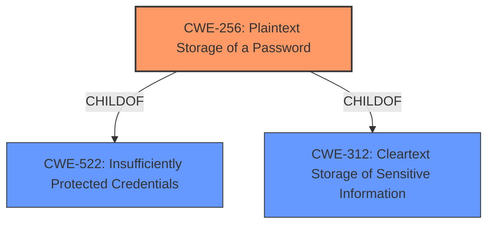

# Analysis Report for CVE-2025-21102

# Vulnerability Analysis Report: CVE-2025-21102

## Description

Dell VxRail, versions 7.0.000 through 7.0.532, contain(s) a Plaintext Storage of a Password vulnerability. A high privileged attacker with local access could potentially exploit this vulnerability, leading to Information exposure.

## Vulnerability Description Key Phrases

- **Rootcause:** plaintext storage of password
- **Impact:** Information exposure
- **Attacker:** high privileged attacker with local access
- **Product:** Dell VxRail
- **Version:** 7.0.000 through 7.0.532

## Analysis (with Relationship Data)

# Summary
| CWE ID | CWE Name | Confidence | CWE Abstraction Level | CWE Vulnerability Mapping Label | CWE-Vulnerability Mapping Notes |
|---|---|---|---|---|---|
| CWE-256 | Plaintext Storage of a Password | 1.0 | Base | Primary | Allowed |
| CWE-312 | Cleartext Storage of Sensitive Information | 0.7 | Base | Secondary | Allowed |

## Evidence and Confidence

*   **Confidence Score:** 0.9
*   **Evidence Strength:** HIGH

## Relationship Analysis
The primary relationship is that CWE-256 (Plaintext Storage of a Password) is a specific type of CWE-312 (Cleartext Storage of Sensitive Information). Therefore, CWE-256 is a child of CWE-522 and CWE-312. The chosen CWE, CWE-256, is at the Base level, which is the preferred level of abstraction, so it is more specific than its parent.



## Vulnerability Chain
The vulnerability chain starts with the **plaintext storage of a password** (CWE-256). A high privileged attacker with local access can then exploit this to achieve information exposure.

## Summary of Analysis
The analysis is based on the provided evidence, particularly the **rootcause** "plaintext storage of password" and the "CVE Reference Links Content Summary" which explicitly mentions "Plaintext Storage of a Password" as the root cause. The retriever results also list CWE-256 with a high score. The relationship analysis shows that CWE-256 is a child of CWE-312 and CWE-522, but it is selected because it is the most specific match for the vulnerability.

Relevant CWE Information:

# Enhanced Context (25 CWEs)
The following CWEs were identified as potentially relevant to this vulnerability:

## CWE-256: Plaintext Storage of a Password
**Abstraction Level**: Base
**Similarity Score**: 0.75
**Source**: dense

**Description**:
Storing a password in plaintext may result in a system compromise.

**Mapping Guidance**:
- Usage: Allowed
- Rationale: This CWE entry is at the Base level of abstraction, which is a preferred level of abstraction for mapping to the root causes of vulnerabilities.

## CWE-312: Cleartext Storage of Sensitive Information
**Abstraction Level**: Base
**Similarity Score**: 0.73
**Source**: dense

**Description**:
The product stores sensitive information in cleartext within a resource that might be accessible to another control sphere.

**Mapping Guidance**:
- Usage: Allowed
- Rationale: This CWE entry is at the Base level of abstraction, which is a preferred level of abstraction for mapping to the root causes of vulnerabilities.

**CWE-256: Plaintext Storage of a Password**
CWE-256 is the primary CWE because the vulnerability description explicitly mentions "**plaintext storage of password**". This aligns directly with the definition of CWE-256, which is "Storing a password in plaintext may result in a system compromise." The impact of the vulnerability is information exposure, which is a direct consequence of storing passwords in plaintext.
The evidence is strong, and the confidence is high (1.0).

**CWE-312: Cleartext Storage of Sensitive Information**
CWE-312 is a secondary CWE because it is a more general form of the **weakness**. The vulnerability involves storing sensitive information (passwords) in cleartext. While CWE-256 is more specific to passwords, CWE-312 captures the broader issue of storing sensitive data without encryption.
The evidence is present, and the confidence is medium (0.7).

**CWEs Considered But Not Used:**

*   CWE-522: Insufficiently Protected Credentials - While related, this is a class-level CWE and less specific than CWE-256. The **root cause** is not just insufficient protection, but the specific act of storing the password in plaintext.
*   CWE-916: Use of Password Hash With Insufficient Computational Effort - This CWE is about weak hashing algorithms, not **plaintext storage**, so it is not applicable.
*   CWE-532: Insertion of Sensitive Information into Log File - This is about logging sensitive information, which is not the case here. The vulnerability is about storing passwords in plaintext.
*   CWE-327: Use of a Broken or Risky Cryptographic Algorithm - This CWE relates to the use of weak encryption algorithms, and there is no mention of encryption in the vulnerability description.
*   CWE-261: Weak Encoding for Password - This CWE is about weak encoding, not necessarily **plaintext storage**.
*   CWE-668: Exposure of Resource to Wrong Sphere - This CWE is too general. The problem is not just exposure, but **plaintext storage**.
*   CWE-549: Missing Password Field Masking - This CWE is about password masking during entry, not about storage.
*   CWE-208: Observable Timing Discrepancy - This CWE is about timing attacks, which are not relevant here.


## CWE Relationship Analysis

Current CWEs represent these abstraction levels: .


### Vulnerability Chain Analysis

**Chain starting from CWE-327:**
- 327 (Use of a Broken or Risky Cryptographic Algorithm) - ROOT


**Chain starting from CWE-916:**
- 916 (Use of Password Hash With Insufficient Computational Effort) - ROOT


### CWE Relationship Diagram

```mermaid
graph TD
    classDef primary fill:#f96,stroke:#333,stroke-width:2px
    classDef secondary fill:#69f,stroke:#333
    classDef tertiary fill:#9e9,stroke:#333
```


*Report generated on 2025-07-14 09:07:47*
