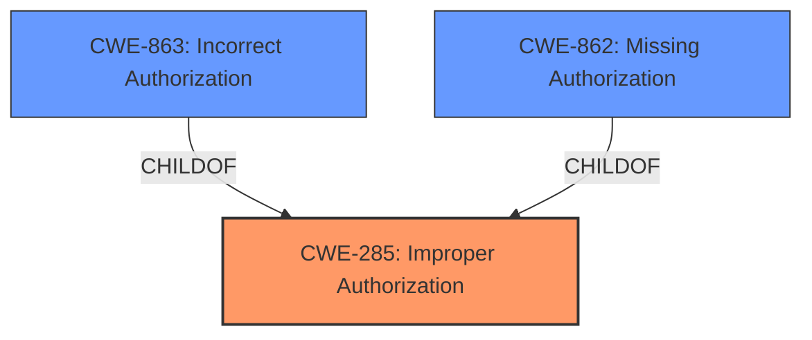

# Analysis for CVE-2025-2114

# Summary
| CWE ID    | CWE Name                      | Confidence | CWE Abstraction Level | CWE Vulnerability Mapping Label | CWE-Vulnerability Mapping Notes |
| :---------- | :----------------------------- | :--------- | :---------------------- | :------------------------------ | :-------------------------------- |
| CWE-285     | Improper Authorization         | 0.95       | Class                   | Allowed                         | Primary CWE                       |
| CWE-863     | Incorrect Authorization        | 0.75       | Class                   | Allowed-with-Review             | Secondary Candidate                |
| CWE-862     | Missing Authorization          | 0.65       | Base                    | Allowed                         | Secondary Candidate               |

## Evidence and Confidence

*   **Confidence Score:** 0.90
*   **Evidence Strength:** HIGH

## Relationship Analysis
The primary CWE is CWE-285, Improper Authorization, which is a class-level CWE. Given the available information, it's challenging to pinpoint a more specific base-level CWE. CWE-863 and CWE-862 are considered as secondary options.
CWE-863, Incorrect Authorization, is a child of CWE-285, which means it provides a more specific description of the authorization problem.
CWE-862, Missing Authorization, is also a child of CWE-285.

## Vulnerability Chain
The vulnerability chain starts with **improper authorization**, which allows an attacker to manipulate the OperId argument to perform unauthorized actions.

## Summary of Analysis
The vulnerability description clearly indicates an **improper authorization** issue. The description states "The manipulation of the argument OperId leads to **improper authorization**." This suggests that the system is not correctly validating whether the user has the necessary permissions to perform the requested action.

The retriever results also support this classification, with CWE-284, CWE-285, CWE-863, CWE-862, and CWE-306 being the top candidates. The guidance provided emphasizes the distinction between authentication and authorization, which further supports the selection of an authorization-related CWE.

CWE-285 is selected as the primary CWE because it directly addresses the **improper authorization** issue. CWE-863 (Incorrect Authorization) and CWE-862 (Missing Authorization) were considered because they are children of CWE-285 and offer more specific descriptions of authorization flaws. However, without more information, it's difficult to determine if the authorization is incorrect or simply missing, so CWE-285 is the most appropriate choice.

Relevant CWE Information:

# Enhanced Context (25 CWEs)
The following CWEs were identified as potentially relevant to this vulnerability:

## CWE-472: External Control of Assumed-Immutable Web Parameter
**Abstraction Level**: Base
**Similarity Score**: 0.77
**Source**: dense

**Description**:
The web application does not sufficiently verify inputs that are assumed to be immutable but are actually externally controllable, such as hidden form fields.

**Mapping Guidance**:
- Usage: Allowed
- Rationale: This CWE entry is at the Base level of abstraction, which is a preferred level of abstraction for mapping to the root causes of vulnerabilities.

*Not selected*: This CWE is related to external control of immutable parameters, which is not the primary issue described in the vulnerability.

## CWE-807: Reliance on Untrusted Inputs in a Security Decision
**Abstraction Level**: Base
**Similarity Score**: 0.76
**Source**: dense

**Description**:
The product uses a protection mechanism that relies on the existence or values of an input, but the input can be modified by an untrusted actor in a way that bypasses the protection mechanism.

**Mapping Guidance**:
- Usage: Allowed
- Rationale: This CWE entry is at the Base level of abstraction, which is a preferred level of abstraction for mapping to the root causes of vulnerabilities.

*Not selected*: While untrusted input (OperId) is involved, the core issue is the **improper authorization**, not reliance on the input itself.

## CWE-41: Improper Resolution of Path Equivalence
**Abstraction Level**: Base
**Similarity Score**: 0.76
**Source**: dense

**Description**:
The product is vulnerable to file system contents disclosure through path equivalence. Path equivalence involves the use of special characters in file and directory names. The associated manipulations are intended to generate multiple names for the same object.

**Mapping Guidance**:
- Usage: Allowed
- Rationale: This CWE entry is at the Base level of abstraction, which is a preferred level of abstraction for mapping to the root causes of vulnerabilities.

*Not selected*: This CWE is not relevant to the vulnerability, which focuses on **improper authorization**, not path equivalence.

## CWE-425: Direct Request ('Forced Browsing')
**Abstraction Level**: Base
**Similarity Score**: 0.76
**Source**: dense

**Description**:
The web application does not adequately enforce appropriate authorization on all restricted URLs, scripts, or files.

**Mapping Guidance**:
- Usage: Allowed
- Rationale: This CWE entry is at the Base level of abstraction, which is a preferred level of abstraction for mapping to the root causes of vulnerabilities.

*Not selected*: While related to authorization, this CWE is specific to direct requests, which is not explicitly mentioned in the vulnerability description.

## CWE-267: Privilege Defined With Unsafe Actions
**Abstraction Level**: Base
**Similarity Score**: 0.75
**Source**: dense

**Description**:
A particular privilege, role, capability, or right can be used to perform unsafe actions that were not intended, even when it is assigned to the correct entity.

**Mapping Guidance**:
- Usage: Allowed
- Rationale: This CWE entry is at the Base level of abstraction, which is a preferred level of abstraction for mapping to the root causes of vulnerabilities.

*Not selected*: This CWE is about privileges being used for unsafe actions, which is not directly stated in the vulnerability description.

## CWE-668: Exposure of Resource to Wrong Sphere
**Abstraction Level**: Class
**Similarity Score**: 0.75
**Source**: dense

**Description**:
The product exposes a resource to the wrong control sphere, providing unintended actors with inappropriate access to the resource.

**Mapping Guidance**:
- Usage: Discouraged
- Rationale: CWE-668 is high-level and is often misused as a catch-all when lower-level CWE IDs might be applicable. It is sometimes used for low-information vulnerability reports [REF-1287]. It is a level-1 Class (i.e., a child of a Pillar). It is not useful for trend analysis.

*Not selected*: This is a high-level CWE and less specific than CWE-285.

## CWE-303: Incorrect Implementation of Authentication Algorithm
**Abstraction Level**: Base
**Similarity Score**: 0.75
**Source**: dense

**Description**:
The requirements for the product dictate the use of an established authentication algorithm, but the implementation of the algorithm is incorrect.

**Mapping Guidance**:
- Usage: Allowed
- Rationale: This CWE entry is at the Base level of abstraction, which is a preferred level of abstraction for mapping to the root causes of vulnerabilities.

*Not selected*: The vulnerability is about authorization, not authentication algorithms.

## CWE-497: Exposure of Sensitive System Information to an Unauthorized Control Sphere
**Abstraction Level**: Base
**Similarity Score**: 0.75
**Source**: dense

**Description**:
The product does not properly prevent sensitive system-level information from being accessed by unauthorized actors who do not have the same level of access to the underlying system as the product does.

**Mapping Guidance**:
- Usage: Allowed
- Rationale: This CWE entry is at the Base level of abstraction, which is a preferred level of abstraction for mapping to the root causes of vulnerabilities.

*Not selected*: The vulnerability description does not mention exposure of sensitive information.

## CWE-274: Improper Handling of Insufficient Privileges
**Abstraction Level**: Base
**Similarity Score**: 0.75
**Source**: dense

**Description**:
The product does not handle or incorrectly handles when it has insufficient privileges to perform an operation, leading to resultant weaknesses.

**Mapping Guidance**:
- Usage: Discouraged
- Rationale: This CWE entry could be deprecated in a future version of CWE.

*Not selected*: While related to privileges, the description focuses on **improper authorization**, not the handling of insufficient privileges.

## CWE-280: Improper Handling of Insufficient Permissions or Privileges
**Abstraction Level**: Base
**Similarity Score**: 0.