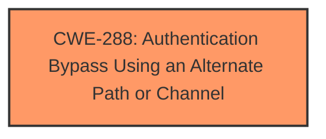

# Analysis Report for CVE-2025-21194

# Vulnerability Analysis Report: CVE-2025-21194

## Description

Microsoft Surface Security Feature Bypass Vulnerability

## Vulnerability Description Key Phrases

- **Impact:** bypass security feature
- **Product:** Microsoft Surface

## Analysis (with Relationship Data)

# Summary

| CWE ID  | CWE Name | Confidence | CWE Abstraction Level | CWE Vulnerability Mapping Label | CWE-Vulnerability Mapping Notes |
|--------------|---------------------------------------------------------------------------------------------------|-------------------|--------------------------|--------------------------------------------------------------------------------------|--------------------------------------------------------------------------------------------------------------------------------------------------------------------------------------------------------------------------------------------------------------------------------------------------------------------------------------------------------------------------------------|
| CWE-288 | Authentication Bypass Using an Alternate Path or Channel | 0.75 | Base | Allowed | This CWE best describes the vulnerability where a security feature is bypassed, effectively circumventing authentication. |

## Evidence and Confidence

*   **Confidence Score:** 0.75
*   **Evidence Strength:** LOW

## Relationship Analysis

The primary identified CWE is CWE-288. There is not enough information to infer any further relationships.



## Vulnerability Chain

The vulnerability chain consists of a **bypass** of the security feature, leading to potential unauthorized access or actions. The root cause is the **incorrect** or **missing** implementation of authentication checks in an alternate path or channel.

## Summary of Analysis

The analysis is primarily based on the provided vulnerability description, which indicates a security feature bypass. The limited information restricts a more detailed analysis, but CWE-288 appears to be the most relevant. The evidence supporting this classification is primarily the "**impact:** bypass security feature" key phrase, although the lack of CVE reference links limits confidence. The selection is based on the direct description of the vulnerability without deeper technical root cause data.

Relevant CWE Information:

# Enhanced Context (25 CWEs)
The following CWEs were identified as potentially relevant to this vulnerability:

## CWE-288: Authentication Bypass Using an Alternate Path or Channel
**Abstraction Level**: Base
**Similarity Score**: 0.71
**Source**: dense

**Description**:
The product requires authentication, but the product has an alternate path or channel that does not require authentication.

**Mapping Guidance**:
- Usage: Allowed
- Rationale: This CWE entry is at the Base level of abstraction, which is a preferred level of abstraction for mapping to the root causes of vulnerabilities.


## CWE Relationship Analysis

Current CWEs represent these abstraction levels: .


### Vulnerability Chain Analysis

**Chain starting from CWE-288:**
- 288 (Authentication Bypass Using an Alternate Path or Channel) - ROOT


### CWE Relationship Diagram

```mermaid
graph TD
    classDef primary fill:#f96,stroke:#333,stroke-width:2px
    classDef secondary fill:#69f,stroke:#333
    classDef tertiary fill:#9e9,stroke:#333
```


*Report generated on 2025-07-14 09:12:27*
