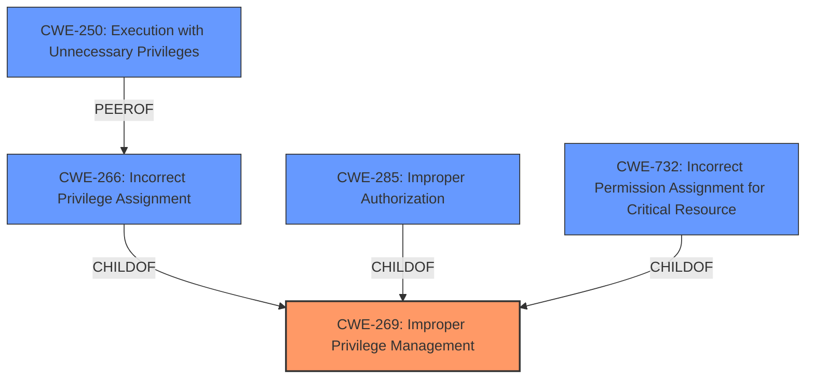

# Raw Analyzer Response for CVE-2025-21202

# Summary
| CWE ID    | CWE Name                                                                              | Confidence | CWE Abstraction Level | CWE Vulnerability Mapping Label | CWE-Vulnerability Mapping Notes |
| --------- | ------------------------------------------------------------------------------------- | ---------- | --------------------- | ------------------------------- | ------------------------------- |
| CWE-269   | Improper Privilege Management                                                         | 0.6        | Class                 |                                 | Discouraged                   |
| CWE-285   | Improper Authorization                                                                | 0.4        | Class                 |                                 | Discouraged                   |
| CWE-266   | Incorrect Privilege Assignment                                                        | 0.3        | Base                  |                                 | Allowed                       |
| CWE-250   | Execution with Unnecessary Privileges                                                 | 0.3        | Base                  |                                 | Allowed                       |
| CWE-732   | Incorrect Permission Assignment for Critical Resource                                 | 0.3        | Class                 |                                 | Allowed-with-Review           |

## Evidence and Confidence

*   **Confidence Score:** 0.6
*   **Evidence Strength:** LOW

## Relationship Analysis
The analysis is based on the limited evidence provided, primarily focusing on the "Elevation of Privilege" **impact**. Several CWEs related to privilege and permission management were considered. Due to the lack of specific root cause information, a Class-level CWE was selected, with consideration for other potential Base-level CWEs if more information were available.

## Vulnerability Chain
The vulnerability description mentions "Elevation of Privilege," which suggests a potential chain of events. However, without more information, the chain is incomplete. A potential chain could start with a **missing** or **incorrect** authorization check, leading to **improper privilege management**, and ultimately resulting in **elevation of privilege**.

## Summary of Analysis
The analysis is limited by the minimal evidence provided. The primary **impact** is "Elevation of Privilege," but the root cause is unclear.

Given the limited information, the initial assessment leaned towards CWE-269 (Improper Privilege Management) as a general classification for privilege-related issues. However, this is a Class-level CWE and is often misused.

The relationship graph shows how CWE-266, CWE-285, and CWE-732 could be potential children of CWE-269, providing more specific classifications if more information were available. CWE-250 is shown as a peer, indicating a different type of privilege issue (unnecessary privileges) that might be relevant.

The final decision is to keep CWE-269 as the primary CWE, but with a lower confidence score (0.6) due to the lack of specific root cause details. If the root cause was known to be an **incorrect privilege assignment**, CWE-266 would be a better fit. If the issue was related to **incorrect authorization checks**, CWE-285 would be more appropriate. If the issue was related to **incorrect permission assignment**, CWE-732 would be more appropriate. If the process was running with **unnecessary privileges**, then CWE-250 might be a better fit.

Relevant CWE Information:

**CWE-269: Improper Privilege Management** - This is a Class-level CWE that broadly covers issues related to privilege management. It is often misused and not useful for trend analysis.

**CWE-285: Improper Authorization** - This is a Class-level CWE that indicates the product does not perform or incorrectly performs an authorization check when an actor attempts to access a resource or perform an action. This is often high-level and lower-level CWEs can frequently be used instead.

**CWE-266: Incorrect Privilege Assignment** - This is a Base-level CWE. A product incorrectly assigns a privilege to a particular actor, creating an unintended sphere of control for that actor.

**CWE-250: Execution with Unnecessary Privileges** - This is a Base-level CWE. Code runs with higher privileges than needed to complete its function.

**CWE-732: Incorrect Permission Assignment for Critical Resource** - This is a Class-level CWE. The product specifies permissions for a security-critical resource in a way that allows that resource to be read or modified by unintended actors.

The selected CWEs are at the optimal level of specificity given the available evidence. If more information about the root cause were available, a more specific Base or Variant CWE could be selected.